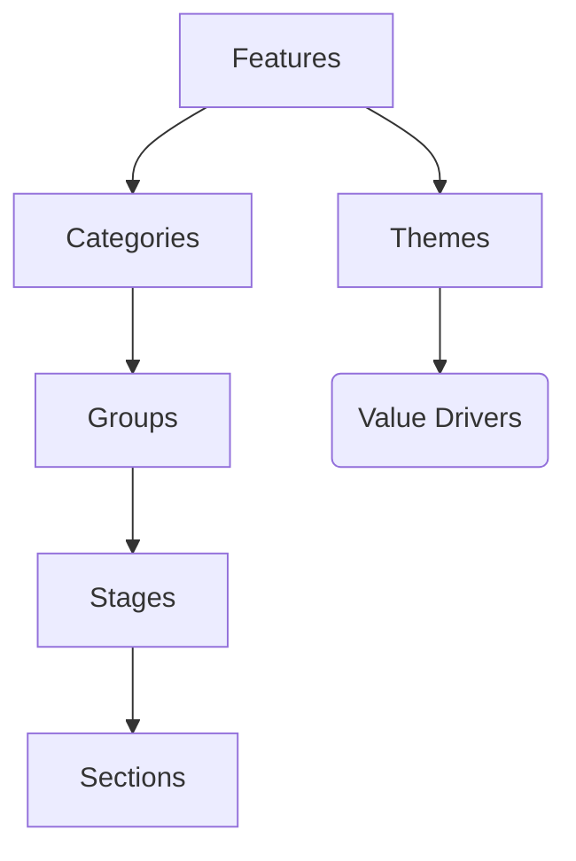

GitLab's pricing strategy is set by the CEO, Sid Sibrandij. Everyone can contribute, and the best way to communicate is on the #pricing Slack channel.

Contributions are part of the day-to-day jobs of the following people:
- Principal Pricing Manager (Lisa Hoang)
- Principal Pricing Manager (TBH)
- Sr Director, Product Monetization (Justin Farris)
- Product Marketing (Saumya Upadhyaya)

## Pricing Strategy

Most of GitLab functionality is and will be available for free in our Free tier. Our paid
tiers include features that are
[more relevant for managers, directors, and executives](/company/stewardship/#what-features-are-paid-only).
[We promise](/company/stewardship/#promises) all major features in [our scope](https://about.gitlab.com/direction/#scope)
are available in Free too. Instead of charging for specific parts of our scope
(CI, Monitoring, etc.) we charge for smaller features that you are more likely
to need if you use GitLab with a lot of users. There are a couple of reasons for
this:

1. We want to be a good [steward of our open source product](/company/stewardship/).
1. Giving a great free product is part of our go to market, it helps create new users and customers.
1. Having our scope available to all users increases adoption of our scope and helps people see the benefit of a [single application](https://about.gitlab.com/handbook/product/single-application/).
1. Including all major features in Free helps reduce merge conflicts between CE and EE

Because we have a great free product we can't have one price. Setting it high
would make the difference from the free version too high. Setting it low would
make it hard to run a sustainable business. There is no middle ground that would
work out with one price.

That is why we have [Premium and Ultimate tiers](https://about.gitlab.com/handbook/product/gitlab-the-product/#paid-tiers).
The price difference between them is half an order of magnitude (5x).

We will charge per user, per
application, or per instance. We do include free minutes with our subscriptions
and trials to make it easier for users to get started. As we look towards more
deployment-related functionality on SaaS it's tempting to offer compute and
charge a percent on top of, for example, Google Cloud Platform (GCP). We don't
want to charge an ambiguous margin on top of another provider since this limits
user choice and is not transparent. So we will always let you BYOK (bring your
own Kubernetes) and never lock you into our infrastructure to charge you an
opaque premium on those costs.

### The Value of Free users

As a commercial organization, we always want to grow the number of paying customers, therefore we are focused on increasing the free to paid conversion rate. However, GitLab offers a free product, and our free users bring tremendous value to the company beyond just the likelihood of converting to a paid customer one day.

1. Awareness/Mindshare: A large free user base helps GitLab become known to the developer community and stay top of mind.
1. Product Familiarity/Training: Offering a free product invites anyone to try out GitLab without any barrier so many developers become familiar with GitLab. Through using the free product, many users are trained on how to use GitLab functionality which makes them more effective when using GitLab for their job.
1. Advocacy/Internal Champion: Happy loyal free users become advocates of GitLab, which brings more users and strengthens our brand. We often see users of GitLab for personal projects then become an internal champions to advocate their employers to buy GitLab. This personal use -> organizational use cross over and bottoms-up growth can't happen without our free product.
1. Contributions/Community: Many free users are also active contributors to the product so they make GitLab better. They also help grow our community which becomes an even more valuable asset to all free and paid customers.
1. Third party support/Platform: Free users increase our total user base, and a large user base makes 3rd party tools/APIs/integrations more likely to support GitLab, growing our ecosystem and enhancing our platform status.
1. Enable product-led growth & Reduce Customer Acquisition Cost: our free product enables GitLab to acquire more users at a lower customer acquisition cost, as some of them will purchase via self-service funnel since they are already familiar with GitLab and won't require a full sales cycle to be convinced to buy.
1. User habit/Retention lever: offering a free product allows users to develop a habit before they pay, therefore the paid customers are more likely to see higher ROI of GitLab. Additionally, even if the customer stays on the free plan, we are not losing the customer to a competitor.
  
## Pricing Philosophy

Our pricing philosophy is aligned with our [GitLab Values](/handbook/values/).

- **Collaboration**: We want to keep the trust of our customers through a pricing approach that supports long-lasting customer relationships.
- **Results**: We aim to get a great ROI for our customers while maximizing IACV for GitLab over the long-term.
- **Efficiency**: Our pricing approach should be easy to understand, plan, and order.
- **Diversity, Inclusion and Belonging**: We build GitLab to be the best option for a wide variety of organizations, including educational institutions and organizations in different geographic regions.
- **Iteration**: We want to encourage the full scope of GitLab to be adopted over time.
- **Transparency**: We are public and explicit about what our pricing is based on.

## Pricing Methodology

We take a value-based pricing approach at GitLab. The core of the value-based pricing is to understand the value proposition that our innovations provide to our current and future customers for that offering. We aim to price our offerings to achieve continued growth and financial success for both the customer and GitLab.

#### 1. Value Proposition

To understand the value that we deliver to our customers, we focus on the benefits that our customers can receive to achieve their business goals. The value to our customers can include:

- Development cost reduction
- Revenue gain due to decreased time to market
- Improved reliability and security
- Greater and more effective collaboration
- Emotional contribution of having delighted users

#### 2. Customer Collaboration

Defining and quantifying the value being delivered does not happen in isolation. We regularly engage with customers to understand how our solutions help them. These engagements are important as they will provide insights on how our innovations are valued by the customers and how it impacts our customers’ willingness to pay. Willingness to pay is a crucial element when we decide on how to price and packaging our offerings.

#### 3. Competitive Landscape

We understand that customers have choices when they decide to make a purchase. Hence,  understanding the competitive landscape of our products is very critical. With respect to competition, we focus on the key differences between our value proposition and the competition’s value proposition. Our pricing aims to reflect the differential value that we provide. We aim to design the pricing structure that works best for our customers compared to our competitors inclusive of pricing metric.

#### 4. Mutual Success

To following our pricing philosophy, we aim to support long-lasting customer relationships. When we develop our pricing, the target is that both our customers and GitLab become successful together. For long term success, where we can run a sustainable business and meet our company’s financial goals, we do also consider cost to serve and margins as factors when pricing is determined. It is important to note that while costs and margins are factors in pricing, value provided to our customers is the foundational element.

## Departments and Decision Making

Pricing affects Product, Marketing, and Sales.
Therefore, general pricing decisions are made by the CEO.

Product makes most decisions on a day-to-day basis about what feature should go
in what plan based on [the paid tiers](https://about.gitlab.com/handbook/product/gitlab-the-product/#paid-tiers).

The following table describes how large cross-functional pricing decisions should be made.  This decision making method differs from our normal [RADCIE](https://about.gitlab.com/handbook/people-group/directly-responsible-individuals/#radcie) method due to the extremely cross-functional nature and business risk of large pricing decisions.

| Responsible | Sr. Director, Pricing | Responsible for analysis and recommendation |
| Agree | Chief Product Officer, CRO | Should ideally agree with the recommendation |
| Perform | Pricing, Fulfillment, Sales Ops, Product Marketing, and Website teams | Executes the recommendation |
| Input |  CMO, CFO | Should be consulted and allowed to provide input prior to decision |
| Decide | CEO | Final decision maker |

## Three Tiers

We have three pricing tiers.
How we make decisions on a day-to-day basis is specified on our [stewardship page](/company/stewardship/#what-features-are-paid-only).

| Self-Managed/SaaS tier | Free | Premium | Ultimate |
| ---------- | ------ | ------ | ---- |
| Per user per month | $0 | $29 | $99 |
| [Who cares most about the feature](/company/pricing/#buyer-based-open-core) | Individual Contributors | Directors | Executives |
| Main competitor | GitHub Team | GitHub Enterprise | Veracode, Checkmarx |
| Type of sell | No sell | Benefit/solution | Transformation |

### Buyer Based Tiering Clarification

When considering buyers as part of product tiering decisions we use the following guidance:

1. Free is for a single developer, with the purchasing decision led by that same person
1. Premium is for team(s) usage, with the purchasing decision led by one or more Directors
1. Ultimate is for strategic organizational usage, with the purchasing decision led by one or more Execs

When the tiering of a feature is being evaluated, the [stewardship promise](/company/stewardship/#promises) will override this guidance.

### Examples

Understanding the distinction of our buyer-based model can be difficult. In it we focus not on the user of the feature, but on the buyer and in what cases a feature would be useful to that buyer even in cases where the buyer is not the user. When making these decisions we ask questions like:

1. Who would drive the demand for this feature?
1. At what level of an organization does this feature add value?

Below we list product categories and the current and proposed features which reside in a given tier to highlight how the buyer-based model works in practice.

#### Feature - Kanban Boards

1. **Project and Group Boards (Free)** : The primary user and buyer for Issue Boards in general is Individual Contributors. While group boards likely span teams, there are also valid use cases for an individual to organize code in several projects and manage issues across those projects at the group level. The key differentiation is that an Individual Contributor will likely only ever need a single group level Issue Board; whereas Managers need several group level Issue Boards to facilitate their team's workflows. ([Documentation](https://docs.gitlab.com/ee/user/project/issue_board.html))
1. **Issue Weight on Boards (Premium)** : The users assigning issue weights are individual contributors but the value of that weight is for Directors of teams to ensure proper milestone planning. (Documentation [with respect to boards](https://docs.gitlab.com/ee/user/project/issue_board.html#sum-of-issue-weights-starter))
1. **Multiple Group Issue Boards (Premium)** : Issue boards which span groups are valuable to and also utilized by groups of groups which aligns to Director level likely buyer. ([Related documentation](https://docs.gitlab.com/ee/user/project/issue_board.html#group-issue-boards-premium))
1. **Issue Board Epic Swimlanes (Ultimate)** : Everyday users of swimlanes might be individual contributors but their value is in the visualization of activity for company wide portfolio management by Executives. ([Related issue](https://gitlab.com/gitlab-org/gitlab/issues/7371))

#### Feature - Merge Requests

1. **Merge conflict resolution (Free)** : Resolving merge conflicts is part of the daily workflow and valuable to Individual Contributors. ([Documentation](https://docs.gitlab.com/ee/user/project/merge_requests/resolve_conflicts.html#merge-request-conflict-resolution))
1. **Merge approvals (Premium)** : Requiring approvals on merge requests is only useful when there is a team working on a project and their Director (who isn't likely to be the user of approvals) requires specific individuals to provide their approval. ([Documentation](https://docs.gitlab.com/ee/user/project/merge_requests/approvals/))
1. **Merge request reviews (Premium)** : Merge request reviews enables the expedient review by multiple team members on merge requests. Typically large enough teams to value the reduced chatter accompanying MR reviews reside under Directors. ([Documentation](https://docs.gitlab.com/ee/user/discussions/index.html))

#### Feature - Pipelines

1. **Built in CI Pipelines (Free)** : CI Pipelines are integral to GitLab and used primarily by Individual Contributors. ([Documentation](https://docs.gitlab.com/ee/ci/))
1. **Show pipeline code coverage rate (Premium)** : The ability to determine code coverage rate is particularly valuable to Directors. ([Documentation](https://docs.gitlab.com/ee/user/group/repositories_analytics/index.html))
1. **Pipeline dashboards (Premium)** : Dashboards of pipelines across groups and projects are primarily used and valued by Directors. ([Documentation](https://docs.gitlab.com/ee/user/operations_dashboard/#operations-dashboard-premium))
1. **Downloadable all pipeline logs (Ultimate)** : Pipeline logs would be generated and even downloaded by individual contributors, but the value of collating these logs is provided to Executives responsible for ensuring compliance.

### Usage can be more important than buyer-based tiering

While our [tiers](#three-tiers) are based on who leads the purchasing decision there are occasions where driving increased usage takes precedence over the natural buyer-based tiering, always in favor of moving features to lower tiers. Here's why:
As GitLab develops new categories that are likely to be in paid tiers, it is still reasonable (and in many cases advisable) to get the early MVC versions to land in the free or lower paid-tier to spur adoption, encourage contributions and gain feedback from the wider user base. Over time, the team can then add more features on top of the MVC functionality that will be placed in the paid-tiers. However, Product Managers should not move features down in violation of the buyer-based model unless there is a concrete high confidence plan to follow up with meaningful additions to the base feature that can be added to and monetized with the right paid tier

1. Our [dual flywheels](/company/strategy/#dual-flywheels) work because of increased users.  Having capabilities in open-source - even for those oriented towards teams encourages more usage - increased users. Those users are essential to creating contributors, an improved product and future tiered features.

When considering tiering, if the feature is geared to be used (not purchased) by individuals and the answer to the question of `who cares most about this feature?` is `today - very few people` we should consider open-sourcing it to get more usage and contributors. Regardless of the reasoning behind the down-tiering of a feature, the [process](https://about.gitlab.com/company/pricing/#changing-tiers-and-pricing-changes) should still be followed.

### Prevent the ability to circumvent tiering

If a feature in the free tier (typically useful to ICs, but also to others) will open up the possibility to circumvent or abuse our tiering policy, we should exercise extreme caution and err on the side of maintaining the feature in a paid tier. An example of this is [repo pull mirroring](https://docs.gitlab.com/ee/user/project/repository/repository_mirroring.html#pulling-from-a-remote-repository) that is useful for ICs and can also be great for adoption (i.e. trying out GitLab.). However, it may also lead to larger instances in Free tier mirroring to smaller instances in paid tiers to make use of paid-tiered features. This goes against our pricing terms & conditions and therefore we chose to keep the feature in a paid tier instead of Free tier.

### Partner integration considerations

When building integrations to partners it is possible to make exceptions to our buyer-based model when our tiers don't align well with those of the partner, but only in favor of lower tiers. As an example - a partner who provides a team collaboration tool with a free tier might desire any GitLab integration to be present in our free tier despite it clearly being appropriate for single team usage. The go-to-market benefits of this partnership can outweigh the divergence from our buyer-based model.

### Themes

We've found that bundling our features within tiers into themes [resulted in improved conversion performance on our pricing page](https://gitlab.com/groups/gitlab-com/marketing/growth-marketing/-/epics/11). While it is how we present the value of our tiers, this themes-based representation serves as an additive filter for, and is not a replace of, our Buyer Based Tiering decision.

Themes are then bundled into [customer value drivers](https://about.gitlab.com/handbook/sales/command-of-the-message/#customer-value-drivers).

#### Current Theme List

The following are our current set of capabilities:

{}

#### What happens when themes don't match our Buyer Based Tiering Decisions?

Because themes are filters for our Buyer Based tiers, there can occasionally be instances where a feature's tier and its natural theme don't match. In that case we should either:

1. Adjust the feature's tier to match
1. Adjust the feature to a different theme to match
1. Adjust the naming of the theme to better capture the distinction between tiers

Note - it is OK for the features of a theme to be in the listed tier and any lower tier.

## Lower tiers have more relative value

Our lower tiers have:

1. A lower price.
1. A lower discount we give (price after discount is closer to list price both absolute and as a percentage).
1. The price charged for value generated is lower.
1. More value per dollar as a percentage (in absolute numbers higher tiers generate more net value)

Our higher tier is still the best option for our customers:

1. Higher tier adds much more absolute value. For example our top tier can add 2000% more value than our lower tier while still adding less relative value.
1. The Return On Investment (ROI) for higher tiers tends to be better than our lower tiers due to costs outside of the subscription. For example, when you switch to GitLab you will have a fixed cost in implementation and training. And if you use a lower tier you need to find a workaround for features you are missing out on, increasing cost and decreasing efficiency.

There are multiple reasons why our lower tiers have more relative value:

1. The lower tiers are older so they had more time to accumulate features.
1. Any pricing model will have to be compatible with our open source tier. The open source tier should be the top alternative to our priced tiers. That tier has zero cost, zero discounting, a zero price charged for value generated, and infinite value per dollar. Our lowest tier should be the tier that is closest to that to make it possible for people to go from free to paid. As soon as they are paid we can help them to generate more value with GitLab, for example by using more stages. If they realize more value we can move them up in tiers.
1. The lower tiers (including open source) are a pipeline of future customers for the higher tiers.
1. We can easily increase revenue in the next 3 years by raising prices and/or making lower tiers less attractive (of course [never by moving features up](#moving-a-feature-down)). But we are optimizing the Net Present Value ([NPV](https://www.investopedia.com/terms/n/npv.asp)) of the company with a 10% a year discount rate. This means we have to look beyond 3 years.
1. Raising prices on our lower tiers might cause more revenue in the short term, both directly and by compelling most organizations to move to higher tiers. But the minority of organizations that switch to a competition will cause them to be much harder for us to reach in the future and will allow competitors a [flywheel effect](/company/strategy/#dual-flywheels) of their own. This tradeoff has to be calculated explicitly when raising prices.
1. That our lower tiers are popular is not a pricing problem but a communication problem. Higher priced tiers have less value per dollar as a percentage but generate more net value in absolute terms. It is up to us to explain that value in the product, with marketing, and in our sales interactions.
1. Open core projects capture (ratio of value created vs. captured) less value than proprietary projects. Because the pricing tiers are low relative to the value created the difference between the tiers can be much higher than with proprietary software. If you capture 1% you can easily introduce a new tier at 5x, if you capture 50% even doubling your price will take away all benefit for the customer.
1. We see customers on Premium but not users on Free. If we focus only on the visible customers that are on Premium we miss the largest opportunity. Premium is priced too if the conversion from Premium to Ultimate is lower than organizations becoming customers after using free. Currently this is not the case because it is much harder reaching out to free users since they aren't customers and we don't have a point of contact to discuss the value of higher tiers.

Arguments in favor of raising the price of the lower tier (which we won't necessarily do) are:

1. Our sales effort don't change much with the plan, making lower tiers relatively much more expensive to sell.
1. Over time we keep adding features to the lower tiers due to our [Buyer Based Open Core model](#buyer-based-open-core) so you would expect prices to rise.
1. While the absolute value of higher tiers is better and that seems the most rational measure people also do look at relative value and we should make sure that the price to go to a higher tiers is perceived well.
1. Many successful open source companies charge a relatively high price for their most affordable plan.
1. The future growth of GitLab is much more influenced by how many people are using the open source version than our lower tier, so having fewer paid users is a relatively small impact.
1. The future competition for GitLab is much more likely to come from an open source project than a proprietary only product competing only with our lowest tier.
1. We can reduce the relative attractiveness of the lowest tier by open sourcing features, although this too makes it harder to raise the price of that tier.
1. Lots of companies don't want to forgo support, especially in their first year, and there is little price elasticity there.

Please note that all the above is not a plea to add more or fewer features to lower tiers, we should just follow our [Buyer Based Open Core model](#buyer-based-open-core).

## Consistent names

We use the same names for SaaS and Self-Managed tiers because:

1. The feature set for our SaaS and Self-Managed offerings is largely consistent and we want SaaS and Self-Managed tiers to be as similar as possible.
1. Consistent naming is easy to understand and use for our customers.

## Type of sell

1. A feature sell means that people want to buy the extra features. This can be done self-serve.
1. A benefit sell means that people buy the business outcomes that come with fully utilizing GitLab. You need case studies, metrics like [DevOps Score](https://docs.gitlab.com/ee/administration/analytics/dev_ops_reports.html#devops-score), and a quarterly check-in with a Customer Success Manager from Customer Success to review the status of the adoption plan. A competitive process can include a bake-off to show people are 10x faster in starting new projects with GitLab.
1. A transformation sell means that people want to transform as an organization. They want to reduce cycle time by 10x and want us to help them. We do workshops with transformation consultants and define a complete, shared project.

## Hybrid sales model

There is a big price difference between the different tiers (0$, $29, $99 per user per month, a price difference of infinite, 5x). For GitLab Inc., the majority of revenue comes from large enterprises buying the top two tiers.

Most companies in a similar situation would focus only on the highest tiers.
But we want to make a our hybrid model work for the following reasons:

1. We want to keep being a [good steward of the open source project](/company/stewardship/).
1. The free tier is a scalable way to create future customers.

A 5x higher price doesn't mean there is 5x more value, just like the Premium tier doesn't provide infinitely more value than the gratis Free tier.
When deciding between tiers, organizations should look at the ratio between how much extra value they get divided by how much extra they pay.
If this ratio is comfortably above 1, it makes sense to move to a higher tier.
The value is in making people more effective, saving time on integrating tools, driving faster time to value, and retiring other tools.
This should more than pay for the increased price of a tier.
An analogy would be Apple's iPhone: it is twice as expensive as an average Android phone, and while it doesn't deliver twice as much value, the extra value is worth the extra cost.

As [Stripe documented](https://stripe.com/atlas/guides/business-of-saas#hybrid-sales-approaches): hybrid is hard, because "The most common result of attempting both models simultaneously is that only one of the models receives any traction, and (because these models weave themselves into all operations of the company) it typically strangles the other."

This hybrid models is how we [bridge the chasm](https://www.worklife.vc/blog/crossing-the-chasm) between self-service and enterprise.

## Combining features in plans

We tried selling one feature at a time, but this was not feasible.
An improved version of that would be selling 7 main features, instead of 3 plans.
Examples of main features would be: High Availability, Security, Service Desk, etc.

The advantages are:

1. Gradual upgrading to more expensive features.
1. Pay only for the features you use.
1. Add-ons are a common way of selling this.

The disadvantages are:

1. It is [suboptimal for both the buyer and GitLab Inc.](http://cdixon.org/2012/07/08/how-bundling-benefits-sellers-and-buyers/).
1. It is hard for the buyer to estimate how much of each feature they will need.
1. The complexity can lengthen the sales process when buyers have to make separate tiering decisions for each group.
1. For users, it is unclear what features they can use.
1. It is not common in the industry, buyers don't expect it, and it isn't a boring solution (an operating principle under our [efficiency value](/handbook/values/#efficiency)).
1. The true-up process becomes more complex.
1. The customer has to administer a process for how users can get more features.
1. Features get less usage, and therefore the improvements are slower.
1. It is hard to do with a hybrid sales model, where there is a 25x difference between the lowest and highest paid plans.

We currently think the disadvantages outweigh the advantages.

## Single plan for one customer

The advantages are:

1. Users can use more features from more stages uniformly. Taking advantage of the power the one DevOps application results in better ROI for the customer.
1. Buyers do not have to estimate how much of each tier they will need.
1. There will not be confusion on what users can or can't use.
1. Simple pricing and true-up process.
1. There's no increased product complexity to turn features on/off on a per user basis.
1. Simpler administration: the customer will not have to administer a process to move users between tiers.

The disadvantages are:

1. Customers may be paying for feature they feel not enough users are using.
1. May lead to multiple instances with separate licenses for different groups.
1. More negotiation up front.
1. Increased renewal risks.

We believe having a single plan for one customer works because the advantages outweigh the disadvantages.

For the GitLab sales team and for GitLab customers, we suggest handling the objection by focusing on the [value and business outcomes](https://about.gitlab.com/handbook/sales/training/)

### Reporter User Permission Pricing

As our customers adopt GitLab as the single application for their entire DevOps lifecycle, we are hearing more and more non-developer use cases using GitLab for Agile project management. The main functionality that some non-developer roles need aligns fairly well with our [reporter permission](https://docs.gitlab.com/ee/user/permissions.html#project-members-permissions) access, including Managing Labels, Assigning Issues, and Creating and Editing Epics, etc. Those users don’t really need to use much other developer functionality.

Currently, we do not offer a different list price for users who only need the reporter permission because:

1. This pricing approach aligns with our [Buyer Based Open Core model](#buyer-based-open-core).
1. The list prices of our plans are blended prices with consideration for both developer and non-developer use cases.
1. We are [selling a suite](#only-sell-a-suite) and taking care of specific non-developer use cases by making a discount conditional on not using part of the product.
1. A simplified pricing and packaging (PnP) strategy serves customers in the optimal way per the industry best practice. More SKUs lead to a more complex PnP model as a company scales, which eventually causes huge confusion to customers.
1. We do not limit a license to the [reporter permission](https://docs.gitlab.com/ee/user/permissions.html#project-members-permissions) in GitLab. Any reporter user can be updated to a regular developer user by using the same license.

We understand that our customers have non-developer use cases. Please [contact our sales team](https://about.gitlab.com/sales/) or connect with us via [this issue](https://gitlab.com/gitlab-org/gitlab/-/issues/213185) to discuss your specific use cases.

## True-up pricing

1. With true-up pricing, the license/sale is never blocking user growth.
1. We currently charge 100% for users added during the year, because some organizations gave an intentionally too-low estimate when we charged 50%. If we technically can count "user days," we can make it fair for everyone. A pre-requisite of this would be customer adoption of [Cloud Licensing](https://about.gitlab.com/pricing/licensing-faq/cloud-licensing/).
1. For customers on Cloud Licensing, we offer [Quarterly Subscription Reconciliation](https://docs.gitlab.com/ee/subscriptions/quarterly_reconciliation.html).

## Consumption pricing principles

1. These are some principles we think are useful. These are not a promise not an entitlement. Our [pricing page](https://about.gitlab.com/pricing/) contains our current pricing which might deviate from the principles below.
1. Our price is 5x the on-demand cost of the clouds, so we have 80% margin. This seems to be what's common in our market (for example: [GitHub](https://github.com/pricing) and [CircleCI](https://circleci.com/pricing/)), but we're open to other companies fact checking us with list prices. Here's [our long-term cost model](https://about.gitlab.com/handbook/finance/financial-planning-and-analysis/#long-term-targets) which shows how this enables us to get a 20% profit margin.
1. The user has the flexibility to bring their own resources whenever practical (for example, runners and clusters). This can be their on-premise equipment or from their own cloud contract.
1. We don't want to compete with the major clouds because they are our partners. The only reasons we'd offer our own are because it needs to be in our infrastructure (repository storage) and it's convenient for the end user (runners).
1. We reap the benefits of scale and sustained-use discounts. We use that to sponsor the resource use that isn't priced. For example: Coordinating the runners, logging in, showing the interface, and sending emails.
1. As costs become more significant, we might start charging for it (E.g. bandwidth costs).
1. We can offer new services that make it easier to use GitLab, like for clusters that run Static Application Security Testing (SAST), Dynamic Application Security Testing (DAST), and other Auto DevOps features.
1. The consumption differences between the tiers should be proportional to the price difference between the tiers for the paid plans. The free tier should have an equal difference. Currently it is 5x between all the tiers.
1. We anticipate that not all of the consumption that is included in the accounts is used.
1. We simplify the pricing model for our customers whenever we can. For example, our pricing is one fee for storage, while the underlying repository might be on a Solid State Drive (SSD) or Hard Disk Drive (HDD).
1. In the future we can offer extra credits if users do something that generates value to the company. Similar to the Dropbox "get GBs for inviting a friend" offering. Examples: Using new stages, linking to a partner (AWS/GCP), and inviting new users.
1. Prepay vs. postpay: We select prepayment since it solves non-payment problems like bitcoin miners. It’s also more predictable for users with fewer unexpected bills, so it makes budgeting easier. Postpay reduces the risk of infrastructure going down due to the lack of funds. In GitLab, most of the consumption is driven by people in the organization instead of their customers. This makes it more likely that we can get them to pay quickly when that is needed. We should think about emergency processes for enterprise customers that have long ordering cycles.
1. Manual vs. automatic ordering: We need both. We'll start with manual ordering since that is simpler to make, we need it anyway, and it leads to fewer unexpected bills for customers. Automatic ordering will help customers prevent their developers being ineffective because they don't have minutes. At some point, we might change the default from manual to automatic. If we do, we should communicate this well and always give customers the option to keep it manual.
1. Recurring vs. non-recurring: We will make it recurring for anything that was manually ordered and non-recurring for anything that was automatically ordered. Recurring reduces work on the side of the customers. Non-recurring reduces the chance of customers paying for consumption they don't use.
1. Refundable vs. non-refundable: We'll make it non-refundable for now, since refundable is complex to implement, has legal constraints, and makes revenue recognition harder. Refundable would be better for customers that have more consumption purchased than they need.
1. Split vs. combined pricing: Do you charge separately for storage and minutes, or do you buy a bunch of credits you can use for both? We select split pricing, because it makes it simpler to understand. The hyperclouds are also going this way with [reserved instances](https://aws.amazon.com/ec2/pricing/reserved-instances/) and [free tiers](https://aws.amazon.com/free/?all-free-tier.sort-by=item.additionalFields.SortRank&all-free-tier.sort-order=asc) are also for specific products.
1. Dollars vs. credits vs. native: Do we add x dollars to an account, add credits, or add compute minutes and storage GBs. We choose native since it is simplest to understand if you do split pricing. Not all minutes are the same (sizes, operating system) but we can use a multiplication factor for that. More than 95% of the minutes are of the 1x type, so native instead of credits makes it easier in most situations.
1. Partial vs. full refill: We do a full refill since it is simpler to communicate, understand, bill, and administer. CircleCI does a partial refill for 25% of your normal credits.
1. How much free? We should probably do 5x less than the lowest tier since we have 5x between the paid tiers. GitHub followed our pricing so that isn't a good source of comparison. CircleCI does 250 minutes on the free plan.
1. Accumulative vs. non-cumulative:
We currently think the pros with the non-cumulative approach outweigh the pros with the cumulative approach.
    1. It seems that per namespace is easier to communicate.
    1. Customers don't need to do calculations on the total minutes and storage they are getting when signing on contracts, renewals, adding users, etc. as long as they stay under the total it is a predictable bill.
    1. It is simpler to implement, and we already have it.
    1. The allotment with the plan is to get people started, not for serious consumption, that you can buy separately.
    1. It looks like a bigger number of minutes and storage.
    1. This gives the most to free users, for whom purchasing consumption is a big hurdle to try GitLab.
    1. We need to make sure that a paid tier doesn’t benefit from free users quota.
    1. Some other vendors' pricing metrics are like this as well.
    1. It makes more logical sense.
    1. It is more fair as customers will have more minutes and storage as they sign up more users.
    1. It is aligned with our tier pricing metric.
    1. It incentivizes more users per namespace of which we know it drives conversion.
    1. It drives free users to more quickly buy consumption and convert them into customers.
1. Per user vs. per namespace: Are the consumption limits provisioned per user or per namespace?
In the case of per namespace, the user gets more minutes and storage when they create another namespace. In the case of per user, the user receives fixed minutes and storage across all their contributions. We currently provision consumption limits per namespace. A user namespace also receives the group namespace’s quota.
1. Does storage pricing include other storage types: attachments, containers, etc.?
The single storage pricing covers registry (containers are part of it), repository, artifacts, and attachments, etc.
1. Pricing is not a substitute for scalability. For example, putting something in a higher tier if we are worried about its scalability is not what we do. We should rather start with Beta, limited access, or mailing lists etc.

## Price difference between self-managed and SaaS

Arguments to charge more for SaaS:

1. The costs of SaaS are higher for GitLab.
1. It is more logical in revenue recognition.

Arguments to at least make them equal:

1. Self-managed pricing tends to be higher, in general.
1. There is more market demand for self-managed.
1. No incentive for sales to sell SaaS over self-managed.
1. We want to incentivize customers to move to SaaS with us because we have more data (better customer success outcomes) and we don't have to rewin their business when they do move from self-managed to SaaS

Not sure what is normal in the market. Adobe did a good job, but they moved from perpetual licensing to subscriptions, where it is hard to [compare the two prices](https://blog.adobe.com/en/publish/2015/05/27/a-new-way-to-buy-acrobat-dc-subscription).

## When is a dollar not a dollar?

This is the title of a [great article](https://codingvc.com/when-is-a-dollar-not-a-dollar/) of which we'll apply the 8 points to GitLab below:

1. Cost vs. revenue: we can help both to reduce costs and increase revenue, make sure you align to what the priorities of the prospect are.
1. Principle agent problem: for a VP of Engineering, you probably want to highlight our features that provide more visibility over features that save developers time.
1. Existing expense vs. new expense: we can make use of existing budgets, be aware that multiple can apply (dev tools, security, operations, DevOps transformation).
1. Above vs. below discretionary spending limits: one more reason to have multiple pricing tiers.
1. Selling services vs. customized products vs. off-the-shelf products: we're selling a high-margin product and augment with services when needed to make the customer more successful.
1. Selling to many stakeholders vs. one stakeholder: this is another reason for our multiple tiers—Premium is sold to the single stakeholder of development teams, Ultimate is sold to multiple stakeholders and will need the CIO to enforce the transformation.
1. Monthly vs. upfront payments: that is why we prioritize yearly upfront, sometimes even multi-year upfront. Also, yearly is the standard for enterprises (Salesforce sells it like this) and helps reduce support costs that are an order of magnitude greater for SaaS (most likely to be monthly) vs. self-managed.
1. Selling vs. upselling: this is why we have multiple tiers.

## Annual pricing is prioritized over monthly pricing

Annual, up-front pricing is currently our only offering.
All internal systems should show only annual pricing to keep comparisons simple.
We do [show monthly pricing externally](#why-show-monthly-pricing-on-the-website).

Arguments supporting annual up-front pricing:

1. On [slide 7 of the 2020 Go To Market (GTM) Survey of Redpoint](https://docs.google.com/presentation/d/e/2PACX-1vTUqJyPtn3dQKP8YlmCwiSXgKNyCAe2qfAfkfh2R68rXCC_lhLlzhtJPQQjOCUP-fvPqAozCx1IoUTs/pub?start=false&loop=false&delayms=3000&slide=id.g8864de4371_0_264) it showed that Annual pricing was the majority from $5k up.
1. It helps to recover the costs of acquiring, onboarding, and supporting a customer.
1. It enables reinvestment to speed delivery of new product capabilities for customers.
1. It aids customer self-selection and commitment to drive to successful deployment and enough time to see successful outcomes with the product.
1. It can be offered at a discount relative to monthly pricing.
1. We offer a wide range of product tiers, including a free tier to appeal to many customer types and free trials of any tier.
1. Costs are lower for sales, billing, and customer support.
1. Better customer experience due to ongoing product availability and less frequent administration and billing contact.
1. It is much easier to enforce license entitlement only once per year and yields lower product development cost.
1. It enables a more predictable business and more up-front investment in customer success to ensure great outcomes from use of the product.
1. Annual pricing lends to a more simple revenue recognition model where consumption is not relevant since revenue is recognized evenly over the course of the term. To get the equivalent with monthly pricing you need a 'use it or lose it' condition per month, while the industry standard is to allow carry-over into the next month.
1. It helps to reduce churn with SMB customers, as that has been a problem in the industry.

Arguments supporting also offering monthly pricing:

1. Monthly billing gives customers another way to buy and thus reduces barriers to adoption of the product.
1. Monthly pricing can align with billing of combined or dependent products/services that are already billed monthly. (ex: if bundled with another monthly service)

## Why show monthly pricing on the website

Almost all SaaS products show monthly pricing on their pricing pages. GitLab shows [monthly pricing on our website](https://about.gitlab.com/pricing/) and notes clearly that it is billed annually. This is also a standard practice followed by companies like [Salesforce](https://www.salesforce.com/editions-pricing/sales-cloud/). We previously have tried showing annual pricing on the website, but repeatedly heard from customers that they were confused by it. They often thought our product was priced significantly higher than it actually was because they expected the pricing to be displayed in monthly units and read the annual price as though it were per month.

## Only sell a suite

Most companies evolve in the following way:

1. Sell one product
1. Sell multiple products
1. Sell multiple products and a suite of them
1. Only sell a suite

An example is Microsoft Office, where it is costly to buy components of Office365 separately, although higher tiers include more products.
At GitLab, we decided to skip the intermediate steps and immediately only offer a suite that includes all our products.
Having our complete scope included in our open source version is even part of our [stewardship promises](/company/stewardship/#promises).

Selling only a suite has risks, after the => is how we mitigate those at GitLab:

1. Leave money on the table, if people want all products. => Offer an Ultimate tier that is great value, if you adopt everything of GitLab.
1. Discount because people don't want all the products. => Make a discount conditional on not using part of the product.
1. Tiers are harder to define than if you would have separate products. => Hard to mitigate, we have to work extra hard on communicating the differences.
1. No revenue feedback from customer about what products they value more. => The product function focuses on usage data as our best proxy for value.

Companies evolve to selling only a suite for the following reasons, after the => is how this applies to GitLab:

1. Makes it easier for organizations to adopt the other products. => This is essential; organizations have official solutions and GitLab grows with organic adoption from developers.
1. Show customers the benefit of a [single application](https://about.gitlab.com/direction/#single-application). => This is essential, since people are skeptical (showing beats telling).
1. More usage of all the products. => This is essential for us, due to our [seed then nurture](/company/strategy/) product strategy.
1. Harder to displace the suite, once it is in place. => This will help if competitors offer a service based on our open source code.

We're going even further than selling a suite by integrating everything in a single application. We do that because of the advantages mentioned on our [direction page section about us being single application](https://about.gitlab.com/direction/#single-application). A secondary effect is that the user doesn't have to make a buying, or even an adoption, decision.

Charging one price that incorporate all our stages is the **perfect bundle**.

## Value creation

There are two factors that determine how much value GitLab creates for an organization, in order of importance:

1. Scope: how many parts of GitLab you use, indicated by the DevOps score, how many components of GitLab are in use.
1. Size: how many people work in an organization and use GitLab.

When an organization is larger, the benefits of GitLab are larger because:

1. Coordination takes up a greater amount of the work. 80% is coordination costs; it is much more valuable to reduce that than when it is 20%.
1. Harder and more expensive to train people and enforce best practices.
1. More silos that benefit from innersourcing.
1. More cancellations, longer cycles, more time to win.
1. Higher requirements for governance.

## Value capture

Since GitLab is an open core project, we'll always create much more value then we (are able to) capture. Based on the value created, the straightforward way to capture value would be to:

1. Scope: charge a higher price per user the more of GitLab you use.
1. Size: Charge a higher price per seat the more users you have.

These straightforward ways are not possible for the following reasons:

1. Scope: charging more for adoption would hurt the adoption of GitLab for the whole lifecycle. In January 2018, version control is 10 times more popular than the next feature (CI). We need the features to spread organically, so people can create more value with GitLab. People are much more willing to pay when they are already using a part of the lifecycle.
1. Size: many other software companies limit the maximum amount of users in certain [tiers](#three-tiers). For GitLab, we can't do this because we [promise the open source version won't contain artificial restrictions](/company/stewardship/#promises). We can do it in our proprietary tiers, but this doesn't seem symmetrical. It also feels unfair, if you have to pay more simply by being a bit larger than the limit.

So we're left with charging for features.
We can't charge for each feature separately, since that is unwieldy for the customer.
So we charge for tiers that contain a bundle of features.
We select features in the (more expensive) paid tiers that:

1. Scope: become more useful and valuable as your DevOps score increases
1. Size: become more useful and valuable as your organizational size increases

Adding features to a (more expensive) paid tier is not the only thing stopping users from adopting them, but it is a very important factor.

To simplify the above, we base our feature groupings on champion position (see below).

## Buyer-Based-Open-Core

We make feature tiering decisions based on: **"Who cares most about the feature"**.
Our [three tiers](#three-tiers) are differentiated based on [the buyer persona](https://about.gitlab.com/handbook/product/personas/#buyer-personas) or IC who buys GitLab, from individual contributor, to manager/director, to executive. Every person in the company [is on the same tier](#single-plan-for-one-customer), even if they don't use all the features.
The feature is put in the plan based on what champion is most likely to **care** about it.
Buyers make sense, since a higher-cost plan needs a higher-placed buyer.

Alternatives that don't work:

1. Pricing based on company size doesn't work; some small companies need the features of the most expensive plan.
1. [Scope and size](#value-capture) don't work.
1. Pricing based on maturity is strange, because organizations at the beginning of their journey should pay the most, since in a greenfield you benefit the most quickly and extensively from GitLab.

More detail about this in Sid's presentations about Buyer-Based-Open-Core at the [Open Source Leadership Summit in 2019](https://about.gitlab.com/blog/2019/04/03/five-ways-resist-service-wrapping-buyer-based-open-core/) and at [Heavybit](https://www.heavybit.com/library/video/commercial-open-source-business-strategies/).

Also see [fork and commoditize](https://about.gitlab.com/handbook/leadership/mitigating-concerns/#fork-and-commoditize) in the list of our concerns.

### Example template for customer response

**A customer asked why merge request approvals were not included in free:**

> Thanks for asking. We think that managers are more likely to care about merge requests approvals than individual contributors. That doesn't mean that individual contributors don't care about them. And it doesn't mean that in all cases managers care more, just in most cases. For more information please see our Buyer Based Open Core model: [#buyer-based-open-core](#buyer-based-open-core).

### Below is a video of the CEO talking about monetizing open source with co-founders from Infracost.io



## If a feature can be moved down do it quickly

We should not hesitate to open source features. When we put a feature into too high of a tier we should move it quickly because not having it in all tiers limits who can use the feature and this hurts:

1. Getting more users: having the product sell itself makes us much more efficient, for it to sell itself it has to get used, more open source features can increase the popularity of GitLab compared to rival offerings.
1. Getting more [stages per user](https://about.gitlab.com/handbook/product/performance-indicators/#stages-per-user-spu): if an open source feature gets a user to adopt a new stage this increases the value one user gets from GitLab greatly since the [single application](https://about.gitlab.com/handbook/product/single-application/) benefits grow exponentially is you adopt more stages.
1. Getting more open source contributions to improve the feature: since the number of contributions grows with the number of users.
1. Increase demand for paid features on top of what you open source: When you move a feature down this increases the usage of the specific feature, for example our service desk functionality. When a feature is popular this creates more demand for paid features that we can add later like custom templates for service desks.

In most cases the following guidelines apply:

1. Prioritize feature adoption in free prior to attempting to monetize it.
1. If other paid features will be within reach of more users by using this features we should probably open source it. An example is the support for multiple Kubernetes clusters that can drive adoption of adding Kubernetes clusters which allows people to use the paid feature of browser performance testing.
1. If no buyer cares about the feature, that means it isn't the focus of any buyer, and we should open source it.
1. We should make sure that the basic features of a comparable offerings are open source. We should charge for the features that the comparable offerings charge extra for. We do need features to be open source to drive initial adoption.

Below is a video with the CEO discussing the philosophy of this with a Product Manager:



## Default to move features down

When in doubt, we will default to moving features to a lower tier, [moving it down quickly](#if-a-feature-can-be-moved-down-do-it-quickly) if
data shows that this is more appropriate. Not all tier changes will involve moving things to lower-priced plans and paid features may move into the higher tier, but
[open source features should never move to paid tiers](/company/stewardship/#promises).

Occasionally, a feature may unintentionally become available at a lower-tier due to a bug. This can include the free (open source) tier. When we fix the bug and return the feature to the correct tier, this is not the same as moving an open source feature to a paid tier. The definitive source for a given feature's tier is [our documentation](https://docs.gitlab.com/ee/development/documentation/styleguide/index.html#product-tier-badges).

We should focus on building new features that buyers want and making sure that the initial assessment of new features is never too low. While we reserve the
ability to move features up in tier, proving the necessity has a much higher bar since we are constraining the existing reach of a feature rather than expanding it.

Please also note that the CEO is in charge of pricing and tiers; this is delegated to product for the day-to-day work.
While other parts of the GitLab organization are consulted, the CEO is the [directly responsible individual](https://about.gitlab.com/handbook/people-group/directly-responsible-individuals/).

## Changing tiers and pricing changes

To propose a change that impacts pricing or changes a feature's tier (e.g. moving a feature from Premium to Free), please follow the process outlined in the [Feature Tier or Pricing Change issue template](https://gitlab.com/gitlab-com/Product/issues/new?issuable_template=Feature-Tier-Or-Pricing-Change).

## DevOps score is not maturity

What is interesting is that GitLab creates more value as you adopt more of it.
This shouldn't be confused with DevOps maturity.
DevOps maturity is how advanced your practices are and how fast your DevOps lifecycle is, shown in [cycle analytics](https://docs.gitlab.com/ee/user/analytics/value_stream_analytics.html).
With the best practices embedded in GitLab, you will mature faster than without it. GitLab enables a 200% faster DevOps lifecycle.
But DevOps maturity is mostly about organizational change. GitLab the product is just an enabler of it.
Even if an organization uses everything of GitLab (high DevOps score), they can still have a slow process (slow lifecycle).
We know there is a correlation between a higher DevOps score and a faster lifecycle; but especially in organizations new to DevOps, it is a trend, not an absolute.
Linking our tiers to maturity would mean we don't ask any money from the large organizations that currently have a slow lifecycle but that are making it faster by adopting all of GitLab.
These large organizations with a slow lifecycle benefit the most from GitLab, since they can adopt it completely, because they are not held back by an existing toolchain.

## Location based pricing

As suggested by [a user on Twitter](https://twitter.com/javierfeldman/status/1101246338824572928).
This is a good suggestion to consider given the GitLab approach to adapting to local markets throughout the business. GitLab will assess viability of the idea in our overall pricing strategy planning. It is difficult to do and our assessment of this will consider:

1. This is a complex issue and requires that all parties are better off if a change is made to account for geography. We fully admit that this would be hard to pull off successfully.
1. If there is a way this could be good for customers and for GitLab, we will not treat this separately. We will treat it as part of a unified pricing strategy
1. In a global and digital marketplace it is difficult to positively identify where a customer is geographically located either because we rely on that customer to self-identify or because it is a large organization with users in several geographical locations.
1. We may be able to solve with a simpler discounting policy
1. Any overall reduction in cost per license must be more than made up by increased volume at the new pricing
