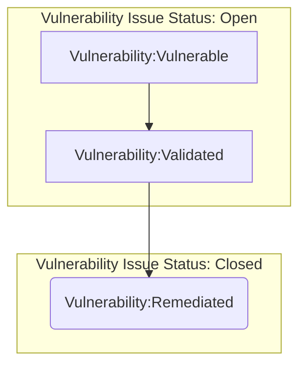
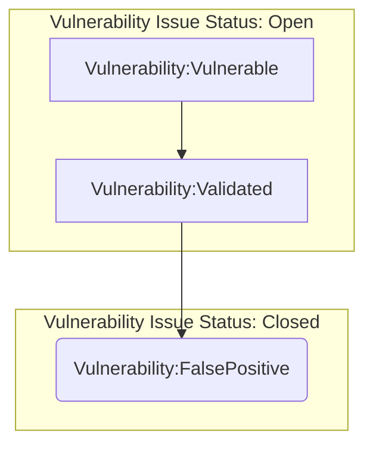
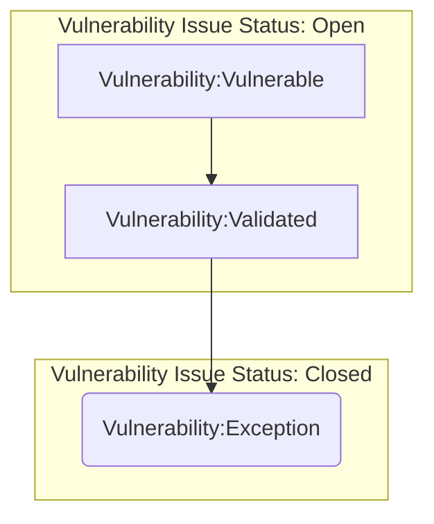
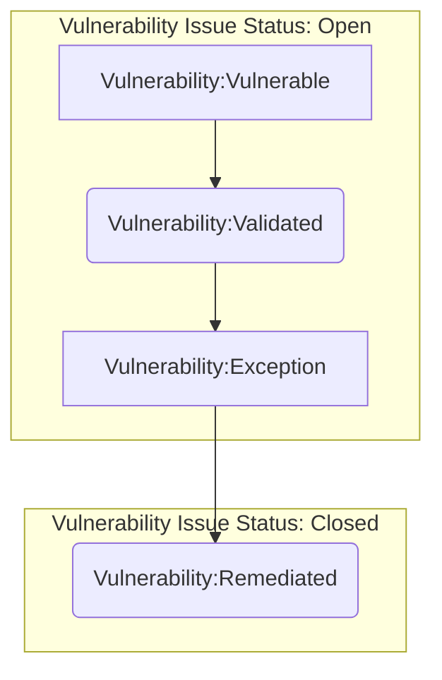
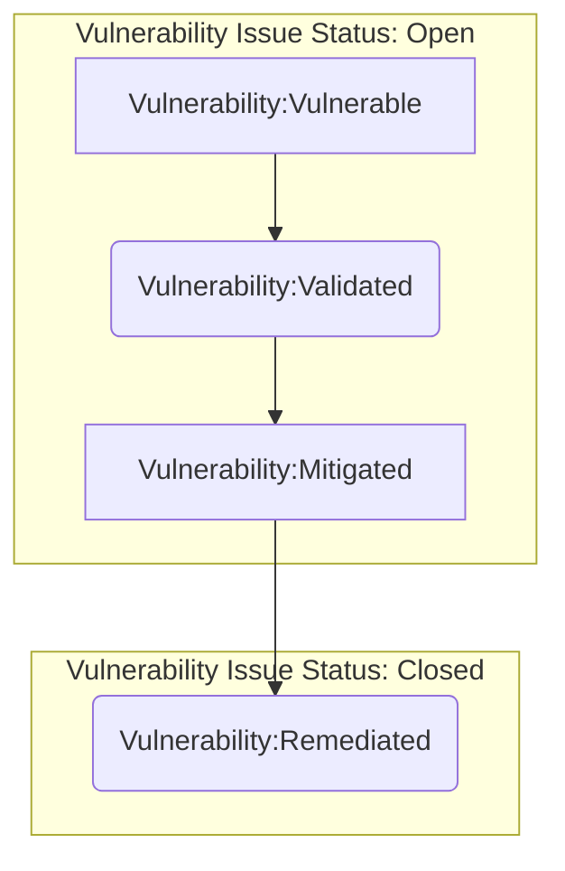

{}
Inline with GitLab's regulatory obligations, changes to [controlled documents]() must be approved or merged by a code owner. All contributions are welcome and encouraged.
{}

This procedure applies to vulnerabilities identified in GitLab Production infrastructure and ensures implmentation of the [Vulnerability Management Standard](). This procedure is designed to provide insight into our environments, promote healthy patch management among other preventative best-practices, and remediate risk; all with the end goal to better secure our environments and our product.

## Scope

Security and Infrastructure partnered to come up with a scope that would make sure all of our critical environments and systems were covered during deployment. The following environments are currently `in-scope` for GitLab.com and GitLab Dedicated production:

| Environment  | Project/Account        | Production  | Deployed |
| :---         | :----                  | :---        | :---     |
| GCP          | gitlab-production      | yes         | yes      |
| GCP          | gitlab-ops             | yes         | yes      |
| GCP          | gs-production          | yes         | yes      |
| GCP          | env-zero               | yes         | yes      |
| GCP          | gemnasium-production   | yes         | yes      |
| GCP          | service-prod           | yes         | yes      |
| GCP          | gitlab-ci              | limited     | yes      |
| AWS          | gitlab-com             | yes         | yes      |
| Azure        | GitLab                 | yes         | no       |

>Note: If you believe a system you are responsible for should be included in the vulnerability management process, please [contact]() the Security Vulnerability Management Team.

With these environments scoped out and Tenable scanners deployed, we can begin the vulnerability management process. Keep in mind that vulnerability management is a feedback loop - vulnerability scanners provide the vulnerability data which is analyzed and ingested to mitigate and remediate found vulnerabilities. Feedback from this process feeds into preventative initiatives that further secure our environments.

Application layer vulnerabilities are our of scope and managed via the [Application Vulnerability Management Procedure]().

## Roles & Responsibilities

| Role | Responsibility |
| -----| -------------|
| Vulnerability Management Team | Responsible for implementing and maintaining this Vulnerability Management Procedure |
| Infrastructure |  Responsible for remediating vulnerabilites according to procedure |
| Security Leadership |  Responsible for making final determination on risk acceptance (exceptions) |

## Procedure

Currently, we break down vulnerability management into the following steps:

#### 1. Vulnerability Scanning

This step is where we scan resources in our environments to identify vulnerabilities. Once setup, scans run on regular cadences that meet or exceed our compliance framework requirements. **The vulnerability remediation [SLA timeframes]() begin as soon as a vulnerability is detected by a scanner.**

#### 2. Reporting/Analysis

Vulnerability scan data is exported and analyzed to provide consolidated vulnerability data we can ingest into GitLab.com for vulnerability remediation tracking. This is currently a manual process where we export vulnerability data into a spreadsheet and pull out pertinent information.

Tenable also provides reporting functionality that is used by our Compliance team to run reports for audits.

Currently, we export vulnerabilities as CSV files. These exports are filtered to be specific to the project/account (for example, gitlab-production in GCP gets its own report). Once exported, we analyze
and consolidate the data into different `views`, including: unique vulnerabilities, vulnerability count, vulnerability count by asset, and vulnerability by severity. Once completed, we open a [vulnerability remediation issue](https://gitlab.com/gitlab-com/gl-security/security-operations/sirt/infrastructure-vulnerability-management/-/blob/master/.gitlab/issue_templates/remediation.md)
in the [Vulnerability Management issue tracker](https://gitlab.com/gitlab-com/gl-security/security-operations/sirt/infrastructure-vulnerability-management/-/issues). These issues are where all discussion and documentation for the vulnerability will occur. We also open a linked issue in [Infrastructure issue tracker](https://gitlab.com/gitlab-com/gl-infra/infrastructure/issues)
which is where additional remediation issues for the vulnerabilities get opened and scheduled for review and remediation.

#### 3. Ingestion

Once the data is prepared in a format that we can pull out the most important information, we can ingest into GitLab.com. Issues are opened in the [Vulnerability Management tracker](https://gitlab.com/gitlab-com/gl-security/security-operations/sirt/infrastructure-vulnerability-management/-/issues) to track the remediation process of the vulnerability. Another issue is opened in the [Infrastructure issue tracker](https://gitlab.com/gitlab-com/gl-infra/infrastructure/issues) linking to the vulnerability management tracker issue; these are so that the work can properly get prioritized and scheduled according to the Infrastructure team’s workflow.

Currently, we group vulnerabilities into a single remediation issue on a monthly basis as to consolidate the work required to remediate. From here, the SIRT team can work with Infra to prioritize and open additional remediation issues which are linked to the monthly remediation issue.

Vulnerability remediation issues should be tagged with the `vulnerability` type label. These leverage GitLab's [scoped label capability](https://docs.gitlab.com/ee/user/project/labels.html#scoped-labels). The following labels exist to track the vulnerability remediation workflow:

- `~vulnerability::vulnerable`: This label identifies that the vulnerability has been opened, but not validated and is considered impactful to our environments per the assigned priority label. With this label a vulnerability issue should not be closed.
- `~vulnerability::validated`: This label identifies that the vulnerability has been validated as legitimate and is scheduled for mitigation or remediation. With this label a vulnerability issue should not be closed.
- `~vulnerability::falsepositive`: This label identifies that the vulnerability has been validated as a false positive and is no longer impactful to our environments. With this label a vulnerability issue can be closed.
- `~vulnerability::exception`: This label identifies that the vulnerability has been validated as legitimate and has an approved exception issue to account for a business need. In extreme circumstances, a vulnerability issue can be closed with an exception.
- `~vulnerability::mitigated`: This label identifies that the vulnerability has been validated and triaged. The impact has been reduced through compensating controls, but not remediated (it is still actively identified on vulnerability scans). With this label a vulnerability issue should not be closed.
- `~vulnerability::remediated`: This label identifies that the vulnerability has been remediated and the remediation has been validated. With this label a vulnerability issue can be closed.

We also add the `VM` label to all Vulnerability issues to scope the issues in the [Vulnerability Management issue board](https://gitlab.com/gitlab-com/gl-security/security-operations/sirt/infrastructure-vulnerability-management/-/boards/1573615).

#### 4. Validation

Validation is an important part of vulnerability management. This is where we investigate to ensure that the vulnerability being reported has properly been identified.

Vulnerabilities can sometimes be identified during a scan, but are not actually on the system. This can happen for a number of reasons, but most commonly is the result of misflagged ports or services. These are classified as false positives and would go through the [process to be closed as a false positive]().

#### 5. Remediation

Remediation is the part of the process in which a validated vulnerability is fixed. The remediation process would be tracked in the corresponding vulnerability issue in the [Vulnerability Management issue tracker](https://gitlab.com/gitlab-com/gl-security/security-operations/sirt/infrastructure-vulnerability-management/-/issues). SLAs are in place to help prioritize vulnerability based on severity. **The [vulnerability remediation SLA timeframes](https://gitlab.com/-/ide/project/gitlab-com/www-gitlab-com/edit/master/-/sites/handbook/source/handbook/security/threat-management/vulnerability-management/index.html.md?_gl=1%2a1gibb41%2a_ga%2aMTQ0NzQ5OTk5NS4xNjU0MTI3MTUz%2a_ga_ENFH3X7M5Y%2aMTY2ODUyMTA2My4yOTguMS4xNjY4NTIxOTc3LjAuMC4w#L216) begin as soon as a vulnerability is detected by a scanner.** Once a vulnerability is remediated, we will run followup scans on the impacted systems to validate that the vulnerability is indeed remediated.

We've implementing an escalation path for remediation issues in the [Infrastructure issue tracker](https://gitlab.com/gitlab-com/gl-infra/infrastructure/issues) that automatically tags the VM DRI and backup when remediation issues are approaching/past [SLAs]().

For improved tracking of remediation issues, we are using GitLab Epics. The [remediation epic](https://gitlab.com/groups/gitlab-com/gl-security/security-operations/sirt/-/epics/1) includes monthly subepics that track remediation progress for that month. If remediation SLAs do not require a vulnerability to be remediated in a month, it will be rolled over into the following subepic until remediated or its due date passes.

#### Vulnerability Issue Workflows

There are several ways a vulnerability issue can be closed - below are some common vulnerability workflows using the `vulnerability` labels as reference:

##### Closed as Remediated

The most common workflow is to close a vulnerability issue as `Remediated`. This means that a vulnerability has been validated and remediation has taken place. Below is the workflow:

##### Closed as False Positive

A vulnerability must always be validated - but sometimes the validation can prove that a vulnerability is a false positive. Below is the workflow:

##### Closed as Exception

Sometimes issues arise that would otherwise prevent a vulnerability from being remediated or mitigated. While commonly, these would result in an open `Exception` vulnerability issue status, there are unique cases where an issue can be closed as an exception. Below is the workflow:

##### Open as Exception

Closed issue via the `Exception` process are very rare. Generally, an exception is a non-permanent way to assume risk on a vulnerability due to extenuating circumstances in which remediation can not take place within the required SLAs. Below is the described the workflow:

##### Open as Mitigated

Another common workflow is when a vulnerability is validated and a fix is scheduled for some time in the future (within the SLA). If we're able to, we will put mitigation in place in the interim to reduce the risk from the vulnerability. Below is the described workflow:

#### 6. Feedback

The last step is for the Security Incident Response Team and Infrastructure to determine what we can learn from each vulnerability remediated. This may be an improvement on the vulnerability management process itself or establishing preventive mechanisms for a repetitive vulnerability type. This feedback will be documented in the vulnerability issue and could result in additional issues being opened.

As stated above, this process is a cyclical loop. Vulnerability scans are recurring, providing new vulnerability data that feed new vulnerability remediation and exception issues which then help update/escalate open issues/processes.

### Host Validation

To ensure we are scanning all possible hosts in the scoped environments, we leverage [Tenable connectors](https://docs.tenable.com/cloud/Content/Settings/Connectors.htm). These connectors run as a service account in our environment projects/accounts and pull metadata regarding all cloud compute assets, thus populating an up-to-date view of all the assets in our environment. These imports run on a 24-hour schedule, meaning we always have a daily view of our assets across the environments.

We setup our traditional scans using subnets that encompass all of our assets. When new subnets are setup in our environments (for example, VPC networks in GCP or AWS), part of the process of setting up that network is making sure that (if in scope) authenticated vulnerability scans are setup. If a connector import ever finds an asset outside of the subnets we are currently scanning, an investigation is launched to determine the validity of that host. These hosts would show up as validated, but unassessed. If a legitimate host has been found in a new subnet, we will add the subnet into our scanning schedule. While we prefer to setup the scans prior to new networks being setup, this feedback loop ensures we never miss assets when scanning.

### Vulnerability Scanning Schedule

Vulnerability scans occur on a weekly basis in our [scoped environments](). The schedule can be seen below:

The start times are always consistent - however, scan durations may fluctuate based on different factors. Generally, the production scans complete in under 2-hours. We’ve segmented the `gitlab-production` scans into multiple separate smaller scans to reduce impact to the environment. We’ve also enabled load throttling, so if increased load is detected on the systems/networks being scanned, Tenable will reduce its footprint to further reduce impact.

The target groups used in these scans are setup using GCP VPC network ranges to ensure any newly provisioned resources are scanned without manually inputting the cloud compute resource's IP into the scan. We will leverage similar functionality during our AWS and Azure deployments to ensure consistent coverage.

{}
For more information, please visit the `#tenable-notifications` channel on Slack where there are links to documentation breaking down which hosts are in the different scan groups.
{}

## Exceptions

Refer to [Vulnerability Management Standard Risk Acceptance (Exceptions)]()

## References

- [Vulnerability Management Standard]()
- [Application Vulnerability Management Procedure]()
