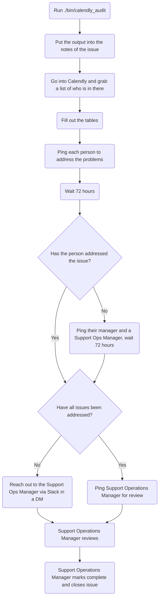

## When do we perform these?

Calendly audits are to be completed every 6 months:

- Once in the first quarter of the fiscal year
- Once in the third quarter of the fiscal year

## Process

To get started, you will first want to make an issue using the
[Calendly issue template](https://gitlab.com/gitlab-com/support/support-ops/support-ops-tools/audits/-/issues/new?issuable_template=Calendly)
in the
[audits project](https://gitlab.com/gitlab-com/support/support-ops/support-ops-tools/audits).

As the API is not yet able to handle this, this process will be a bit more of a
manual process. To start, you will want to run the
[calendly audit script](https://gitlab.com/gitlab-com/support/support-ops/support-ops-tools/audits/-/blob/master/bin/calendly_audit)
(see [below](#running-the-script) for help with running the script). Once the
script completes, it will output a large amount of information. This should be
copied and pasted into the `## Notes` section of the issue you created via the
[Calendly issue template](https://gitlab.com/gitlab-com/support/support-ops/support-ops-tools/audits/-/issues/new?issuable_template=Calendly).

From there, you need to go through the items reported and ping the person in
the issue to ask for the item to be fixed (or clarify if this is intentional).
This can take time, so wait about 72 hours after pinging someone before
following back up. If the person has not replied concerning the topic by that
time, ping that person's manager (as well as the Support Operations Manager).

After that, you need to go into Calendly and confirm who is and isn't there. It
helps to make a list of who all is in the
[Calendly group](https://calendly.com/app/organization/users)
and then correlate it to what the script outputed. Any users in Calendly but
not outputted from the script need to be noted and we will need confirmation of
why they are in there. If no justifcation can be made, they will need to be
removed.

Once all the items have been addressed, you will then ping a Support Operations
Manager to review the audit. They will then close out the issue.

#### Flowchart



#### Running the script

The requirements to run the script are:

- Ruby (version 3.0.1)
- A GitLab.com personal access token

To run the script, you will want to do the following commands:

```bash
git clone git@gitlab.com:gitlab-com/support/support-ops/audits.git
cd audits
gem install bundler
bundle install
./bin/calendly_audit
```

**Note**: This uses environment variables to run. As such, you'd want to set
the following environment variables:

- `GL_TOKEN` - The GitLab.com access token to use

As the script output is quite large, you might want to have it output to a file
so you don't lose the data due to scrollback. This can be done by doing the
following:

```bash
./bin/calendly_audit > audit_output.txt
```

#### How the script works

1. The script grabs the data from the
   [support-team.yaml](https://gitlab.com/gitlab-com/support/team/-/blob/master/data/support-team.yaml)
   file
1. The script outputs the table headers for the Support Team table
1. The script iterates over each person form the
   [support-team.yaml](https://gitlab.com/gitlab-com/support/team/-/blob/master/data/support-team.yaml)
   file, output the table information it can
   - If the person is missing a calendly link in the
     [support-team.yaml](https://gitlab.com/gitlab-com/support/team/-/blob/master/data/support-team.yaml)
     file, it will make note of that
1. The script then outputs the table headers for the Those in Calendly but not
   part of support team table

#### What issues does the script check for?

As it goes through the agents from the
[support-team.yaml](https://gitlab.com/gitlab-com/support/team/-/blob/master/data/support-team.yaml)
file, it checks the following:

- Do they have a calendly link in the
  [support-team.yaml](https://gitlab.com/gitlab-com/support/team/-/blob/master/data/support-team.yaml)
  file?
