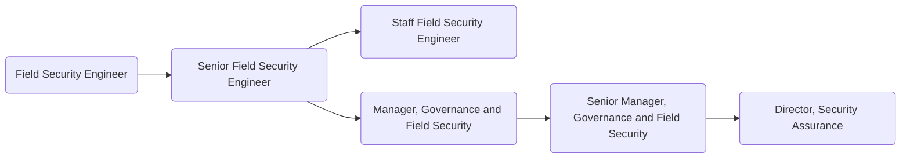

As members of GitLab's [Security Assurance sub department](https://about.gitlab.com/handbook/security/security-assurance/), the [Field Security team](https://about.gitlab.com/handbook/security/security-assurance/field-security/) serves as the public representation of GitLab's internal Security function. The team is tasked with providing high levels of security assurance to internal and external customers through customer support, sales enablement and security evangelism programs.

## Responsibilities

- Professionally handle communications with internal and external stakeholders
- Maintain up-to-date knowledge of GitLab's product, environment, systems and architecture
- Educate internal and external stakeholders on GitLab’s Security practices through formal and informal training, handbook improvements, white papers, conference presentations and blog posts
- Gather and report on established metrics within the field security program

## Requirements

- Capability to use GitLab
- Exemplary written and verbal communication and presentation skills
- Prior experience working with a SaaS company preferred

## Levels

### Field Security Engineer (Intermediate)

This position reports to the Manager, Governance and Field Security at GitLab.

#### Field Security Engineer (Intermediate) Job Grade

The Field Security Engineer is a [6](https://about.gitlab.com/handbook/total-rewards/compensation/compensation-calculator/#gitlab-job-grades).

#### Field Security Engineer (Intermediate) Responsibilities

- Complete customer security assessments, questionnaires and sales enablement activities within pre defined SLA
- Maintain the Customer Assurance Package and other self-service customer security resources
- Maintain GitLab's standard security response database
- Triage new or changing security requirements, security issues, and/or customer risks
- Maintain handbook pages, policies, standards, procedures and runbooks related to Field Security
- Identify opportunities for Field Security process automation
- Maintain Field Security automation tasks
- Maintain security sales enablement educational materials and support security evangelism
- Support Field Security internally facing presentations such as Sales Kick Off, Sales Quick Start, Quarterly Business Reviews, and Customer Success Skills Exchange
- Proactively identify new or increased customer security concerns with management

#### Field Security Engineer (Intermediate) Requirements

- At least 2 years of experience conducting customer assurance activities
- Demonstrated experience with at least two security control frameworks such as: SOC 2, ISO, NIST, COSO, COBIT
- Working understanding of how security works with cloud-native technology stacks

### Senior Field Security Engineer

This position reports to the Manager, Governance and Field Security at GitLab.

#### Senior Field Security Engineer Job Grade

The Senior Field Security Engineer is a [7](https://about.gitlab.com/handbook/total-rewards/compensation/compensation-calculator/#gitlab-job-grades).

#### Senior Field Security Engineer Responsibilities

- Extends the Field Security Engineer responsibilities
- Maintain up-to-date knowledge of GitLab's product, roadmap, environment, systems and architecture
- Build a strong, collaborative partnership with Sales, Product, Customer Support and Technical Account teams.
- Independently execute sales enablement activities, including customer assurance activity requests and self-attestations
- Execute end to end Field Security initiatives in accordance with the compliance roadmap
- Mature the Customer Assurance Package and other self-service customer security resources
- Monitor industry trends and demands to proactively position GitLab as an industry leader in Security and execute initiatives to support these trends
- Execute peer reviews and provide meaningful feedback
- Design and implement requirements for Field Security automation tasks
- Recommend new Field Security metrics and automate reporting of existing metrics
- Mature security sales enablement educational program
- Present a minimum of 4 internally facing presentations per annum such as Sales Kick Off, Sales Quick Start, Quarterly Business Reviews, and Customer Success Skills Exchange
- Build the GitLab Security brand by presenting a minimum of 2 external facing engagements per annum, ex: Commit, SKO, conferences, guest speaking engagements, blog posts, whitepapers
- Monitor and report on new or increased customer security concerns

#### Senior Field Security Engineer Requirements

- Ability to use GitLab
- At least 5 years of experience conducting customer assurance activities
- Demonstrated experience with at least four security control frameworks such as: SOC 2, ISO, NIST, COSO, COBIT
- Demonstrated industry security experience, particularly in DevSecOps, Application Security and/or Cloud-Native Security

### Staff Field Security Engineer

This position reports to the Manager, Governance Field Security at GitLab.

#### Staff Field Security Engineer Job Grade

The Staff Field Security Engineer is a [8](https://about.gitlab.com/handbook/total-rewards/compensation/compensation-calculator/#gitlab-job-grades).

#### Staff Field Security Engineer Responsibilities

- Extends the Senior Field Security Engineer responsibilities
- Maintain proficient knowledge of GitLab's product, roadmap, environment, systems and architecture and help shape strategic decisions focused on meeting customer security demands
- Mentor other Field Security Engineers and improve knowledge, quality and quantity of the team's output
- Participate in the development and continuous improvement of field security metrics
- Design and implement major iterations of Field Security programs in alignment with industry trends, predictions and customer demands
- Participate in Field Security roadmap development based on customer needs
- Build the GitLab Security brand by presenting a minimum of 6 external facing engagements per annum such as Commit, conferences, guest speaking engagements, blog posts, whitepapers
- Create dynamic open-source Field Security programs that deliver value to the GitLab community
- Design, develop, and deploy scripts to automate administrative and process tasks related to Field Security
- Design, develop, and deploy an automated metric reporting for all Field Security programs
- Successfully execute on quarterly KRs asscoiated with OKRs

#### Staff Field Security Engineer Requirements

- At least 10 years of experience conducting customer assurance activities
- Proficient experience with at least six security control frameworks such as: SOC 2, ISO, NIST, COSO, COBIT
- Demonstrated industry security experience, particularly in DevSecOps, Application Security and/or Cloud-Native Security

### Manager, Governance and Field Security

This position reports to the Director, Security Assurance.

#### Manager, Governance and Field Security Job Grade

The {Manager, Governance and Field Security} is a [grade 8](https://about.gitlab.com/handbook/total-rewards/compensation/compensation-calculator/#gitlab-job-grades).

#### Manager, Governance and Field Security Responsibilities

- Hire and oversee a world class team of Security Governance and Field Security Engineers
- Hold regular 1:1s with team members
- Build a strong, collaborative partnership with Security, Training, Legal, Infrastructure, Sales and Product teams
- Manage a robust governance program, to include oversight of security policies, security training and awareness programs
- Manage a robust field security program, to include oversight of security RFP databases, customer assurance, and security evangilization activites
- Assess and promote customer concerns, industry trends and changing regulatory requirements and appropriately adjust the scope to accommodate these changes
- Oversee deployment and promote continuous improvement of Security Assurance technologies, automations and integrations
- Present a minimum of 3 external facing engagements per annum, ex: Commit, SKO, QBRs, conferences, guest speaking engagements, blog posts, whitepapers
- Prepare and deliver meaningful metrics to Security Assurance leadership
- Successfully execute on quarterly OKR(s)

#### Manager, Governance and Field Security Requirements

- At least 3 years prior experience managing information security and customer facing teams
- Exceptional communication skills, including verbal, written, and presentation skills to a variety of stakeholders
- Detailed knowledge of common information security management frameworks, regulatory requirements and applicable standards such as: ISO 27001, SOC 2, HIPAA, GDPR, PCI, SOX, etc.

### Senior Manager, Governance and Field Security

This position reports to the Director, Security Assurance.

#### Senior Manager, Governance and Field Security

The {Senior Manager, Governance and Field Security} is a [grade 9](https://about.gitlab.com/handbook/total-rewards/compensation/compensation-calculator/#gitlab-job-grades).

#### Senior Manager, Governance and Field Security Responsibilities

- The same responsibilities of a Manager, Governance and Field Security, plus the below:
- Hold regular 1:1s with team managers and skip-level 1:1s with all members of their team
- Plan and execute long term strategies that benefit your team and align with strategic objectives
- Partner with the product organization to dogfood and drive GitLab security and compliance features
- Expose technology and organizational needs throughout security assurance and oversee successful deployments
- Create and deploy innovative and effective strategies for proactively addressing regulatory and customer security requests
- Maintain reliable, up-to-date, information across the industry regarding new security trends, threats and vulnerabilities
- Present a minimum of 6 external facing engagements per annum, ex: Commit, SKO, QBRs, conferences, guest speaking engagements, blog posts, whitepapers
- Proactively identify new metrics along with strategic recommendations to Security Assurance leadership
- Draft and successfully execute on multiple quarterly OKRs

#### Senior Manager, Governance and Field Security Requirements

- At least 6 years prior experience managing information security and customer facing teams
- Outstanding communication skills, including verbal, written, and presentation skills to a variety of stakeholders
- Expert knowledge of common information security management frameworks, regulatory requirements and applicable standards such as: ISO 27001, SOC 2, HIPAA, GDPR, PCI, SOX, etc.

## Segment

### Security Leadership

For details on the Security organization leadership roles, to include the Security Assurance Director and VP of Security, see the Security Leadership page.

## Performance Indicators

- [Security Impact on ARR](https://about.gitlab.com/handbook/security/performance-indicators/#security-impact-on-iacv)

## Career Ladder

## Hiring Process

Candidates for this position can expect the hiring process to follow the order below. Please keep in mind that candidates can be declined from the position at any stage of the process. To learn more about someone who may be conducting the interview, find their job title on our [team page](https://about.gitlab.com/company/team/).

- Qualified candidates will be invited to schedule a 30 minute [screening call](https://about.gitlab.com/handbook/hiring/interviewing/#screening-call) with one of our Global Recruiters.
- Next, candidates will be invited to schedule a 50-minute interviews with the hiring manager,
- Then, candidates will be invited to schedule 3 separate 50-minute interviews with 3 different peers from within the Security orgnanization,
- Finally, candidates will be invited to schedule a 25-minute interview with the Director, Security Assurance.

Additional details about our process can be found on our [hiring page](https://about.gitlab.com/handbook/hiring/).
