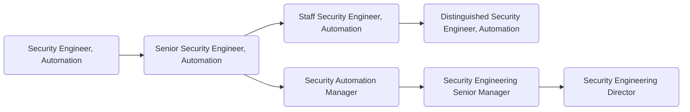

For members of GitLab's [Security Automation sub department](https://about.gitlab.com/handbook/security/security-engineering/automation/), it is the goal of [Security Engineering](https://about.gitlab.com/handbook/security/security-engineering/) through leveraging of diverse technologies and an automation first approach, to strive towards improving the efficiency, effectiveness, and accuracy within GitLab's Information Security program with a focus on cost savings. Examples include the creation of automated security issue triage and management solutions, automating handling of repetitive tasks, and defining re-usable security automation architectures. Additionally, the Security Automation team assist other security specialty teams with automation efforts they are leading and developing through the assessment of automation tools, and integration tools and technologies to support automation efforts as needed.

## Responsibilities

- Design, engineer, deploy, and maintain custom automation products
- Build security tooling and automation for internal use that enable the Security Department to operate at high speed and wide scale
- Define and own metrics and key performance indicators to determine the effectiveness of the Security Automation program
- Collaborate with product teams to ensure that the GitLab product meets security automation requirements for ourselves and our users
- Assess automation tools and integrate tools as needed, particularly open-source tools
- Assist with recruiting activities and administrative work
- Produce quality automation code

## Requirements

- Ability to use GitLab
- You are a team player, and enjoy collaborating with cross-functional teams
- You employ a flexible and constructive approach when solving problems
- You share our [values](/handbook/values/), and work in accordance with those values
- Prior experience working with a SaaS company preferred
- You have passion for transparent security programs
- Passion for technology and automation
- Ability to communicate clearly on technical issues
- An understanding of how to write code that is not only secure but scales to a large number of users and systems

## Levels

### Security Engineer, Automation (Intermediate)

This position reports to the [Security Automation Manager](#security-automation-manager) role at GitLab.

#### Job Grade

The {Security Engineer, Automation} is a [grade 6](https://about.gitlab.com/handbook/total-rewards/compensation/compensation-calculator/#gitlab-job-grades).

#### Responsibilities

- Assist with the design, engineering, deployment, and maintenance of custom automation products
- Assist with the evaluation of automation tools for use by the Security Automation team and Seurity Department
- Assist with the design and gathering of metrics data for the Security Automation program

#### Requirements

- Previous experience on a Security Operations, Software Development, Automation team, or relevant education
- Good written and verbal communication skills
- Scripting/coding experience with one or more languages - Python, Ruby, and/or Golang experience a plus
- knowledge of Internet security issues, automation or software engineering technologies, cloud architectures, and threat landscape concepts
- Understanding of the Software as a Service (SaaS) model
- Understanding of the DevOps model
- Familiarity with Cloud Computing Platforms - GCP experience a plus
- Familiarity with Kubernetes a plus
- Familiarity with infrastructure as code processes and tools a plus

### Senior Security Engineer, Automation

This position reports to the [Security Automation Manager](#security-automation-manager) role at GitLab.

#### Job Grade

The {Senior Security Engineer, Automation} is a [grade 7](https://about.gitlab.com/handbook/total-rewards/compensation/compensation-calculator/#gitlab-job-grades).

#### Responsibilities

- Design, engineer, deploy, and maintain custom automation products
- Evaluate automation tools for use by the Security Automation team and Seurity Department
- Design and gather metrics data for the Security Automation program
- Represent the Security Automation team as a subject matter expert in at least one technical, product, or conceptual area

#### Requirements

- 5 years previous experience on a Security Operations, Software Development, Automation team, or relevant education
- Great written and verbal communication skills
- Hand on scripting/coding experience with one or more languages - Python, Ruby, and/or Golang experience a plus
- Solid understanding of Internet security issues, automation or software engineering technologies, cloud architectures, and threat landscape concepts
- Solid understanding of the Software as a Service (SaaS) model
- Solid understanding of the DevOps model
- Experience with Cloud Computing Platforms - GCP experience a plus
- Experience with Kubernetes a plus
- Experience with infrastructure as code processes and tools a plus

### Staff Security Engineer, Automation

This position reports to the [Security Automation Manager](#security-automation-manager) role at GitLab.

#### Job Grade

The {Staff Security Engineer, Automation} is a [grade 8](https://about.gitlab.com/handbook/total-rewards/compensation/compensation-calculator/#gitlab-job-grades).

#### Responsibilities

- The responsibilities of a Senior Security Engineer, Automation, plus;
- Lead the design, engineering, deployment, and maintenance efforts of custom automation products
- Define evaluation criteria for automation tools to be used by the Security Automation team and Seurity Department
- Lead efforts to gather metrics data for the Security Automation program
- Represent the Security Automation team as a subject matter expert in at least two technical, product, or conceptual area

#### Requirements

- 10 years previous experience on a Security Operations, Software Development, Automation team, or relevant education
- Excellent written and verbal communication skills
- Expert scripting/coding skills in one or more languages - Python, Ruby, and/or Golang experience a plus
- Excellent understanding of Internet security issues, automation or software engineering technologies, cloud architectures, and threat landscape concepts
- Excellent understanding of the Software as a Service (SaaS) model
- Experience working in the DevOps model
- Solid experience with Cloud Computing Platforms - GCP experience a plus

### Distinguished Security Engineer, Automation

This position reports to the [Security Engineering Director](/job-families/security/security-leadership/#director-security-operations) role at GitLab.

#### Job Grade

The {Distinguished Security Engineer, Automation} is a [grade 10](https://about.gitlab.com/handbook/total-rewards/compensation/compensation-calculator/#gitlab-job-grades).

#### Responsibilities

- The responsibilities of a Staff Security Engineer, Automation, plus;
- Drive the design, engineering, deployment, and maintenance of custom automation products
- Drive the technical direction and roadmap of the Security Automation program
- Drive the business value relation of metrics calculations for the Security Automation program
- Represent the Security Automation team across GitLab as a subject matter expert in technology, development, and automation concepts
- Work in a leveraged manner influencing other organizations and teams across GitLab with secure automation approaches and a focus on problem solving with automation

#### Requirements

- 15 years previous experience on a Security Operations, Software Development, Automation team, or relevant education
- Excellent written and verbal communication skills
- Expert scripting/coding skills in one or more languages - Python, Ruby, and/or Golang experience a plus
- Expert understanding of Internet security issues, automation or software engineering technologies, cloud architectures, and threat landscape concepts
- Expert understanding of the Software as a Service (SaaS) model
- Experience leading efforts or managing automation or development teams working in the DevOps model
- Hands on experience architecting, automating, maintaining, and securing Cloud Computing Platforms - GCP experience a plus

### Security Automation Manager

This position reports to the [Security Engineering Director](/job-families/security/security-leadership/#director-security-operations) role at GitLab.

#### Job Grade

The {Security Automation Manager} is a [grade 8](https://about.gitlab.com/handbook/total-rewards/compensation/compensation-calculator/#gitlab-job-grades).

#### Responsibilities

- Hire and oversee a world class team of security automation engineers
- Help their team grow their skills and experience
- Provide input on security architecture, issues, and features
- Hold regular 1:1's with all members of their team
- Create a sense of psychological safety on their team
- Recommend security-related technical and process improvements
- Author project plans for security initiatives
- Draft quarterly OKRs
- Train team members to screen candidates and conduct managerial interviews
- Sense of ownership, urgency, and drive
- Excellent written and verbal communication skills, especially experience with executive-level communications
- Ability to make concrete progress in the face of ambiguity and imperfect knowledge
- Prepare and deliver meaningful metrics to Security Engineering leadership
- Successfully execute on quarterly OKRs

#### Requirements

- Demonstrable prior people management experience
Enjoys working hard; is action oriented and full of energy for the things he/she sees as challenging; not fearful of acting with a minimum of planning; seizes more opportunities than others.
- Can effectively cope with change; can shift gears comfortably; can decide and act without having the total picture; isn’t upset when things are up in the air; doesn’t have to finish things before moving on; can comfortably handle risk and uncertainty.
- Knows how businesses work; knowledgeable in current and possible future policies, practices, trends, and information affecting their business and organization; knows the competition; is aware of how strategies and tactics work in the marketplace.
- Deals with problem reports firmly and in a timely manner; doesn’t allow problems to fester; regularly reviews performance and holds timely discussions; can make negative decisions when all other efforts fail; deals effectively with troublemakers.
- Makes good decisions (without considering how much time it takes) based upon a mixture of analysis, wisdom, experience, and judgment; most of their solutions and suggestions turn out to be correct and accurate when judged over time; sought out by others for advice and solutions.
- Provides challenging and stretching tasks and assignments; holds frequent development discussions; is aware of each report’s career goals; constructs compelling development plans and executes them; pushes reports to accept developmental moves; will take reports who need work; is a people builder.
- Is good at establishing clear guidance; sets stretching goals; distributes the workload appropriately; lays out work in a well-planned and organized manner; maintains two-way dialogue with others on work and results; brings out the best in people; is a clear communicator.
- Is widely trusted; is seen as a direct, truthful; can present the unvarnished truth in an appropriate and helpful manner; keeps confidences; admits mistakes; doesn’t misrepresent him/herself for personal gain.
- Doesn’t hold back anything that needs to be said; provides current, direct, complete, and “actionable” positive and corrective feedback to others; lets people know where they stand; faces up to people problems on any person or situation (not including direct reports) quickly and directly; is not afraid to take negative action when necessary.
- Assigns responsibility for tasks and decisions; sets clear goals and measures; monitors process, progress, and results; designs feedback loops into work.
- Creates a climate in which people want to do their best; can motivate many kinds of reports and team or project members; can assess each persons hot button and use it to get the best out of him/her; pushes tasks and decisions down; empowers others; invites input from each person and shares ownership and visibility; makes each person feel their work is important; is someone people like working for and with.
- Scopes out length and difficulty of tasks and projects; sets goals; breaks down work into the process steps; develops schedules and task/people assignments; anticipates and adjusts for problems and roadblocks; measures performance against goals; evaluates results.
- Uses rigorous logic and methods to solve difficult problems with effective solutions; probes all fruitful sources for answers; can see hidden problems; is excellent at honest analysis; looks beyond the obvious and doesn’t stop at the first answers.
- Can be counted on to exceed goals successfully; is constantly and consistently one of the top performers; very bottom-line oriented; steadfastly pushes self and others for results.

### Security Automation Senior Manager

This position reports to the [Security Engineering Director](/job-families/security/security-leadership/#director-security-operations) role at GitLab.

#### Job Grade

The {Security Automation Senior Manager} is a [grade 9](https://about.gitlab.com/handbook/total-rewards/compensation/compensation-calculator/#gitlab-job-grades).

#### Responsibilities

- The same responsibilities of a Security Automation Manager, plus the below:
- Maintain reliable, up-to-date, information regarding automation technology changes and trends
- Execute strategic vision for the Security Automation program
- Draft and successfully execute on quarterly OKRs

#### Requirements

- At least 5 years prior experience managing security engineering teams

## Segment

### Security Leadership

For details on the Security organization leadership roles, to include the Security Engineering Director and VP of Security, see the Security Leadership page.

## Performance Indicators

- [Mean-Time-To-Mitigation (MTTM) for severity::1-severity::2-severity::3 security vulnerabilities](https://about.gitlab.com/handbook/security/performance-indicators/#mttm-mean-time-to-mitigation-for-severity1-severity2-severity3-security-vulnerabilities)

## Career Ladder

## Hiring Process

Candidates for this position can expect the hiring process to follow the order below. Please keep in mind that candidates can be declined from the position at any stage of the process. To learn more about someone who may be conducting the interview, find their job title on our [team page](https://about.gitlab.com/company/team/).

- Qualified candidates will be invited to schedule a 30 minute [screening call](https://about.gitlab.com/handbook/hiring/interviewing/#screening-call) with one of our Global Recruiters.
- Next, candidates will be invited to schedule a 50-minute interviews with the hiring manager,
- Then, candidates will be invited to schedule 3 separate 50-minute interviews with 3 different peers from within the Security orgnaization,
- Finally, candidates will be invited to schedule a 25-minute interview with the Director of Security Engineering.

Additional details about our process can be found on our [hiring page](https://about.gitlab.com/handbook/hiring/).
