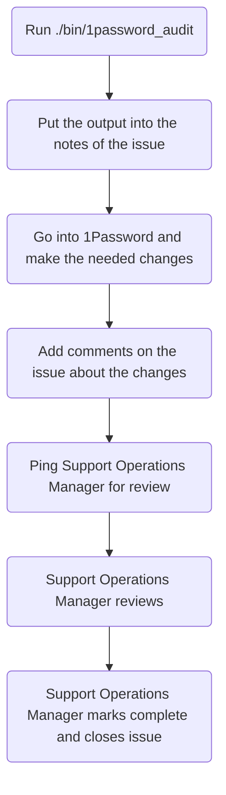

## When do we perform these?

1Password audits are to be completed every 6 months:

- Once in the first quarter of the fiscal year
- Once in the third quarter of the fiscal year

## Process

To get started, you will first want to make an issue using the
[1Password issue template](https://gitlab.com/gitlab-com/support/support-ops/support-ops-tools/audits/-/issues/new?issuable_template=1Password)
in the
[audits project](https://gitlab.com/gitlab-com/support/support-ops/support-ops-tools/audits).

As the API is not yet able to handle this, this process will be a bit more of a
manual process. To start, you will want to run the
[1password_audit audit script](https://gitlab.com/gitlab-com/support/support-ops/support-ops-tools/audits/-/blob/master/bin/1password_audit)
(see [below](#running-the-script) for help with running the script). Once the
script completes, it will output a large amount of information. This should be
copied and pasted into the `## Notes` section of the issue you created via the
[1Password issue template](https://gitlab.com/gitlab-com/support/support-ops/support-ops-tools/audits/-/issues/new?issuable_template=1Password).

After that, you need to go into 1Password and make the changes as shown from
the script output. This may involve adding missing support team members and
removing those that should not be present. Once the changes are made, make
comments on the issues to indicate they have been done.

Once all the items have been addressed, you will then ping a Support Operations
Manager to review the audit. They will then close out the issue.

#### Flowchart



#### Running the script

The requirements to run the script are:

- Ruby (version 3.0.1)
- The `op` script setup (see repo for more details)

To run the script, you will want to do the following commands:

```bash
git clone git@gitlab.com:gitlab-com/support/support-ops/audits.git
cd audits
gem install bundler
bundle install
./bin/1password_audit
```

As the script output is quite large, you might want to have it output to a file
so you don't lose the data due to scrollback. This can be done by doing the
following:

```bash
./bin/1password_audit > audit_output.txt
```

#### How the script works

1. The script grabs the data from the
   [support-team.yaml](https://gitlab.com/gitlab-com/support/team/-/blob/master/data/support-team.yaml)
   file
1. The script outputs the table headers for the Support Team table
1. The script iterates over each person form the
   [support-team.yaml](https://gitlab.com/gitlab-com/support/team/-/blob/master/data/support-team.yaml)
   file, output the table information it can
   - If the person is missing the 1Password Support group, it will make note of that
1. The script then outputs the table headers for the those in the 1Password
   Support group but not part of support team table

#### What issues does the script check for?

As it goes through the agents from the
[support-team.yaml](https://gitlab.com/gitlab-com/support/team/-/blob/master/data/support-team.yaml)
file, it checks the following:

- Are they in the 1Password Support group?

It also checks members of the 1Password Support group that are not in the
support-team.yaml and notes they need to be removed (exceptions are within the
script itself).
