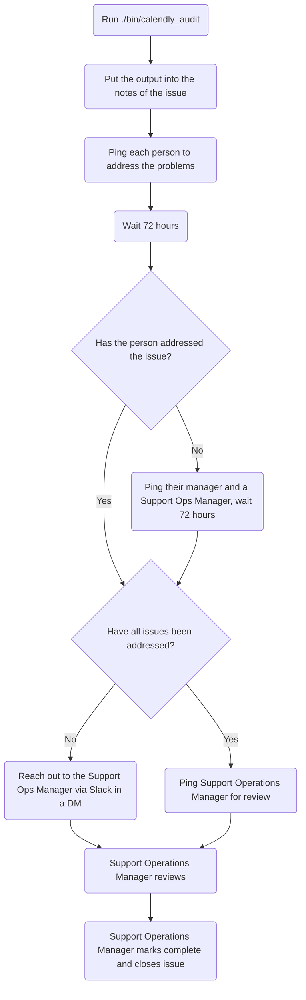

## When do we perform these?

Pagerduty audits are to be completed every 6 months:

- Once in the first quarter of the fiscal year
- Once in the third quarter of the fiscal year

## Process

This is a simpler audit, since it is mostly just checking for valid IDs and
schedules. As this doesn't require much human interaction, it is largely
scripted.

To get started, you will first want to make an issue using the
[Pagerduty issue template](https://gitlab.com/gitlab-com/support/support-ops/support-ops-tools/audits/-/issues/new?issuable_template=Pagerduty)
in the
[audits project](https://gitlab.com/gitlab-com/support/support-ops/support-ops-tools/audits).

To start, you will want to run the
[pagerduty audit script](https://gitlab.com/gitlab-com/support/support-ops/support-ops-tools/audits/-/blob/master/bin/pagerduty_audit)
(see [below](#running-the-script) for help with running the script). Once the
script completes, it will output a large amount of information. This should be
copied and pasted into the `## Notes` section of the issue you created via the
[Pagerduty issue template](https://gitlab.com/gitlab-com/support/support-ops/support-ops-tools/audits/-/issues/new?issuable_template=Pagerduty).

From there, you need to go through the items reported and ping the person in
the issue to ask for the item to be fixed (or clarify if this is intentional).
This can take time, so wait about 72 hours after pinging someone before
following back up. If the person has not replied concerning the topic by that
time, ping that person's manager (as well as the Support Operations Manager).

Once all the items have been addressed, you will then ping a Support Operations
Manager to review the audit. They will then close out the issue.

#### Flowchart



#### Running the script

The requirements to run the script are:

- Ruby (version 2.6 or 2.7 recommended)
- A Pgerduty API token
- A GitLab.com personal access token

To run the script, you will want to do the following commands:

```bash
git clone git@gitlab.com:gitlab-com/support/support-ops/audits.git
cd audits
gem install bundler
bundle install
./bin/pagerduty_audit
```

**NOTE**: This uses environment variables to run. As such, you'd want to set
the following environment variables:

- `PD_TOKEN` - The Pagerduty API token to use
- `GL_TOKEN` - The GitLab.com access token to use

As the script output is quite large, you might want to have it output to a file
so you don't lose the data due to scrollback. This can be done by doing the
following:

```bash
./bin/pagerduty_audit > audit_output.txt
```

#### How the script works

1. The script iterates over the detailed schedules within Pagerduty (they are
   hard-coded into the script currently). During this process, it grabs a list
   of users within the schedules.
1. The script grabs the data from the
   [support-team.yaml](https://gitlab.com/gitlab-com/support/team/-/blob/master/data/support-team.yaml)
   file, iterating over the entries.
   - It skips the iteration if the user is the VP of Support
1. On each iteration, it outputs the users, including notes about the users

#### What issues does the script check for?

As it goes through the agents from the
[support-team.yaml](https://gitlab.com/gitlab-com/support/team/-/blob/master/data/support-team.yaml)
file, it checks the following:

- Does the user have a Pagerduty ID?
- Is the user part of a rotation in the
  [support-team.yaml](https://gitlab.com/gitlab-com/support/team/-/blob/master/data/support-team.yaml)
  file but not in Pagerduty?
