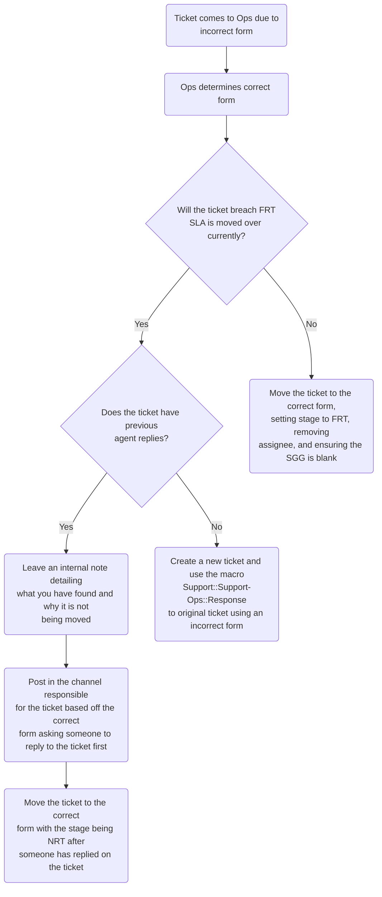

**Note** This is for Zendesk Global tickets only.

Support Operations has a public form that end-users can use to submit tickets.
These go directly to us. Currently, we have 6 problem types:

- [First time setup](#first-time-setup)
- [Manage my organization's contacts](#manage-my-organizations-contacts)
- [Shared organization requests](#shared-organization-requests)
- [Support portal issues](#support-portal-issues)
- [Other](#other)

#### Always check if the user is authenticated

When you are the first one reviewing a ticket, you need to check if the user was
authenticated when the ticket was created (i.e. logged into the support portal).
If they were not, use the macro
`Support::Support-Ops::Ticket filed by unauthenticated user` on the ticket. This
will send a brief message about the current state of the ticket and ask the
requester to reply back confirming the request and actions therein.

#### First time setup

This is for user's who have not been setup in the support portal previously.
Here they should detail what user's they'd like setup and any
important details we should note for working with their organization.

It will largely concern associating a user to an organization and setting up
their list of support contacts.

Please see
[User Association](/handbook/support/readiness/operations/docs/zendesk/user_association/)
for more details on associating users to organizations.

#### Manage my organization's contacts

This is for user's wishing to setup their organization within the support portal
and are not using a contact management project.

Please see
[User Association](/handbook/support/readiness/operations/docs/zendesk/user_association/)
for more details on associating users to organizations.

For removing the association from a user:

1. Locate the user in question (either via the `Users` tab on the organization
   page or via search). From there:
   - If the user in question has a non-closed ticket, make a mental note of
     this. As there is a non-closed ticket, we should not remove them at this
     time. The requester will need to specify what they want done about this
     (close out the ticket, keep the user, etc.)
   - If the user in question was one mentioned in an organization note
     specifying users approved to request changes, make a mental note to
     adjust the organization note via the
     [organizations project](https://gitlab.com/gitlab-com/support/support-ops/zendesk-global/organizations).
1. Remove the association to the organization on the user (done by setting the
   organization to `-`).
1. Add a note on the user with the following:
   > User was de-associated from the organization as per TICKET_LINK

   - Replace `TICKET_LINK` with the link to the request.

After handling the associations and de-associations, you need to reply to the
requester confirming the state of their request. To assist in this process, we
have some macros you can use:

- `Support::Support Ops::Users added to organization`
- `Support::Support Ops::Users removed from organization`
- `Support::Support Ops::User has non-closed tickets`
- `Support::Support Ops::Users need to perform password reset`

These can be used in combination of one another, as they are not full response
macros (but instead pieces of a full response).

#### Maximum contacts limit issues

When a organization not using a contact management project exceeds 30 support
contacts (or a request to add more contacts would do so), we need to intervene
to address that issue. For these types of issues:

1. You should first use the macro
   `Support::Support Ops::Maximum contacts reached`. This will require you to
   attach a CSV of the current contact list for the organization. To get a CSV:
   1. Go to the
      [Advanced Search app](https://gitlab.zendesk.com/agent/apps/advanced-search),
      click the `Users` tab, enter the organization's ID in the `Organization`
      field, then click the blue `Search` button
   1. Click `Columns` and deselect all checkboxes except for `Name` and `Email`
   1. Click the blue `Download CSV` button and wait for the download to complete
      - We suggest renaming the file to something less vague for the customer,
        such as their organizations name or something involving the ticket ID.
1. You will then work with the user to help determine what users to remove (see
   [Manage my organization's contacts](#manage-my-organizations-contacts) for
   more info). This can vary in what exactly will be done, so use your best
   judgment or ask for assistance in the support operations slack channel.

Remember, once the maximum contacts limit issue is fixed, you might need to
review the ticket and go back to a previous issue that the ticket was raised
about.

#### Shared organization requests

These are requests for shared organization setup/management. See the
[Shared Organization management](/handbook/support/readiness/operations/docs/zendesk/organizations/#shared-organization-management)
for more details.

#### Setup a contact management project

These requests are a bit more complicated to do. Please see
[Contact Management Projects](/handbook/support/readiness/operations/docs/gitlab/contact_management_projects/)
for more information on doing these.

#### Support portal issues

These are reports of issues within the support portal. While each issue can
present unique challenges, the common troubleshooting guide for the users would
be:

1. Ensure your browser is allowing third party cookies. These are often vital
   for the system to work. A general list to allow would be:
   - `[*.]zendesk.com`
   - `[*.]zdassets.com`
   - `[*.]gitlab.com`
1. Disable all plugins/extensions/addons on the browser.
1. Disable any themes on the browser.
1. Clear all cookies and cache on the browser.
1. Try logging in again to the the Support Portal.
1. If you are still having issues, obtain the following:
   - the browser’s version
   - the browser's type
   - your operating system (and distro)
   - any other identifying information
   - the complete contents of your Javascript console for your browser
1. Send all of that to support

At the point you get the ticket, the user may or may not have done all of that.
If they have not, point them to trying all that out first.

If they have, you will need to analyze the details of what is sent to determine
next steps.

#### Other

This is a catchall field, meaning there is no specific workflow for requests
using this problem type.

#### Incorrect initial form tickets

When a ticket is filed using the incorrect form, agents will use the
`General::Forms::Incorrect form used` macro. This will change the form to our
form, tag the ticket, and leave an internal note. From there, we are expected
to review the ticket and resolve the problem.

To accomplish this, we need to review the ticket and determine the next steps.
As the ticket as not gotten a first response from the correct team (because it
was using the wrong form), we should be setting the stage to FRT when we correct
the form. If doing so would cause the ticket to instantly breach, we instead
want to create a new ticket.

**Notes**:

1. If the ticket needs to undergo the Needs-Org process, please do that
   in the original ticket first. We want the new ticket to be as ready to be
   worked as possible, and starting a new ticket we created for an end-user with
   the Needs-Org process is not a great customer experience.
1. If you determine the ticket is from a free or community user, there is no
   need to create a new ticket. Instead, simply change the form to the
   appropriate support form and ensure the SaaS/Self-managed Subscription is set
   to 'Free User'. This will ensure the ticket will have no SLA and will be
   visible in the
   [Free user tickets](https://gitlab.zendesk.com/agent/filters/360038103100)
   view.
1. When moving tickets to a new form, do your best to fill out the ticket
   metadata for the team that will work the ticket.

##### If you are making a new ticket

Once you determine the correct form, you should review what ticket fields that
form uses and what information is missing. In the original ticket, leave an
internal comment saying which form needed to be used and what data is missing.
Any of the data you can determine based on the original ticket is a
plus, as it will skip needing to ask the customer to reply with that
information in the new ticket. An example note could be:

> The correct form should have been Self-Managed.
>
> The missing data is:
>
> - Self-Managed Problem Type
> - GitLab Install Type
> - GitLab Version

Once you have noted the original ticket, create the new ticket using the
correct ticket form. Make sure to file the ticket using
<https://support.gitlab.com/hc/en-us/requests/new> (you may need to use a
different browser or an incognito window) so the first reply is from the
original requester and not an agent (this ensures it gets the FRT SLA). Make
sure to fill in as much of the information as is possible. For any information
you do not readily know, do your best to guess for the time being.

Some notes to help in filing the ticket properly:

- The subject of the ticket should be the *exact* same as the original ticket.
- The description should be in the format:
  > Greetings <NAME_OF_ORIGINAL_REQUESTER>,
  >
  > Recently you filed ticket #<ID_OF_ORIGINAL_TICKET> with us. Sadly, it was
  > using the incorrect form and was filed incorrectly on our end. To help
  > clear that up and get you working with the correct team, we are filing this
  > new ticket on your behalf.
  >
  > Your original response was:
  >
  > <DESCRIPTION_FROM_ORIGINAL_TICKET>
  >
  > During our review of ticket #<ID_OF_ORIGINAL_TICKET>, we did find some
  > needed information was missing. Please comment back as soon as possible
  > with the following information:
  >
  > <LIST_OF_MISSING_DATA>
  >
  > While we review your ticket, here is some other data you could also send
  > that is often helpful to us:
  >
  > - A GitLabSOS report (<https://gitlab.com/gitlab-com/support/toolbox/gitlabsos/>) if you are using Omnibus
  > - A KubeSOS report (<https://gitlab.com/gitlab-com/support/toolbox/kubesos/>) if you are using Kubernetes
  >

- Markdown does not work for customer filed tickets. Try to limit the markdown
  used to markdown that will still render properly in plaintext

Once the new ticket is created, notate the original ticket and send a reply using the [`Support::Support-Ops::Response to original ticket using an incorrect form`](https://gitlab.zendesk.com/admin/workspaces/agent-workspace/macros/4623695359260) macro.
