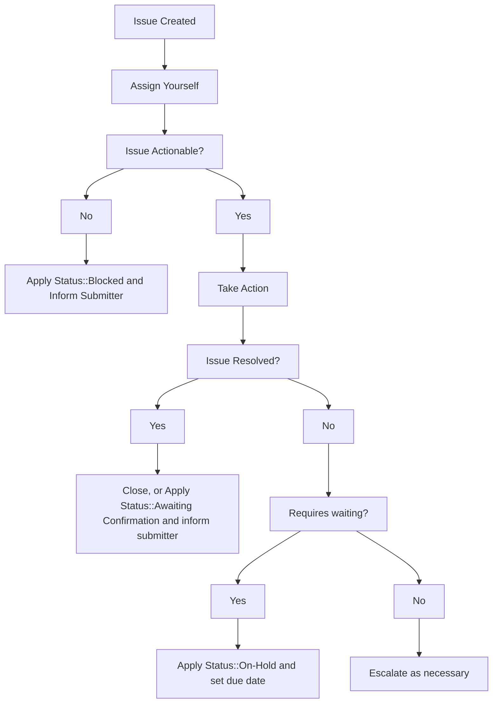

---

title: Handling Internal Requests
description: "Various templates and workflows that should be followed in order to properly handle GitLab.com related requests that Support receives in the internal requests issue tracker"
category: GitLab.com
---

**NOTE:** If you are a GitLab team member who wants to file an internal request, please see the [Support Internal Requests handbook page](/handbook/support/internal-support/).

**NOTE:** For internal requests relating to licenses and subscriptions, please refer to the [relevant license and subscription workflow](/handbook/support/license-and-renewals/workflows/), or [CustomersDot console workflow](/handbook/support/license-and-renewals/workflows/customersdot/customer_console.html).

## Overview

This document details the various templates and workflows that should be followed in order to properly handle GitLab.com related requests that Support receives in the [internal-requests](https://gitlab.com/gitlab-com/support/internal-requests/-/issues) issue tracker.

Internal requests can and should be addressed by any GitLab Support team member who is able to resolve the request.

Those who are at least 50% SaaS focused and have a GitLab.com administrator account should subscribe to and handle any issue that is an [Admin Escalation](https://gitlab.com/gitlab-com/support/internal-requests/-/labels?subscribed=&search=admin+escalation).

Internal requests are typically created by other team members who are not within the Support organization, but you can always create an internal request to track work being done, especially in cases where the request originates internally (and there is no ZenDesk ticket to track).

At the very least, you should subscribe to the following labels:

- [Admin Escalation](https://gitlab.com/gitlab-com/support/internal-requests/-/labels?subscribed=&search=admin+escalation)
- [Dotcom Escalation Weekly Report](https://gitlab.com/gitlab-com/support/internal-requests/-/labels?subscribed=&search=dewr)

You may want to consider subscribing to [Platform::SaaS](https://gitlab.com/gitlab-com/support/internal-requests/-/labels?subscribed=&search=platform+saas) but be aware this will be noisier.

By subscribing to the labels, you'll receive notifications on when a request is created. You should try to work them into your regular workflow, ensuring that you are assigning it to yourself like a customer ticket if you decide to take it.

If you are interested in servicing internal requests that require console access, consider speaking with your manager about completing the [Gitlab.com Console module](https://gitlab.com/gitlab-com/support/support-training/-/blob/master/.gitlab/issue_templates/GitLab-com%20Console.md).

## General Workflow

## Activate Trial Runners

For sales assisted trials, only we can override the credit card validation requirement for a namespace. See [Internal Requests > SaaS Trial Related > Change an existing SaaS trial plan]() for instructions on how to perform this task.

## GitLab.com Trial Change Request

Sales team members will typically open this on behalf of their prospects in order to extend an active trial. You can follow the [L&R Workflow for Extending Trials](https://about.gitlab.com/handbook/support/license-and-renewals/workflows/saas/trials_and_plan_change.html#extending-trials).

## Inactive Namespace Request

GitLab Team Members can no longer submit inactive namespace / namesquatting requests for their own use. See: [support-team-meta#5170](https://gitlab.com/gitlab-com/support/support-team-meta/-/issues/5170)

Customers can submit a support ticket. See [Name Squatting Policy]().

## Contact Request

GitLab team members will use this template to request Support to contact a user on their behalf.

Usually, these are assigned to [CMOC](/handbook/support/internal-support/#regarding-gitlab-support-plans-and-namespaces), but can also be completed by anyone with admin-level access to GitLab.com. `Admin Escalation` label is applied and everyone with admin access is supposed to be subscribed and working on such issues.

See the [Sending notices workflow](/handbook/support/workflows/sending_notices.html) for complete instructions on how to contact users.

## Repo Size Limit Increases

At times, users require an increase to the size limit of their repository as a workaround for a bug issue. In these cases:

1. Open an issue in the **[internal-requests](https://gitlab.com/gitlab-com/support/internal-requests/issues)** issue tracker using the `Repo Size Limit` issue template.
    - If you do not have GitLab.com admin access, add the `Admin escalation` label. If needed, post in the `#support_gitlab-com` Slack channel for attention on it.
1. If a request is a workaround to a bug issue:
    - Use current size + small buffer (2-5 GB) for the exception size.
    - Set a due date for reverting, up to 1 week from current date.
    - If a longer exception time is required, add the `Manager Approval::Required` label, and post in the `#spt_managers` channel to request approval.
    - Make sure to comment on (or create) a bug issue to help future users and prevent further tickets.
1. Apply the `Status::On Hold` label and set the due date to when it should be reverted.
1. Using your GitLab.com admin account navigate to the project in question while appending **/edit** to the URL. For example, if the project in question is located at **<https://gitlab.com/group/subgroup/project/>** you would navigate to **<https://gitlab.com/group/subgroup/project/edit>**.
1. Enter a new value in the **Repository size limit (MB)** field.
1. Click **Save changes**.
1. On the specified due date, revert the size limit back to the default by removing the value.

## Pipeline Quota Reset

See [internal wiki page](https://gitlab.com/gitlab-com/support/internal-requests/-/wikis/Procedures/Pipeline-Quota-Reset).

## GitLab.com Console Escalation

This is a [generic template](https://gitlab.com/gitlab-com/support/internal-requests/-/issues/new?issuable_template=GitLab.com%20Console%20Escalation) used to request an engineer with GitLab.com console access to take action.

Common issues include the following when the UI and API methods are not working:

- Deletion of projects, groups, cluster integrations, container registry images, etc.
- User account confirmation retrigger
- [Project export](https://gitlab.com/gitlab-com/support/internal-requests/-/blob/master/.gitlab/issue_templates/GitLab.com%20Console%20Export%20Request.md)

Rarely, console escalations will also be used to workaround lack of a feature where Support can complete actions that would be unavailable or onerously time-consuming to customers.

Console escalation requests can also serve a purpose when further information (unavailable through the UI or API) is needed to understand the root cause of a problem. For example, searching for unverified secondary email until [gitlab#367823](https://gitlab.com/gitlab-org/gitlab/-/issues/367823) is resolved. This may be because we are not sufficiently logging in Kibana/Sentry, we're unable to replicate an issue, or the creation of an issue may not be the appropriate action needed to resolve a customer problem. Collaborate with console enabled engineers and product teams to solve these types of problems.

Engineers with console access should search for similar previous requests, look for the relevant function in the code, or work with another engineer to resolve each request. Common or custom functions can be found in the [support runbooks](https://gitlab.com/gitlab-com/support/runbooks/).

Any request requiring disk access or a big data pull request similar to this [example](https://gitlab.zendesk.com/agent/tickets/336085), which cannot be done via rails console, requires an [infra issue](https://gitlab.com/gitlab-com/gl-infra/infrastructure/-/issues). Please note that infra does not have an SLO on these requests and may, in the customer's view, take an unreasonable amount of time to action on.
