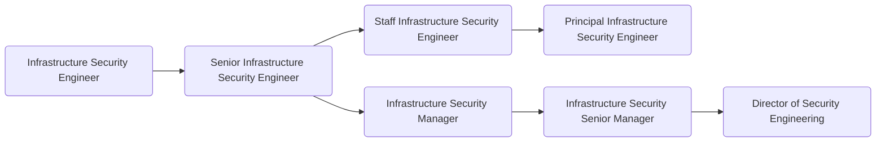

The [Security Logging](https://about.gitlab.com/handbook/security/) engineers own security initiatives related to security of GitLab.com.
They work to improve the coverage and usability of security-data on GitLab.
They work very closely with the Security Incident Response Team [[SIRT](https://about.gitlab.com/handbook/security/security-operations/sirt/)] and share findings proactively.

## Responsibilities

- Be part of the architectural direction, administration, maintenance, documentation, and oversight of the Security information and event management [[SIEM](https://en.wikipedia.org/wiki/Security_information_and_event_management)] solution
- Create and maintain integrations and solutions for the log collection, aggregation, indexing, search, alerting
- Manage implementation, enhancement and adoption of the solutions built by the team into operations
- Utilize log ingestion platform for security analytics and identification of tactics, techniques and patterns of attackers
- Conduct incident response investigations
- Collect and review security logs from all systems (Cloud Providers, GitLab, OS, G-Suite, OKTA, IDS, etc.)
- Ensure compliance with internal policies, standards, and regulatory requirements
- Contribute to creation of runbooks

## Requirements

- Ability to use GitLab
- Good written and verbal communication skills
- Experience working in site-reliability engineering, cloud security, system engineering, or similar positions
- Experience with Google Cloud Platform (preferred) or Amazon Web Services
- Substantial knowledge of the Linux operating system
- Experience with one or more programming languages (Python and either Ruby, Go, or PHP)
- Demonstrated experience with running systems at scale
- Proficiency to communicate over a text-based medium (Slack, GitLab Issues, Email) and can succinctly document technical details
- Share our [values](/handbook/values/), and work in accordance with those values

## Levels

### Infrastructure Security Engineer (Intermediate)

This position reports to the [Manager, Infrastructure Security](/job-families/security/infrastructure-security/#manager-infrastructure-security).

#### Infrastructure Security Engineer (Intermediate) Job Grade

The Infrastructure Security Engineer is a [grade 6](https://about.gitlab.com/handbook/total-rewards/compensation/compensation-calculator/#gitlab-job-grades).

#### Infrastructure Security Engineer (Intermediate) Responsibilities

- Includes responsibilities listed [here](#responsibilities)

#### Infrastructure Security Engineer (Intermediate) Requirements

- Includes responsibilities listed [here](#requirements)

### Senior Infrastructure Security Engineer

This position reports to the [Manager, Infrastructure Security](/job-families/security/infrastructure-security/#manager-infrastructure-security).

#### Senior Infrastructure Security Engineer Job Grade

The Senior Infrastructure Security Engineer is a [grade 7](https://about.gitlab.com/handbook/total-rewards/compensation/compensation-calculator/#gitlab-job-grades).

#### Senior Infrastructure Security Engineer Responsibilities

- Includes responsibilities listed [here](#requirements)
- Create and provide oversight for rule creation to generate actionable security alerts
- Be a subject-matter expert (SME) of at least 1 technical area impacting the security of the product
- Identify inconsistencies in logs and work with development, infrastructure and security teams and work to standardize them
- Assist on root cause analysis (RCA) and security incident reviews
- Guarantee the availability, and recoverability of the SIEM ecosystem
- Assist on actions to mitigate any threats based on findings
- Mentor other members of the Security Team
- Ownership and delivery on complex projects

#### Senior Infrastructure Security Engineer Requirements

- Includes responsibilities listed [here](#requirements)
- Experience working with incident response
- Experience with logging systems and log analysis
- Experience using and administrating analysis platforms such as Splunk, ELK, BigQuery, etc...
- Experience with orchestration technologies such as Chef, Puppet or Ansible
- Experience with infrastructure-as-code
- Working experience with Kubernetes and Docker
- Capability to build working relationships with key stakeholders

### Staff Infrastructure Security Engineer

This position reports to the [Manager, Infrastructure Security](/job-families/security/infrastructure-security/#manager-infrastructure-security).

#### Staff Infrastructure Security Engineer Job Grade

The Staff Infrastructure Security Engineer is a [grade 8](https://about.gitlab.com/handbook/total-rewards/compensation/compensation-calculator/#gitlab-job-grades).

#### Staff Infrastructure Security Engineer Responsibilities

- Includes senior responsibilities listed [here](#senior-infrastructure-security-engineer-responsibilities)
- Lead the design, evaluation, implementation and deployment of new security technologies
- Identify new, and ensure availability of existing GitLab.com data sources and logs that are being used by various GitLab Security teams
- Have significant ownership in and evangelize security training with development teams
- Solid understanding and interest in recognized information security related standards, analysis frameworks (MITRE ATT&CK, Kill Chain, NIST Incident Response, etc.) and technologies
- Develop, evangelize, and monitor the adoption of sound security practices
- Develop new, and review/update existing security-related configurations of GitLab’s infrastructure

#### Staff Infrastructure Security Engineer Requirements

- Includes senior responsibilities listed [here](#senior-infrastructure-security-engineer-requirements)
- Solid experience using and administrating analysis platforms such as Splunk, ELK, BigQuery, etc...
- Experience with secure network design, firewalls, authentication and authorization systems
- Deep technical knowledge of systems in a multi-tenant, cloud environment
- Profound knowledge of the Linux operating system and common OS monitoring practices
- Excellent written and verbal communication skills

## Performance Indicators

- Support the organisation by [ensuring that the Security Engineer On-Call meets SLAs](https://about.gitlab.com/handbook/security/performance-indicators/#sirt-former-security-operations-page-volume).

### Career Ladder

## Hiring Process

Candidates for this position can expect the hiring process to follow the order below. Please keep in mind that candidates can be declined from the position at any stage of the process.

- Qualified candidates will be invited to schedule a 30-minute [screening call](https://about.gitlab.com/handbook/hiring/interviewing/#screening-call) with one of our Global Recruiters.
- Then, candidates will be invited to schedule a 50-minute interview with the team hiring manager.
- Candidates will be invited to schedule 2 separate 50-minute interviews with Security Research team member peers.
- Candidates will then be invited to schedule an interview with VP of Security
- Successful candidates will subsequently be made an offer via email

Additional details about our process can be found on our [hiring page](https://about.gitlab.com/handbook/hiring/).
