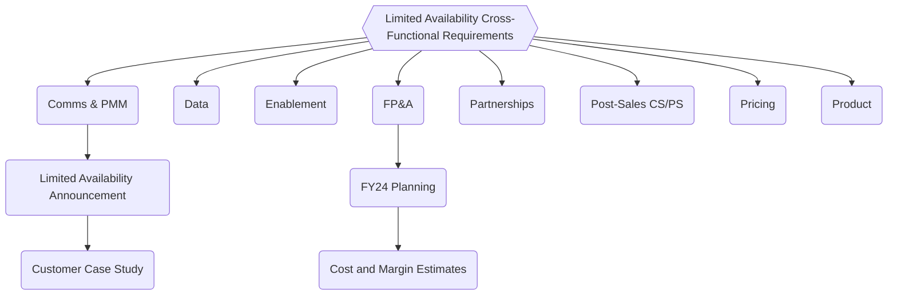

## Attributes

| Property            | Value             |
|---------------------|-------------------|
| Date Created        | 2022-06-29 |
| End Date            | [Launch date of General Availability](https://about.gitlab.com/direction/saas-platforms/dedicated/#phase-9-general-availability) |
| Slack               | [#f_gitlab_dedicated](https://gitlab.slack.com/archives/C01S0QNSYJ2) for GitLab Dedicated questions (only accessible from within the company) |
| Slack               | [#wg_dedicated_cross_functional](https://gitlab.slack.com/archives/C046P7F0N2J) for working group items (only accessible from within the company) |
| Google Doc          | [Working Group Agenda](https://docs.google.com/document/d/1vuKnUwJYrSKAqu0kYtR503LQbuYM_VSD4_z90MR_cQU/edit) (only accessible from within the company) |
| Epic                | Cross-Functional Epic (only accessible from within the company) |

## Additional Resources

- [GitLab Dedicated external webpage](https://about.gitlab.com/dedicated/)
- [Product Category Direction](https://about.gitlab.com/direction/saas-platforms/dedicated/#limited-availability-roadmap)
    - [Limited Availability Roadmap](https://about.gitlab.com/direction/saas-platforms/dedicated/#limited-availability-roadmap)
- [Engineering Team](https://about.gitlab.com/handbook/engineering/infrastructure/team/gitlab-dedicated/)
    - [Project Management](https://about.gitlab.com/handbook/engineering/infrastructure/team/gitlab-dedicated/#project-management)
- [Internal Handbook](https://about.gitlab.com/handbook/engineering/infrastructure/team/gitlab-dedicated/)
- [Top-Level Initiative Epic](https://gitlab.com/groups/gitlab-com/gl-infra/-/epics/479)(only accessible from within the company)
- [Limited Availability Epic - main project epic](https://gitlab.com/groups/gitlab-com/gl-infra/-/epics/484)  (only accessible from within the company)
- [Cross-Functional Limited Availability Requirements](https://gitlab.com/groups/gitlab-com/gl-infra/-/epics/866) (only accessible from within the company)

## Strategy

### Plan

See [Limited Availability Roadmap](https://about.gitlab.com/direction/saas-platforms/dedicated/#limited-availability-roadmap) including milestones for cross-functional work.

### Exit Criteria

The exit criteria for GitLab Dedicated Top Cross-Functional Initiative are the same as the [exit criteria from Limited Availaility](https://about.gitlab.com/direction/saas-platforms/dedicated/#limited-availability)

## Project Management

### How We Work

The GitLab Dedicated Initiative Working Group follows the [same processes as the GitLab Dedicated Engineering team](/handbook/engineering/infrastructure/team/gitlab-dedicated/#how-we-work) from the Dedicated Engineering team page. This includes:
- [Epic management](/handbook/engineering/infrastructure/team/gitlab-dedicated/#epic-hierarchy)
- [Status updates](/handbook/engineering/infrastructure/team/gitlab-dedicated/#status-updates)
- [Labels and usage](/handbook/engineering/infrastructure/team/gitlab-dedicated/#labels)

### Epic Management

See [epic management and hierarchy on Dedicated Team Page](/handbook/engineering/infrastructure/team/gitlab-dedicated/#epic-hierarchy).

The [Cross-Functional LA Requirements epic](https://gitlab.com/groups/gitlab-com/gl-infra/-/epics/866) is a child epic of the GitLab Dedicated [Top Level epic](https://gitlab.com/groups/gitlab-com/gl-infra/-/epics/479). This cross-functional epic is comprised of function-specific child epics managed by the DRI for that functional area. These functional child epics have sub-epics and/or issues representing groups of related tasks that are delivered in a specific phase from [Limited Availability Roadmap](https://about.gitlab.com/direction/saas-platforms/dedicated/#limited-availability-roadmap).

Milestones for functional work from the [Cross-Functional LA Requirements epic](https://gitlab.com/groups/gitlab-com/gl-infra/-/epics/866) are included in [Limited Availability Roadmap](https://about.gitlab.com/direction/saas-platforms/dedicated/#limited-availability-roadmap).

## Status Updates

The GitLab Dedicated Initiative Working Group follows the [status update process](https://about.gitlab.com/handbook/engineering/infrastructure/team/gitlab-dedicated/#status-updates) from Dedicated Engineering team page. The status updates that Functional DRIs make in their respective Functional Epics will incorporated in the [status update cadence](https://about.gitlab.com/handbook/engineering/infrastructure/team/gitlab-dedicated/#status-updates) and used to update the status of the [Cross-Functional epic](https://gitlab.com/groups/gitlab-com/gl-infra/-/epics/866) and the [Top-Level Initiative Epic](https://gitlab.com/groups/gitlab-com/gl-infra/-/epics/479).

In addition to the [status process from Dedicated team page](/handbook/engineering/infrastructure/team/gitlab-dedicated/#status-updates), the Dedicated initiative has additional status update requirements as a [Top Cross-Functional initiative](/top-cross-functional-initiatives/) that the Initiative DRI is responsible for:

- Key Reviews
- Top Initiative Quarterly Meeting

## Key Review

- Initiative DRI provides updates in Product Key Review as the Chief Product Officer is the executive sponsor of this initiative.
- The [Product Key Review](/handbook/key-review/) occurs twice per quarter.

## Top Initiative Quarterly Meeting

- [Top Initiative Quarterly Meeting](https://about.gitlab.com/company/top-cross-functional-initiatives/) occurs once per quarter to review initiative health, risks, and blockers.
- Initiative DRI provides current status for Dedicated during this meeting along with plan for the initiative.
- The Initiative DRI will provide a summary from the most recent update from the [Top-Level Initiative Epic](https://gitlab.com/groups/gitlab-com/gl-infra/-/epics/479).
- The Initiative DRI will share a draft of the Quarterly Update with the Dedicated leadership team and Dedicated Executive Sponsor at least 3 business days before the scheduled presentation date order to gather feedback in order to add responses to the Top Initiatives agenda at least 1.5 days before Top Initiatives meeting.

## Roles and Responsibilities

### Initiative DRIs

1. **Exec Sponsor**: David DeSanto - Chief Product Officer
1. **Initiative DRI**: Ryan Wedmore - Director, Strategy & Operations
    - [Working Group DRI responsibilities](https://about.gitlab.com/company/team/structure/working-groups/#required-roles) and [Cross Functional Initiative DRI responsibilities](https://about.gitlab.com/company/top-cross-functional-initiatives/#cross-functional-initiative-dris)
    - DRI for cross-functional initiative strategy, collaboration, and work streams
1. **Engineering DRI**: Marin Jankovski - Director of Infrastructure, Platforms
    - Overall DRI for Engineering, Infrastructure, and Engineering Strategy
1. **Product DRI**: Fabian Zimmer - Director of Product Management, SaaS Platforms
    - Overall DRI for SaaS Platform Product, Product Strategy, and Product Changes

### Functional Areas and DRIs

Below are the functional areas involved in this Cross-Functional Initiative as well as the Functional DRI representing that functional area.

| Working Group Functions (alphabetical)  | Team Member        | Title
|-----------------------------------------|--------------------|--------------------------------------------------|
| Functional Lead: Channel Partners       | Honora Duncan      | Senior Channel Services Manager                  |
| Functional Lead: Comms & PMM            | Saumya Upadhyaya   | Principal Product Marketing Manager              |
| Functional Lead: Enablement             | Kelley Shirazi     | Manager, Sales Enablement                        |
| Functional Lead: Engineering            | Marin Jankovski    | Director, Infrastructure Platforms               |
| Functional Lead: FP&A                   | Shuang Shackleford | Director, FP&A                                   |
| Functional Lead: Post-Sales (CS/PS)     | Brian Will         | Senior Manager, Professional Services            |
| Functional Lead: Pricing & Fulfillment  | Justin Farris      | Senior Director, Product Monetization            |
| Functional Lead: Product                | Andrew Thomas      | Principal Product Manager                        |
| Functional Lead: Sales                  | Aileen Lu          | Director, Sales Strategy                         |
| Member                                  | Josh Lambert       | Director of Product, Enablement                  |
| Member                                  | Jake Bielecki      | VP, Sales Strategy & Analytics                   |

Functional DRIs are also mentioned at the top of the description of their function's child epics in the [Cross-Functional LA Requirements epic](https://gitlab.com/groups/gitlab-com/gl-infra/-/epics/866) per [epic structure](https://about.gitlab.com/handbook/engineering/infrastructure/team/gitlab-dedicated/#epic-structure).

### Function DRI Responsibilities

Please see [Functional Lead on Working Group page]().

Functional DRIs are responsible for maintaining their function's epics by following process mentioned in [Epic Owner Responsibilities](https://about.gitlab.com/handbook/engineering/infrastructure/team/gitlab-dedicated/#epic-owner-responsibilities) and [Epic Structure](https://about.gitlab.com/handbook/engineering/infrastructure/team/gitlab-dedicated/#epic-structure).

### Dedicated Team DRIs

Below are the specific areas of responsibility within the Dedicated team:

| Area | Tasks | DRI |
| ------ | ------ | --- |
| E-Group reporting       | Write status updates, Key review updates | `@rwedmore`    |
| Program management      | Cross-functional workstream coordination, create launch list, ad hoc coordination requests | `@rwedmore`   |
| Customer Success (CS) | [Define onboarding PS package](https://gitlab.com/gitlab-com/gl-infra/gitlab-dedicated/team/-/issues/1316), outline CS engagement post-sales | `@rwedmore` |
| Environment Automation Roadmap  | Updating direction page, prioritization changes etc. | `@awthomas` consulting and collaborating with `@o-lluch` |
| Switchboard Roadmap  | Updating direction page, prioritization changes etc. | `@fzimmer` consulting and collaborating with `@marin` |
| PRE deal Customer interactions | Meeting with customer prospects, customer qualification, steps 1-6 in [onboarding process](https://internal.gitlab.com/handbook/engineering/horse/#new-customer-process) Supporting customers until CS packages are defined | `@awthomas` |
| POST deal onboarding management | steps 7-9 in in [onboarding process](https://internal.gitlab.com/handbook/engineering/horse/#new-customer-process); until CS package defined | `@rwedmore` or `@fzimmer` |
| [Automate manual onboarding tasks](https://gitlab.com/groups/gitlab-com/gl-infra/gitlab-dedicated/-/epics/56) | Includes driving documentation changes.  | `@awthomas`  |
| Drive cross-product feature requests needed for Dedicated | examples include Maintenance mode prometheus metric, silent mode | `@awthomas` |
| [Go to market definition](https://gitlab.com/groups/gitlab-com/gl-infra/-/epics/482) | PMM and PM to define the remaining GTM items, rest in cross-functional workstream coordination, | `@awthomas`|
| Coordinate with Finance | Fy24 Rev Projection, Cost Optimizations; P&L and min seat count later | `@fzimmer` consulting with `@marin`  |

This table will be reviewed at the end of each month.
