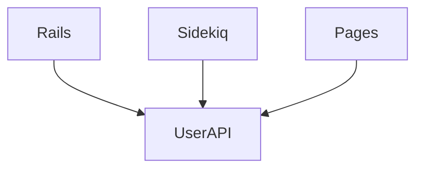

## Fault-Tolerance

GitLab has to be a highly-available, mission critical system. To achieve
this, we must design and deploy the system in such a way that a number
of principles are met:

1. Eliminate single points of failures (SPOF): A failure of a single node
should not cause downtime.
1. [Isolate failures](https://gitlab.com/groups/gitlab-org/-/epics/2283): If a failure happens, it should be isolated as
much as possible to a particular project, user, etc. The blast radius
should be minimized.
1. Rollback: Errors will invariably happen in the software
development. If a bug happens, we must be able to revert quickly without
exposing the problem to a large number of users.

### Example Improvements to GitLab

Below is a list of examples of concrete items that will help improve
GitLab fault-tolerance:

#### SPOF

1. Eliminate use of NFS
   1. https://gitlab.com/gitlab-com/gl-infra/scalability/issues/62
   1. https://gitlab.com/gitlab-org/gitlab/issues/32203
1. [Use multiple Redis cache instances in Rails.cache](https://gitlab.com/gitlab-com/gl-infra/scalability/issues/49)

#### [Isolation](https://gitlab.com/groups/gitlab-org/-/epics/2283)

1. Allow GitLab to function if a single Gitaly node is down
    1. https://gitlab.com/gitlab-org/gitlab/issues/34722
    1. https://gitlab.com/gitlab-org/gitlab/issues/39509
1. TODO

### Microservices does not necessarily provide fault isolation

Note that the above list does not mention microservices as a cure-all. A
microservice architecture can **help** provide fault isolation, but it
does not inherently do this. For example, let's suppose we introduce
`UserAPI` microservice that creates an API for all services to retrieve
users in the system. Now our architecture may look like:

The `UserAPI` microservice could still be a single point of failure
here; if that goes down, all the other services in the system
(e.g. Rails, Sidekiq, etc.) also stop working. We've introduced a new
service that can be owned by a single team, but in doing so we haven't
necessarily improved isolation. Can the system function without this
service? Probably not, although there may be other advantageous to doing
this (e.g. make it possible to shard user data in multiple servers,
performance, etc.). We still have to think about how to avoid a SPOF.

In addition, GitLab also is unique in that every microservice that
we create has to be shipped to customers, so there is overhead in
managing configuration and redundancy of these services as well.

That being said, microservices may be worth it if we can clearly define
the engineering benefit towards maintainability, scalability, and
reliability.  For example, we've considered introducing a [GitLab CI
service daemon](https://gitlab.com/gitlab-org/gitlab/issues/19435) that
can better handle CI queues.
