## Overview

Our long term focus is on reducing or replacing IT 1.0 tech debt with a greenfield approach for IT 2.0 using our Automation Philosophy as guiding principles and focusing on Level 4 automations and engineering simpler solutions to reduce Level 5 automations to Level 4 complexity.

Our team is good at foreshadowing and working on projects proactively that will offer benefits to the organization in 3-12 months to solve root cause problems instead of continuing to engineer workarounds for systemtic symptoms.

The overarching philosophy has shifted to focus on backend integrations development that doesn't require a frontend UI in the traditional MVC sense. We have found that eliminating a web UI saves us a lot of headache and allows us to focus more on that last 20% of business logic that we need to solve for.

Most of our next-gen automation is focused on API calls, CLI scripts, GitLab CI/CD jobs, and Slackbot interactions.

## Leadership Highlights

> Most projects relate to a thematic "IT 2.0" greenfield direction that removes a lot of technical debt.

1. **Architecting** next-generation automation and integration between IT managed systems that provides data consistency, reliability, strong security, and audibility.
1. **Building** Archie to programmatically provision and deprovision users in GitLab, Google, Okta, and Slack groups that are provisioned and deprovisioned manually today as part of baseline entitlements, career mobility, and offboarding issue templates. This has significant time savings for dozens of team members, and mitigates many problems that we face with audit and compliance observations. Many other services we work with depend on a reliable directory source and this has the potential of being a valuable SSOT.
1. **Consolidating** and refactoring [Demo Systems](https://about.gitlab.com/handbook/customer-success/demo-systems) web applications and legacy tech debt.
1. **Developing** HackyStack v2 with improved cost management features, offboarding automation, Slack integration, and evaluating the future direction of Terraform environments that can be embedded in the GitLab product.
1. **Escalation engineering** and emergency response for IT Operations and Security teams, and providing assistance to team members with all of the systems that we build and manage.
1. **Factor** in cost, security, compatibility, maintainability and user experience when making decisions.
1. **Growing other team members’ skill sets** through mentorship to improve operational efficiency and encourage professional development.
1. **Helping** team members with all systems that we build and manage.
1. **Iterating** continuously as part of our company values.

## Quick Links

- [List of Epics](https://gitlab.com/groups/gitlab-com/it/dev/-/epics)
- [Epics Gantt Chart (Development Only)](https://gitlab.com/groups/gitlab-com/it/dev/-/roadmap?state=all&sort=end_date_asc&layout=MONTHS&timeframe_range_type=CURRENT_YEAR&progress=WEIGHT&show_progress=true&show_milestones=false&milestones_type=ALL)
- [Epics Gantt Chart (IT)](https://gitlab.com/groups/gitlab-com/it/-/roadmap?state=all&sort=end_date_asc&layout=MONTHS&timeframe_range_type=CURRENT_YEAR&progress=WEIGHT&show_progress=true&show_milestones=false&milestones_type=ALL)

### Initiatives at a Glance

- [dev&23 IT Automation v2 (GLabIT)](https://gitlab.com/groups/gitlab-com/it/dev/-/epics/23)
- [dev&26 IAM and RBAC v3](https://gitlab.com/groups/gitlab-com/it/dev/-/epics/26)
- [dev&25 HackyStack and Sandbox Cloud](https://gitlab.com/groups/gitlab-com/it/dev/-/epics/25)
- [dev&22 Open Source Packages and SDKs](https://gitlab.com/groups/gitlab-com/it/dev/-/epics/22)

### Roadmap Timelines

Since IT Systems Engineers split their time between Engineering and Operations (development happens as time allows), we are not able to provide accurate timeline forecasting (including quarterly OKRs) and instead provide stack ranked priority. All roadmap start and end dates are estimates and are not commitments.

One engineer is the DRI for each epic and are managers of one for efficiency. This allows each of us to focus on our strengths and be DRIs for the projects that we're passionate about and go deep into the programming headspace as needed without coordination. We still collaborate when we run into tough engineering challenges and we still perform peer MR reviews on all code.

We work on 1-3 projects at a time and the project priority increases as the business need increases at the discretion of the IT Engineering team. Any epics with a P1 are top of mind and are being worked on in the current quarter or are in the up next queue. Any epics with P4 are considered wishlist. Please keep in mind that projects are often interrupted with distractions from day-to-day Slack and issue requests.

## Architecture Diagrams

### Color Key

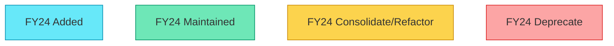

### Demo and Training Systems

#### gitlabdemo.com

```mermaid
graph TD
subgraph "Laravel App Logic"
    subgraph "Student UI"
        GITLABDEMO_COM_STUDENT_INVITATION_CODES("Redeem Invitation Code"):::yellow
        GITLABDEMO_COM_STUDENT_CREATE_USER("Create GitLab User Account"):::yellow
        GITLABDEMO_COM_STUDENT_CREATE_GROUP("Create GitLab Group"):::yellow
    end
    subgraph "Admin UI"
        GITLABDEMO_COM_ADMIN_INVITATION_CODES("Create and Manage<br />Invitation Codes"):::yellow
        GITLABDEMO_COM_ADMIN_CREATE_GROUP("Create GitLab Group for Session"):::yellow
    end
    GITLABDEMO_COM_ADMIN_INVITATION_CODES --> GITLABDEMO_COM_STUDENT_INVITATION_CODES
    GITLABDEMO_COM_STUDENT_INVITATION_CODES --> GITLABDEMO_COM_STUDENT_CREATE_USER
    GITLABDEMO_COM_STUDENT_INVITATION_CODES --> GITLABDEMO_COM_STUDENT_CREATE_GROUP
    GITLABDEMO_COM_ADMIN_CREATE_GROUP -.- GITLABDEMO_COM_STUDENT_CREATE_GROUP
end
subgraph "GCP Project demosys-mgmt"
    direction LR;
    DEMO_COM_APP["Linux Nginx Server"]:::red
    DEMO_COM_LARAVEL["Laravel Application (link)"]:::red
    DEMO_COM_SQL["MySQL Database"]:::red
    DEMO_COM_APP -.- DEMO_COM_SQL
    DEMO_COM_LARAVEL --- DEMO_COM_APP
    DEMO_COM_LARAVEL --- DEMO_COM_SQL
    click CS_OMNIBUS "https://cs.gitlabdemo.cloud" "Access System" _blank
    click DEMO_COM_LARAVEL "https://gitlab.com/gitlab-com/it/dev/gitlabdemo-com-app" "Open Repository" _blank
end
subgraph "ops.gitlab.net/it-infra-realm"
    direction LR;
    DEMO_COM_TERRAFORM["demosys-terraform Repo (link)<br />Admin Local Terminal Only"]:::red
    DEMO_COM_ANSIBLE["gitlabdemo-com-ansible (link)<br />Admin Local Terminal Only"]:::red
    click DEMO_COM_TERRAFORM "https://gitlab.com/gitlab-com/it/infra/demosys-terraform" "Open Repository" _blank
    click DEMO_COM_ANSIBLE "https://ops.gitlab.net/it-infra-realm/environments/gcp/gcp-project-demosys-mgmt/gitlabdemo-com-ansible" "Open Repository" _blank
end

classDef slate fill:#cbd5e1,stroke:#475569,stroke-width:1px;
classDef red fill:#fca5a5,stroke:#dc2626,stroke-width:1px;
classDef orange fill:#fdba74,stroke:#ea580c,stroke-width:1px;
classDef yellow fill:#fcd34d,stroke:#ca8a04,stroke-width:1px;
classDef emerald fill:#6ee7b7,stroke:#059669,stroke-width:1px;
classDef cyan fill:#67e8f9,stroke:#0891b2,stroke-width:1px;
classDef sky fill:#7dd3fc,stroke:#0284c7,stroke-width:1px;
classDef violet fill:#c4b5fd,stroke:#7c3aed,stroke-width:1px;
classDef fuchsia fill:#f0abfc,stroke:#c026d3,stroke-width:1px;
```

#### gitlabdemo.cloud

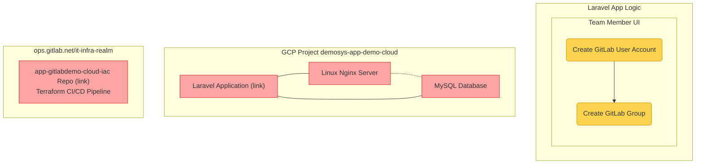

#### gitlabsandbox.cloud

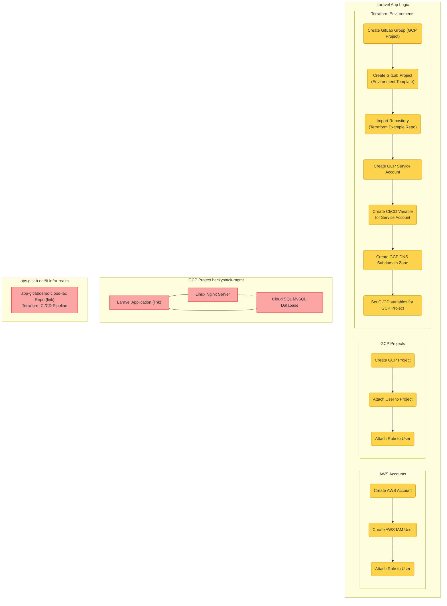

### IT Automation v1

#### IT Ops CLI Scripts

```mermaid
graph LR
subgraph "Laravel App Logic"
    CLI_SCRIPTS_GITLAB_ISSUE("gitlab-issue:* CRUD Commands (link)"):::yellow
    CLI_SCRIPTS_GITLAB_CONTRIBUTIONS("gitlab-event:* Contribution/Standup Reports (link)"):::yellow
    CLI_SCRIPTS_GITLAB_KANBAN("gitlab-issue:* Kanban Reports (link)"):::yellow
    CLI_SCRIPTS_GITLAB_GROUP_CRUD("gitlab-group:* CRUD Commands (link)"):::yellow
    CLI_SCRIPTS_GITLAB_USER_CRUD("gitlab-user:* CRUD Commands (link)"):::yellow
    CLI_SCRIPTS_GOOGLE_CRUD("google-workspace:* CRUD Commands (link)"):::yellow
    CLI_SCRIPTS_OKTA_CRUD("okta:* CRUD Commands (link)"):::yellow
    CLI_SCRIPTS_SLACK_REPORTS("slack:* Reports (link)"):::yellow
    CLI_SCRIPTS_SNIPEIT("snipe-it:* CRUD Commands (link)"):::yellow
    click CLI_SCRIPTS_GITLAB_ISSUE "https://gitlab.com/gitlab-com/it/dev/it-ops-laravel-cli-scripts#gitlab-issue-tracker" "Open Repository" _blank
    click CLI_SCRIPTS_GITLAB_CONTRIBUTION "https://gitlab.com/gitlab-com/it/dev/it-ops-laravel-cli-scripts#gitlab-events-and-standup-reports" "Open Repository" _blank
    click CLI_SCRIPTS_GITLAB_KANBAN "https://gitlab.com/gitlab-com/it/dev/it-ops-laravel-cli-scripts#gitlab-issue-tracker-kanban-board" "Open Repository" _blank
    click CLI_SCRIPTS_GITLAB_GROUP_CRUD "https://gitlab.com/gitlab-com/it/dev/it-ops-laravel-cli-scripts#gitlab-group-and-user-provisioning" "Open Repository" _blank
    click CLI_SCRIPTS_GITLAB_USER_CRUD "https://gitlab.com/gitlab-com/it/dev/it-ops-laravel-cli-scripts#gitlab-group-and-user-provisioning" "Open Repository" _blank
    click CLI_SCRIPTS_GOOGLE_CRUD "https://gitlab.com/gitlab-com/it/dev/it-ops-laravel-cli-scripts#google-workspace" "Open Repository" _blank
    click CLI_SCRIPTS_OKTA_CRUD "https://gitlab.com/gitlab-com/it/dev/it-ops-laravel-cli-scripts#okta-application-group-and-user-provisioning" "Open Repository" _blank
    click CLI_SCRIPTS_SLACK_REPORTS "https://gitlab.com/gitlab-com/it/dev/it-ops-laravel-cli-scripts#slack" "Open Repository" _blank
    click CLI_SCRIPTS_SNIPEIT "https://gitlab.com/gitlab-com/it/dev/it-ops-laravel-cli-scripts#snipe-it" "Open Repository" _blank
end
subgraph "Local Laptop"
    direction LR;
    CLI_SCRIPTS_LARAVEL["Laravel CLI Application (link)"]:::yellow
    click CLI_SCRIPTS_LARAVEL "https://gitlab.com/gitlab-com/it/dev/it-ops-laravel-cli-scripts" "Open Repository" _blank
end
classDef slate fill:#cbd5e1,stroke:#475569,stroke-width:1px;
classDef red fill:#fca5a5,stroke:#dc2626,stroke-width:1px;
classDef orange fill:#fdba74,stroke:#ea580c,stroke-width:1px;
classDef yellow fill:#fcd34d,stroke:#ca8a04,stroke-width:1px;
classDef emerald fill:#6ee7b7,stroke:#059669,stroke-width:1px;
classDef cyan fill:#67e8f9,stroke:#0891b2,stroke-width:1px;
classDef sky fill:#7dd3fc,stroke:#0284c7,stroke-width:1px;
classDef violet fill:#c4b5fd,stroke:#7c3aed,stroke-width:1px;
classDef fuchsia fill:#f0abfc,stroke:#c026d3,stroke-width:1px;
```

#### Asset Scripts

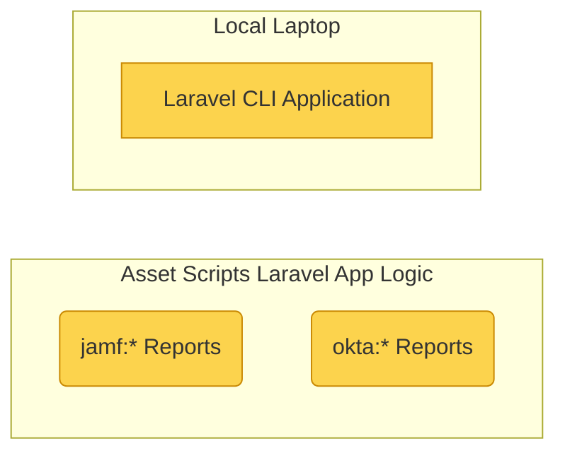

#### Archie Scripts

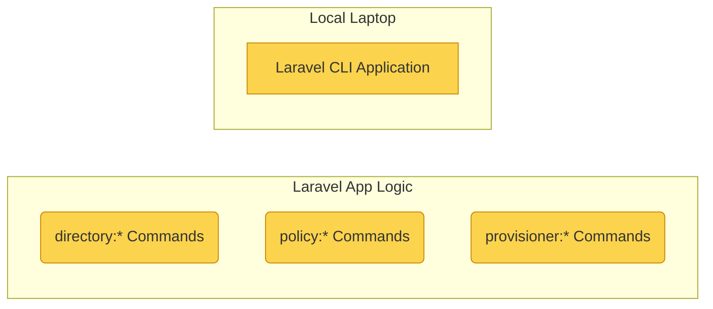

### GitLab SaaS

#### Learn Labs

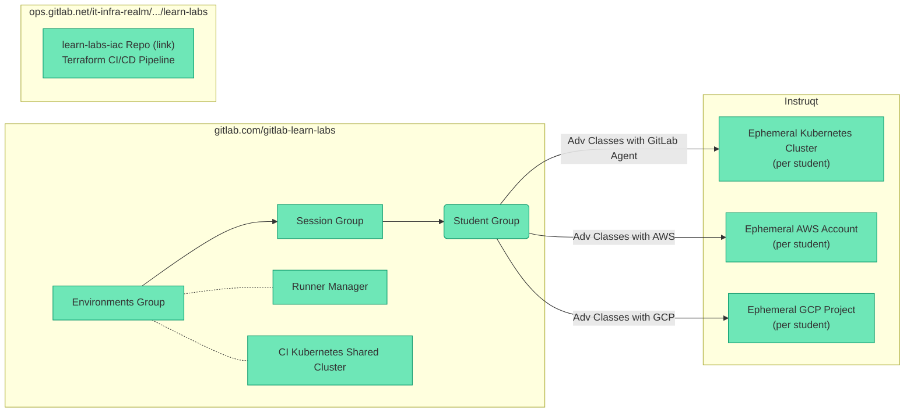

### GitLab Self Managed Instances

#### cs.gitlabdemo.cloud

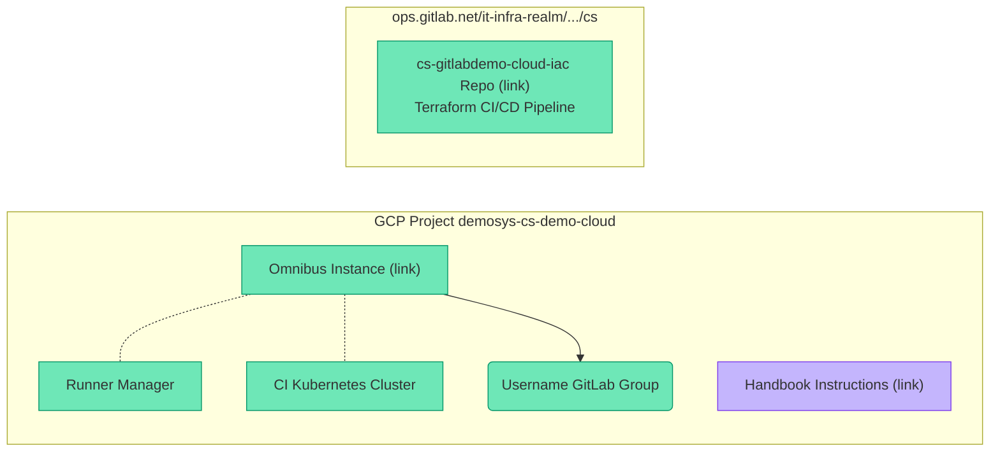

#### ilt.gitlabtraining.cloud

#### workshop.gitlabtraining.cloud

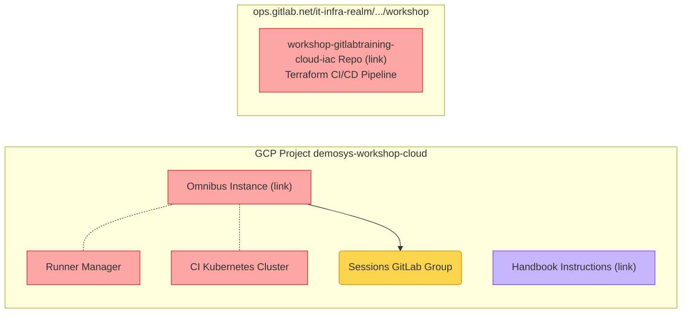

#### spt.gitlabdemo.cloud

#### gitops.gitlabsandbox.cloud

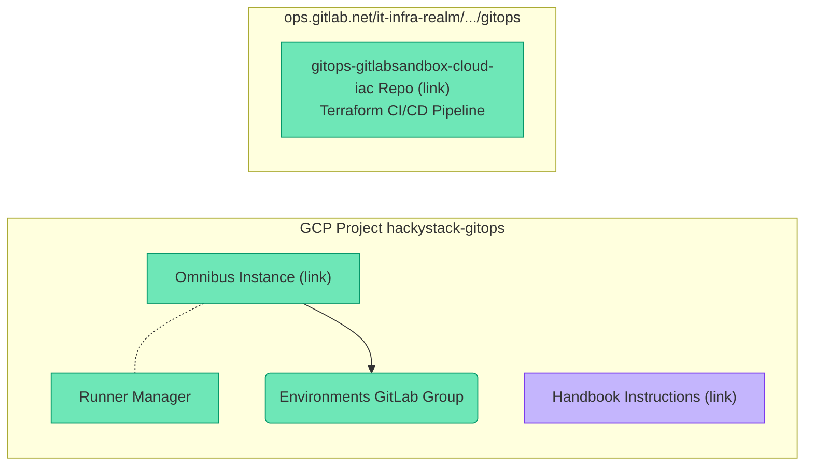
