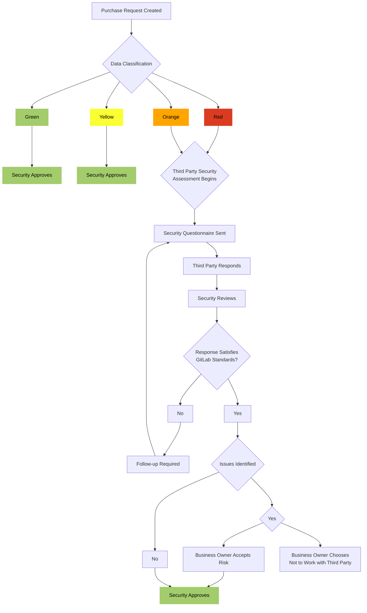

{}
Inline with GitLab's regulatory obligations, changes to [controlled documents]() must be approved or merged by a code owner. All contributions are welcome and encouraged.
{}

## Purpose

GitLab's Security Third Party Risk Management (TPRM) Program helps guard against security threats posed by third parties who have access to GitLab data or that of our customers. These risks may include data breaches, unauthorized use or disclosure, and corruption or loss of data. Adequate TPRM is a best practice that helps [mitigate security concerns](https://about.gitlab.com/handbook/leadership/mitigating-concerns/#security-breach) and enables GitLab to meet our contractual obligations. TPRM also enables GitLab to meet regulatory requirements and standards related to ISO, SOX, GDPR and other state and federal laws requiring vendor oversight.

GitLab's Security TPRM program involves three components which are integrated in to our [Procurement](https://about.gitlab.com/handbook/finance/procurement/) processes:
1. Performing due diligence to ensure the third party implements safeguards to enforce data privacy and security.
    - This activity is performed via our Security Assessment Process.
1. [Contractually](https://about.gitlab.com/handbook/finance/procurement/#contracting) obligating the third party to implement these safeguards.
1. Monitoring third party safeguards and compliance with these contracted provisions.
    - Certain high risk Third Parties are reviewed annually while those posing lower risk are reviewed at intervals defined further within this document.

## Scope

This procedure applies to all third party providers that access, store, process or transmit GitLab data.

## Roles & Responsibilities

| Role | Responsibility |
| ------ | ------ |
| Security Risk Team |  Maintain a mechanism to intake and respond to TPRM Activities   Assess Third Party inherent and residual security risk   Inform business owners of the result of TPRM assessments |
| Business or System Owner |  [Describe the nature of the Third Party Relationship](https://about.gitlab.com/handbook/finance/procurement/#step-2-submit-your-zip-request)   Work with the Security Risk team to facilitate the TPRM review, to include remediation activities  * Ensure the responsiveness of the third party as part of the security review requirements |
| Security Assurance Management (Code Owners) | Responsible for approving significant changes and exceptions to this procedure |

## Third Party Minimum Security Standards

TPRM utilizes a risk-based approach when assessing third parties. Specific procedures used to assess different vendor types / risk profiles can be found below.

The following items often reflect Security deficiencies that may result in a higher vendor residual risk score:
1. Inability to integrate with *[Okta](https://about.gitlab.com/handbook/business-technology/okta/#what-is-okta)
1. Lack of third-party Security attestation (ISO 270001, SOC2 Type 2)
1. Lack of background checks for employees and contractors
1. Systems lacking multi-factor authentication (MFA) capabilities
1. Systems lacking evidence of a recent penetration test

*While Okta SSO integration is GitLab's preferred method, IT Engineering can review and approve alternative SSO methods on a case by case basis. Exceptions must be submitted and reviewed through an [IT EngOps issue](https://gitlab.com/gitlab-com/it/engops/issue-tracker/-/issues/?sort=due_date&state=opened&first_page_size=100) before approval of the vendor's services.

Deficiencies identified are reviewed in the context of the vendor's greater Security environment and the data transmitted. If a material risk to GitLab data is identified, a Risk Acceptance is drafted and presented to the Business Owner for review. See the **TPRM Risk Acceptance Process** section below.

## Procedure

Where GitLab controls, owns, or is otherwise responsible for data, the diagram below depicts TPRM procedures based on the [Data Classification]() of data shared with the third party.

### TPRM Assessment Requirements

The following table defines the procedures followed by TPRM engineers for vendors accessing or being transmitted different [classifications of GitLab data](). The below procedures are initiated by the [Procurement](https://about.gitlab.com/handbook/finance/procurement/#--what-is-the-procurement-process-at-gitlab) process and are followed in all instances where applicable vendors have not been reviewed within the established approval windows defined below.

If a vendor has been reviewed and approved within the preceding 12-24 months (as defined within the **TPRM Approval Windows** section) of a new procurement request, the TPRM Engineer will review the requisition to determine if a material change has occurred to the services provided. Material changes may require performance of a new Security review, and may include:

- Change in data classification (e.g., going from Yellow to Orange data classification)
- New system from vendor not previously reviewed (e.g., we've reviewed XYZ for the purchase of their Billing system, but a new request has come in for the purchase of their Revenue system)
- Change of location where data is stored or accessed from (e.g., moving data from GitLab-hosted app to vendor-hosted SaaS)
- New contractor from a vendor that is not responsible for their contractor's security controls

Circumstances may exist outside of those defined above that could necessitate further review. TPRM Engineers are encouraged to use professional discretion in identifying these circumstances and performing additional Security review or validation as needed.

If a Risk Acceptance was put in place at the time of the previous assessment, inquiry should be performed with the vendor or relevant stakeholder to determine the current status of the risk. Any updates should be documented within the Risk Object. This can be performed in tandem with the requisition or after its approval.

| Data Classification | Request | Supplemental Questionnaire in Zen? | Okta SSO? | New BIA / Tech Stack Entry? | BitSight Score Review?| Evidence of PenTest and BCP Testing |
| ------ | ------ |------ |------ |------ |------ |------ |
|Red*     |3rd Party Attest & SIG Lite Plus (or equiv)|     Yes|          If applicable|     Yes|     If applicable| Yes |
|Orange SaaS Systems or Locally Hosted/Installed Systems with Data Exchange| 3rd Party Attest & SIG Lite Plus (or equiv)|     Yes|          Yes|     Yes|     Yes| Yes |
|Orange Professional Services | 3rd Party Attest or SIG Prof Svcs|          N/A|     N/A| N/A|     N/A| N/A|
|Yellow/Green**     |-|     -|     -|     Yes*|     -| - |

Software is inventoried in the tech stack regardless of data classification. See [Tech Stack Application Handbook](https://about.gitlab.com/handbook/business-technology/tech-stack-applications/#tech-stack-updates) for more details.

### TPRM Approval Windows

The Security Risk team has established approval windows dictating the lifecycle of our TPRM assessments and their reliance in approving requisitions, after which a new assessment must be completed prior to approval of subsequent requisitions to ensure continued adherence to GitLab's regulatory and due diligence requirements. These windows are defined in alignment with the sensitivity of data shared and the nature of the associated requisition.

- **Red and Orange Vendors:** Vendors being transmitted Red or Orange data are subject to a 12-month approval window from the previous assessment, with the exception of Low Risk Orange Vendors defined below.
- **Low-Risk Orange Vendors** Vendors receiving Orange data elements limited to GitLab Team Member physical addresses and phone numbers are subject to a 24-month approval window. An example may be a SWAG provider that receives GitLab employee names and addresses for the purposes of delivering shipments. The transmission of this type of GitLab Team Member personal data presents a low level of risk and does not present a Security Risk that could impact GitLab customers.

Requisitions must be reviewed to determine whether a scope change has occurred since the previous assessment that could indicate a material change in the data transmitted to the vendor. Examples of material changes are defined in the above **TPRM Assessment Requirements** section and may result in the need to perform a new review regardless of the above-defined approval windows. Questions or concerns regarding the materiality of a change or the appropriate approval window should be escalated to the Security Risk Manager within the #Sec-Assurance-Team channel.

### Exceptions to the TPRM Process

In specific instances, requirements for the performance or contents of TPRM reviews may vary from the standard process defined above:
1. Law Firms, Accountants and Auditors may receive data, including red data, in a [Controller-to-Controller relationship](https://about.gitlab.com/handbook/legal/privacy/#privacy-terms), meaning these types of entities have direct obligations and standards for processing data under law. As such, these entities may be treated as Orange vendors.
1. Instances where Gitlab team members provide their own data to a third-party [Data Controller](https://about.gitlab.com/handbook/legal/privacy/#privacy-terms), in which the team member personally acknowledges the third-party's terms, may not require a TPRM assessment.  Examples may include signing up for health, coaching or counseling benefits where GitLab only finances the service but does not send or receive data on behalf of team members and team members voluntarily decide to enter the program.
1. Field Marketing events do not require the completion of a Security review as the gathering of contact information for GL Team Members and prospects is considered to be standard for the normal course of business for the Field Marketing team. Note that if the Field Marketing Team is commissioning the use of software to facilitate its operations or have hired a Vendor to collect data on behalf of Gitlab, these vendors are subject to TPRM review.  GitLab receiving event data from another organizer or GitLab sharing event data with other independent organizations and/or sponsors does not require a TPRM assessment.

#### The Standard Information Gathering (SIG) Questionnaire

The Security Risk Team leverages the [Standard Information Gathering (SIG)](https://sharedassessments.org/sig/) Questionnaire to gain a more in-depth understanding of a vendor's Security environment beyond what is attained by reviewing a Third-Party Attestation such as an ISO certification or SOC-2 report. Responses within the SIG questionnaire, or an equivalent document such as a CAIQ, should be reviewed alongside the vendor's third-party attestation (if available) and their responses to our Security Questionnaire when assessing the Security environment in place within the service organization.

Security Risk maintains multiple templated versions of the SIG questionnaire for use depending on the product or service being assessed, as some vendors may not have a SIG questionnaire or equivalent to provide. The SIG templates include instructions noting that we only require Inquiry responses within Columns D and E of the main questionnaire tab, as additional requests for information or documentation within the SIG are generally not required. Note that potential fringe cases *could* exist wherein professional discretion may dictate the necessity for additional documentation requests to supplement vendor responses. These scenarios should be discussed with the Security Risk Manager to determine what is needed. Further, professional discretion should be applied when making decisions as to which version of the SIG questionnaire should be sent. For cases in which the level of review required is unclear, engineers are encouraged to discuss with the @Security-Risk team in the #Sec-Assurance-Team channel to come to a decision.

{}
- SIG Lite Plus
    - The SIG Lite Plus questionnaire is leveraged most commonly and should be utilized for all Red vendors and Orange SaaS systems. We refer to our SIG Lite as the "SIG Lite Plus" as it includes full scope SIG questionnaires for domains "A. Enterprise Risk Management" and "E. Human Resource Security". All other domains include standard SIG Lite content. Our objective here is to obtain additional information related to personal computers and background checks.
    - The following 18 domains are included within the scope of the SIG Lite Plus questionnaire:
        - A. Enterprise Risk Management (Full SIG Content)
        - B. Security Policy
        - C. Organizational Security
        - D. Asset and Info Management
        - E. Human Resources Security (Full SIG Content)
        - F. Physical and Environmental
        - G. IT Operations Management
        - H. Access Control
        - I. Application Security
        - J. Cybersecurity Incident Mgmt
        - K. Operational Resilience
        - L. Compliance and Ops Risk
        - M. Endpoint Device Security
        - N. Network Security
        - P. Privacy
        - T. Threat Management
        - U. Server Security
        - V. Cloud Hosting Services
{}

{}
- SIG Professional Services
    - The Professional Services SIG Lite Plus questionnaire features a reduced scope and can be leveraged for scenarios in which an **Orange** vendor is only providing contracted services or services not otherwise resulting in the introduction of a system being transmitted sensitive GitLab data. In these cases it may not be necessary to perform a full-scope review of the vendor's Security environment, as many controls within the full SIG Lite questionnaire may not apply or present a material risk to GitLab data.  **Please note this guidance applies only to Orange professional services providers. Service providers being granted access to Red data in the provision of services should be assessed utilizing the SIG Lite Plus questionnaire defined above due to the greater obligation for Data Security with these providers.**
    - The following domains are included within the scope of the Professional Services SIG Lite Plus questionnaire.
        - D. Asset and Info Management
        - E. Human Resources Security (Full SIG Content)
        - F. Physical and Environmental
        - H. Access Control
        - L. Compliance and Ops Risk
        - M. Endpoint Device Security
        - N. Network Security
        - P. Privacy
        - T. Threat Management

{}

{}
Vendor responses documented within the SIG questionnaire should be reviewed in the context of the services provided by the vendor, with care taken to understand the broader control environment and how certain control deficiencies may be mitigated by other existing controls. For example, a vendor that does not rely on 3rd party service providers in the provision of services would be unlikely to maintain a Third Party Risk Management program, which is unlikely to pose a risk to GitLab in the broader context of services being provided. Significant deviations such as this should be flagged during the review and noted within the SIG questionnaire with an explanation on why the deficiency does not present a risk to GitLab data. Mitigating controls, if identified, should be defined within these notes as well. Engineers are encouraged to perform follow-up inquiries with vendors as necessary to determine whether a control deficiency exists. These inquiries should be further noted within the SIG document or within the TPRM Assessment Report.

Deficiencies identified that may present a material risk to GitLab data should be noted within the TPRM assessment report and presented to the business owner via the Risk Acceptance Process detailed below.

*SIG questionnaires (or equivalent) provided by a vendor **not** utilizing a GitLab-provided template should be reviewed to ensure they meet our due diligence standards. Domains not sufficiently addressed by a vendor-provided questionnaire should be identified, with additional inquiries performed to gain assurance over all in-scope domains.*
{}

### Other Types of Third Party Assessments

#### Change Requests

Change requests relating to previously-approved requisitions will be reviewed by the on-call Engineer to determine whether a material change is being requested to (1) the scope of services provided, (2) the data elements transmitted to the vendor, or (3) the timeframe of the services provided. If material changes occur as defined here or that are otherwise identified resulting in a change to data classification or movement outside of the above-defined window from the previous review, a security assessment should be launched in alignment with the TPRM assessment requirements. Changes requested specific to the cost of services and that do not present a material change impacting Security can be approved based on inheritance of approval from the parent requisition.

*For example: We performed a TPRM assessment for Vendor X which was completed on December 31, 2021, resulting in a 12 month coverage period lasting to December 31, 2022. A change request was created in January 2023 (outside of coverage period) related to overage charges for services provided during November 2022 (within coverage period). This example change request can be approved without a new TPRM assessment.*

Engineers are advised to use professional judgment in determining the scope of changes and are encouraged to perform additional review prior to approving the Change Request if there is potential for introduction of additional risk. For other non-material adjustments not defined here that may not warrant additional review, Engineers should ping the Security Risk team or discuss with the Security Risk Manager prior to moving forward to ensure alignment with GitLab's due diligence requirements. Rationale should be documented when approving the Change Order in alignment with the low-risk approval language in the [TPRM README](https://gitlab.com/gitlab-com/gl-security/security-assurance/security-risk-team/third-party-vendor-security-management/-/blob/master/Readme.md).

For situations where IT is unable to complete a GitLab Laptop Request due to country location or other constraints, the Security Risk Team will require consultation and may require a Risk Acceptance to be completed. See [TPRM Risk Acceptance]() Process for more details.

#### Third Party Application Integrations

Integrations between systems within GitLab's environment are subject to the above-defined TPRM assessment procedures to obtain assurance over the security of data transmitted between each system. The Security Risk team will review the request to obtain an understanding of the data being shared. Application Integration Requests can be opened using the 'app_integrations' template located [here](https://gitlab.com/gitlab-com/Finance-Division/procurement-team/procurement/-/issues/new?issuable_template=app_integrations).

The Application Integration Request process functions to allow visibility and oversite of systems interacting with each other in support of GitLab. This process also functions as a "soft gate" for the Security Risk team to identify and assess existing systems that have aged out of their approval window. Each system within the integration request is reviewed to determine whether an assessment has previously been completed to address the sensitivity of data being transmitted as a result of the proposed integration. New systems, or integrations resulting in increased sensitivity of data being transmitted to a system, will require a TPRM review be completed prior to approval of the request. If each system listed within the request has been previously assessed in alignment with the data shared in the new integration, the request can be approved prior to additional review. If either review has aged out of its approval window, the request can be approved with a new review of either system being launched and completed afterwards. This is intended to support GitLab's values of Iteration and Results by not delaying integrations that we believe to be of lower risk. If our review criteria have been met, but areas of concern have otherwise been identified, assessors are encouraged to use professional judgment in not approving the request until the items are resolved or until a new assessment has been completed. Deficiencies identified as a result of Application Integration Requests are reported to the Business Owner of the related system, which may or may not be the individual that opened the Integration Request.

#### Individual-Use Software Requests

GitLab team-members are encouraged to identify and utilize applications that could assist with day-to-day responsibilities following the guidance within the [Individual Use Software handbook page](https://about.gitlab.com/handbook/finance/procurement/personal-use-software/). The Security Risk team supports the use of Individual Use Software by performing third party security risk assessments where applicable. These procedures follow the same requirements, workflows, and approval windows as other Orange or Red vendors as defined above.

Commonly requested individual-use software is added to the Pre-Approved Application Listing located [here](https://about.gitlab.com/handbook/finance/procurement/personal-use-software/#pre-approved-individual-use-software-requests). This listing is used to document approved vendors, their data classification, and the expiration of their most recent TPRM assessment where applicable. Assessments that have aged out are re-performed on an ad-hoc basis or upon entry of a new procurement request.

#### Independent Assessments

Want to vet a third party before initiating a new procurement request? [Click here to open a new Third Party Risk Intake Request](https://gitlab.com/gitlab-com/gl-security/security-assurance/security-risk-team/third-party-vendor-security-management/-/issues/new?issuable_template=TPRM%20Intake%20Request).

### TPRM Risk Acceptance Process

Circumstances may arise in which a Security deficiency exists that is unavoidable or does not otherwise warrant the allocation of resources necessary to mitigate it. In these scenarios the Security risk team may present a Risk Acceptance to the Business Owner and other relevant stakeholders in order to support an informed decision and allow the Business to move forward with the associated requisition if needed.

Identified deficiencies are reported to the Business Owner via a [Risk Acceptance Issue](https://gitlab.com/gitlab-com/gl-security/security-assurance/security-risk-team/third-party-vendor-security-management/-/issues/new?issuable_template=TPRM%20Risk%20Acceptance%20Template) within GitLab. This issue contains (1) background information pertinent to the vendor or requisition, (2) a description of the validations performed by the Security Risk team, and (3) a description of Security deficiencies and resulting risk that may be present to GitLab data shared with the vendor. A "worst case" scenario is included to portray the potential real-world impact of a security incident resulting from the risk. If the Business Owner decides to move forward with the vendor in light of the reported deficiencies, they are responsible for completion of the below items:

1. **Acknowledgement** of the [Accept the Risk](/handbook/security/security-assurance/security-risk/storm-program/#accept-the-risk) section of the StORM handbook page and their understanding of its contents.
1. **Justification** for moving forward with the vendor in light of the identified deficiencies.
1. **Approval** of the risk. Note that this may require multiple levels of approval based on the level of risk identified. See below.

Deficiencies require different stakeholder input based on the level of risk associated with the deficiency:

- **Moderate Risks** are defined as risks that could result in the loss or improper disclosure of "lower" sensitivity (Orange) GitLab data. These risks are reported to the Business Owner for approval. If the Business Owner is not a Director or above, additional Director approval is required.
- **High Risks** are risks that could result in the loss or improper disclosure of higher sensitivity (Red) data belonging to GitLab customers. Due to the higher level of sensitivity and potential impact on GitLab's obligations for securing this data, approvals are required from the Business Owner, their Director, and the appropriate member of the E-Group as determined by the Security Risk team. This is done to ensure appropriate stakeholder visibility and understanding of the risk being undertaken.

IT approval is required for TPRM Risk Acceptances resulting from security deficiencies.

In the case of a control deficiency introducing a material risk to the security of data, the Privacy team should be notified prior to finalization of the associated Risk Acceptance. Scenarios could exist in which a Security control failure carries Privacy implications that should be communicated to the Business Owner.

Please refer to our [StORM Handbook]() for required approvals based on risk rating (High/Medium/Low) and responsibilities of Accepted Risk Owners and Risk Acceptance Approvers. IT approval is also required to promote transparency across the organization.

## Exceptions

Exceptions to this procedure will be tracked as per the [Information Security Policy Exception Management Process]().

## Documentation Requests

Looking for compliance reports for an active GitLab vendor? [Open a new issue](https://gitlab.com/gitlab-com/gl-security/security-assurance/security-risk-team/third-party-vendor-security-management/-/issues/new) within the TPRM workspace using the 'Vendor Documentation Request' template, and we'll be happy to track it down.

## References

- Parent Policy: [Information Security Policy]()
- SCF Compliance Controls
- [Data Classification Standard]()
- [Current listing of controlled documents](https://gitlab.com/gitlab-com/gl-security/security-assurance/governance/security-governance/-/issues/42)
- [App Integrations (Team Member Enablement)](https://about.gitlab.com/handbook/business-technology/team-member-enablement/app-integrations/)
- [Observation Management Procedure]()
- [STORM]()
- [Professional Services](https://about.gitlab.com/handbook/finance/procurement/#-how-do-i-create-a-purchase-request-in-zip)
