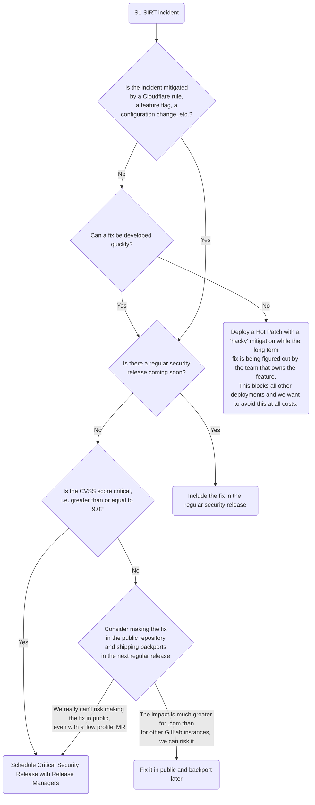

The following chart is intended for `~"severity::1"` issues. Other issues should follow the regular security release process.

```mermaid
flowchart TD
    Start(S1 SIRT incident) --> Mitigated{Is the incident mitigated<br>by a Cloudflare rule,<br>a feature flag, a<br>configuration change, etc.?}
    Mitigated -->|No| QuickFix{Can a fix be developed quickly?}
    QuickFix --> |Yes| RegularRelease
    QuickFix --> |No| HotPatch(Deploy a Hot Patch with a 'hacky' mitigation while the long term<br>fix is being figured out by the team that owns the feature.<br>This blocks all other deployments and we want to avoid this at all costs.)
    Mitigated --> |Yes| RegularRelease{Is there a regular security<br>release coming soon?}
    CVSSS1{Is the CVSS score critical,<br>i.e. greater than or equal to 9.0?} --> |Yes| CriticalRelease
    CVSSS1 --> |No| PublicFix{Consider making the fix<br>in the public repository<br>and shipping backports<br>in the next regular release}
    RegularRelease --> |Yes| ShipRegularRelease(Include the fix in the regular security release)
    RegularRelease --> |No| CVSSS1
    PublicFix -->|We really can't risk making the fix in public,<br>even with a 'low profile' MR| CriticalRelease(Schedule Critical Security Release with Release Managers)
    PublicFix -->|The impact is much greater for .com than<br>for other GitLab instances, we can risk it| ShipPublicFix(Fix it in public and backport later)
```
