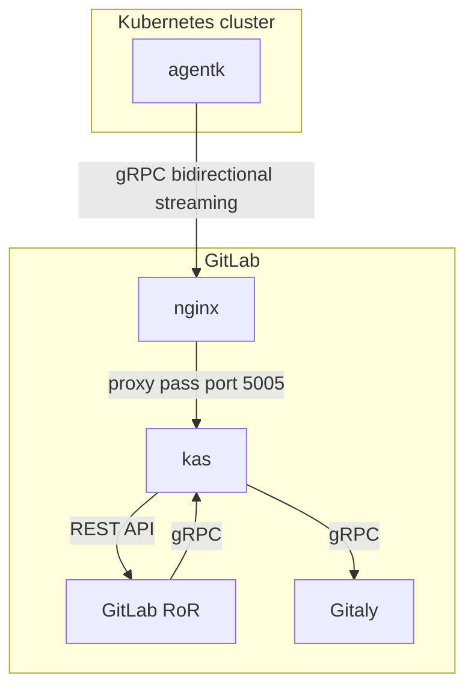

## Using the `threat model` scoped labels

To assist in the creation of threat models the two labels `~threat model::needed` and `~threat model::done`
should be used. Whenever a threat model for a particular issue or epic should be created the Appsec stable
counterpart will apply the `~threat model::needed` label to the epic or issue. The Appsec stable counterpart
will also create a dedicated threat modeling issue in the
[`threat-models`](https://gitlab.com/gitlab-com/gl-security/appsec/threat-models/-/issues/new?issuable_template=Threat%20Model)(internal link) project.
Within the issue the development and the application security team should collaborate on the creation
of a threat model. The issue template contains detailed steps to guide through the process.

If you're new to threat modeling: for a beginner friendly start please have a look at our
[threat modeling how to page]().

## Creating the threat model

The scope definition and priortization is a very first step towards
building a proper [threat model]()
for the to-be-reviewed item. If time allows and the complexity of
to-be-reviewed feature justifies it, a more in-depth threat model
should be developed. In the context of an AppSec review we will
follow the [PASTA approach]()
which has been chosen to be the most flexible approach fitting
for various threat modeling cases throughout GitLab.

- In the AppSec review we should start with the [Stage III - Application Decomposition]()
  as soon as we have a clear scope definition for the review. This stage
  of application decomposition is an extension of the priortization step
  where much more details should be considered.
- The threat analysis [Stage IV - Threat Analysis]()
  should be used to create a detailed test plan for the review.
- Finally the
  [Stage V - Vulnerability and Weakness Analysis]()
  would be the actual technical review process which allows us to verify
  the assumptions of the two previous stages.
  
In total this would reflect the
[evidence driven threat model]()
within the review.

### Stage III - Application Decomposition

This stage of the threat modeling approach is listed in the review template as
a dedicated item. In this stage, the most work is being done to actually have a
model of what is being reviewed.

For the typical AppSec review of a new GitLab feature a few things should be
considered to get a meaningful threat modeling output. The threat model should
be developed starting at the entry points of external data considering any security
or trust boundaries the data passes. This will result in a of Data Flow Diagram
which can be used to guide the actual review process. In the threat modeling context
a Data Flow Diagram is a visual representations of the modeled item, showing
the components and their interaction along with trust boundaries which might
be traversed by data form untrusted sources.

A good starting point for a data flow diagram in threat model is usually to
take (a maybe existing) architecture diagram, like to following from the
GitLab Agent for Kubernetes:

Considering this diagram we can already spot a trust boundary between the
`agentk` and the `Gitlab` components. The flow of data is also depicted
in a usable way for threat modeling and the involved components wich consume
or provide data are visible. Such a diagram can now be used and complemented
with actual threat and security context to form an actual threat model.

More specific instructions and steps are listed in the [review template](https://gitlab.com/gitlab-com/gl-security/appsec/appsec-reviews/-/tree/master/.gitlab/issue_templates/AppSec%20Review.md).

### Stage IV - Threat Analysis

This stage is the actual doing of the review. Any findings made are the main
output of the threat analysis.

### Stage V - Vulnerability and weakness analysis

The output of the review process done in stage IV should be mapped back to the
decomposition in stage III. That way we can verify that our decomposition and
the initial threat assumptions did provide meaningful guidance for the review
process. The output and mapping can be documented in the conclusion's summary
and coverage sections.
