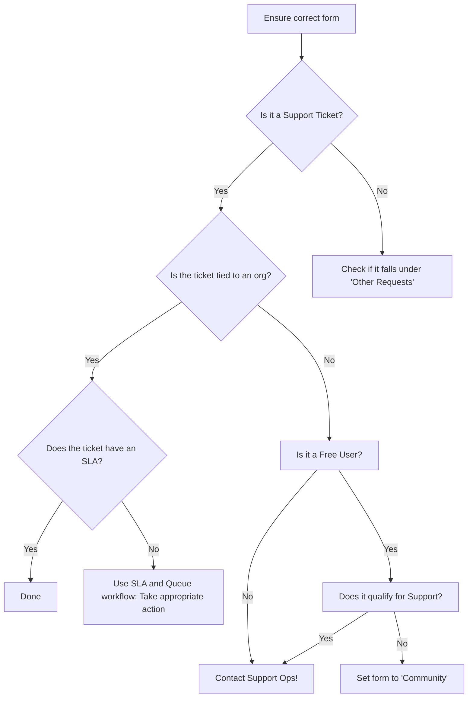

---

title: Triaging Tickets
description: "A walk through of some basic checks and items to tick off when working on the Needs Org and Triage queue in ZenDesk."
category: Handling tickets
subcategory: Triaging
---

## Purpose of this page

This page aims to walk you through some basic checks and items to tick off when working on the Needs Org and Triage queue in ZenDesk.

## Overall Flow

## Applying the Correct Form

A ticket should have the correct [form](https://handbook.gitlab.com/handbook/support/readiness/operations/docs/zendesk/forms/) applied to it to help route it to the right set of individuals who can assist with that request.

The single source of truth for what forms exist is the [Current active forms](https://handbook.gitlab.com/handbook/support/readiness/operations/docs/zendesk/forms/) list in the Support Ops handbook section.

Below is a list of some commonly used Zendesk forms with a brief explanation regarding their usage:

- Self-Managed: An issue where the customer is maintaining their own local instance of GitLab
- SaaS (GitLab.com): An issue involving the GitLab hosted SaaS offering
- SaaS Account: Single user account issue only, all others go to GitLab.com (SaaS).
- L&R (License and Renewals): subscription and purchase issues, see also [L&R workflows](/handbook/support/license-and-renewals/workflows/).
- Community: any ticket not entitled to support. Typically, Self-managed CE user, or SaaS free user request [not listed as supported](/support/statement-of-support/#free-users). See [Handling Free User tickets](#handling-free-user-tickets) for further instructions on how to handle free user tickets.
- Professional Services: For tickets that should go to the Professional Services team, such as requests about [the GitLab LevelUp platform](https://about.gitlab.com/handbook/people-group/learning-and-development/level-up/)(`levelup.gitlab.com`).

**Please note:** It's recommended to always use the `General::Forms::Incorrect form used` macro to *change* the ticket form, unless it's between Self-Managed, SaaS (GitLab.com) and SaaS Account.

### For security related matters

Apply the macro `Security::All Security Questions`. This will reply and solve out the ticket.

### Moving to non-support forms

For cases that need to go to non-support forms, apply the `General::Forms::Incorrect form used` macro. Support Operations will do the rest from there.

### Handling Free User tickets

Free Users who are reporting Self-Managed or SaaS issues

1. Triage the Free User ticket and verify if they are a SaaS user who meets the support criteria outlined in the [free users section of the statement of support](https://about.gitlab.com/support/statement-of-support/#free-users).
1. If they do not meet the above criteria or the ticket is for a self-managed Free User, tickets that are `New` can be moved to the `Community` form, which will activate the [`Ticket::FRT and NRT Stage::Autoreply to Community tickets`](https://gitlab.com/search?group_id=2573624&repository_ref=master&scope=blobs&search=id%3A+5475841891484&snippets=false) trigger (responds and solves the ticket). If the ticket is `Open`, then direct the customer to the [GitLab community forum](https://forum.gitlab.com/) via the ["Self-managed or GitLab.com Free User Request" macro](https://gitlab.com/search?utf8=%E2%9C%93&group_id=15990755&project_id=17008590&scope=&search_code=true&snippets=false&repository_ref=master&search=id%3A+360044960813) and mark it "Solved”. If you wish to provide technical assistance to the user, then please do so via the [GitLab community forum](https://forum.gitlab.com/).

Free Users who are reporting L&R issues

Triage the Free User ticket and verify if the user’s issue relates to subscriptions or account/billing listed in the [Applying the Correct Form section](#applying-the-correct-form), change the form to the appropriate one so that a team member can deal with the request directly.

If the user is asking for assistance getting in contact with sales, you can use the "L&R" form.

If the request falls outside of such scenarios, see the [Other Requests section](#other-requests), or direct the user to the [GitLab community forum](https://forum.gitlab.com/) and the ticket marked as "Solved".

## After applying the correct form

- Apply the correct `Problem type` if possible (this may need to happen after looking up the organization information).
- With help from the [Looking up customer details]() page to understand how and where you can find customer information from ZenDesk, Salesforce and the customer portal.
- Check [SLA and Zendesk views page]() for after an org is assigned.

## US Federal tickets in Global Support Portal

Users of GitLab's [US Federal Support](https://about.gitlab.com/support/us-federal-support/) offering may opt to raise a ticket in the Global Support Portal as well. The most common reason for this is the need for support outside of the US Federal's [hours of operation](https://about.gitlab.com/support/#hours-of-operation). If during the triage process, a Global Agent comes across a ticket that is from an organization which appears to be a customer entitled to US Federal Support, the agent can work this case the same as they would any other ticket.

If a ticket is created through the Global Support Portal and a request is made that only agents with US citizenship handle the case, then the agent should direct the customer to file a new case via the US Federal Support portal and make their account team aware.

## Other Requests

We also receive non Support requests in our queue - if you see something not listed below or something you are unsure about, ask in the `#spt_managers` slack channel and make a MR to update the list below when you find out the answer.

|Request|Workflow|
|--|--|
|Training|Redirect requester to [Education from Professional Services](https://about.gitlab.com/services/education/)|
|New Set Up/Installation|Follow the [Passing a Lead to Sales](/handbook/support/license-and-renewals/workflows/working_with_sales.html#specific-workflows-to-pass-to-sales) workflow|
|Requests for swag|Ask in the #swag internal slack channel or direct to [the FAQ](https://shop.gitlab.com/faq) for existing orders. For general requests for free swag, use the `General::Free Swag Request` Macro.|
|Questions related to jobs/openings|Redirect requester to Outbound Talent Acquisition Model page|
|Questions related to status of job application| Use the `General::Job Application Questions` [macro](https://gitlab.com/gitlab-com/support/support-ops/zendesk-global/macros/-/blob/master/macros/active/General/Job%20Application%20Questions.yaml) and send a note to the internal `#talent acquisition` Slack channel.|
|Legal Questions and Concerns|Ask in the #legal internal slack channel|
|Missing Learning and Development Certificates | Direct requester to review  Missed Certificate and contact `learning@` with a note about which certificate/knowledge assessment is missing. |
|Questions regarding [GitLab Partner Program](https://partners.gitlab.com/English/) or problems with registration. | This program is under [Channel Partner](https://about.gitlab.com/handbook/resellers/). Kindly direct requester to contact `partnersupport@` or ask in [#partner-programs-ops](https://gitlab.slack.com/archives/CTM4T5BPF) when unsure. |
