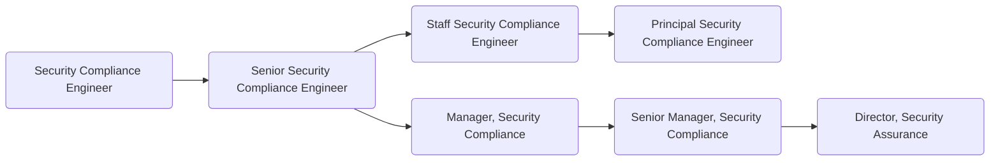

For members of GitLab's [Security Assurance sub department](https://about.gitlab.com/handbook/security/security-assurance/), it is the goal of [Security Compliance](https://about.gitlab.com/handbook/security/security-assurance/security-compliance/) to:

1. Enable security to scale through the definition of security and privacy controls and document the boundaries and applicability of the information security management system to establish its scope.
1. Work across industries to support GitLab customers in their own compliance journey.
1. Identify and mitigate GitLab information security risk through continuous control monitoring and automation.

Security Compliance professionals at GitLab focus on operating our security and privacy compliance programs and are proficient in all things security compliance. They are comfortable operating within our transparent compliance programs and understand how compliance works with cloud-native technology stacks.

## Responsibilities

- Professionally handle communications with internal and external stakeholders on security and privacy compliance issues
- Maintain up-to-date knowledge of GitLab's product, environment, systems and architecture
- Educate control owners on compliance workflows and processes
- Maintain GitLab's security control framework and continuous control monitoring activities
- Gather and report on established metrics within the security and privacy compliance programs

## Requirements

- Ability to use GitLab
- Prior experience working with a SaaS company preferred
- Passion for transparent compliance programs

## Levels

### Security Compliance Engineer (Intermediate)

This position reports to the Security Compliance Manager role at GitLab.

#### Security Compliance Engineer (Intermediate) Job Grade

The {Security Compliance Engineer} is a [6](https://about.gitlab.com/handbook/total-rewards/compensation/compensation-calculator/#gitlab-job-grades).

#### Security Compliance Engineer (Intermediate) Responsibilities

- Conduct security control test of design and test of operating effectiveness activities
- Identify observations and manage remediation tasks through to closure while adhering to strict deadlines
- Support internal and external auditors or advisors as needed
- Maintain handbook pages, procedures and runbooks related to security compliance
- Identify opportunities for security compliance control automation
- Maintain security compliance automation tasks

#### Security Compliance Engineer (Intermediate) Requirements

- A minimum of 2 years' experience working with security compliance programs
- Demonstrated experience with at least two security control frameworks (e.g. SOC 2, ISO, NIST, COSO, COBIT, etc.)
- Working understanding of how compliance works with cloud-native technology stacks

### Senior Security Compliance Engineer

This position reports to the Security Manager, Compliance role at GitLab.

#### Senior Security Compliance Engineer Job Grade

The {Senior Security Compliance Engineer} is a [7](https://about.gitlab.com/handbook/total-rewards/compensation/compensation-calculator/#gitlab-job-grades).

#### Senior Security Compliance Engineer Responsibilities

- The responsibilities of a Security Compliance Engineer, plus;
- Execute end to end compliance initiatives in accordance with the compliance roadmap
- Design high-quality test plans and direct security control test activities
- Continuously improve GitLab's security control framework
- Draft and implement handbook pages, procedures and runbooks related to security compliance
- Direct external audits
- Build and maintain security controls that map to GitLab security compliance requirements and provide implementation recommendations
- Peer review control test worksheets and provide feedback and guidance to Security Compliance Engineers
- Identify manual security compliance controls that can be improved through automation
- Design requirements for security compliance automation tasks
- Recommend new security compliance metrics and automate reporting of existing metrics

#### Senior Security Compliance Engineer Requirements

- A minimum of 5 years' experience defining and shaping compliance programs
- Demonstrated experience with at least four security control frameworks (e.g. SOC 2, ISO, NIST, COSO, COBIT, etc.)
- Detailed understanding of how compliance works with cloud-native technology stacks

### Staff Security Compliance Engineer

This position reports to the Security Manager, Compliance role at GitLab.

#### Staff Security Compliance Engineer Job Grade

The {Staff Security Compliance Engineer} is a [8](https://about.gitlab.com/handbook/total-rewards/compensation/compensation-calculator/#gitlab-job-grades).

#### Staff Security Compliance Engineer Responsibilities

- The responsibilities of a Senior Security Compliance Engineer, plus;
- Maintain expert knowledge of GitLab's product, environment, systems and architecture while mentoring others on this knowledge and helping to shape designs for the sake of security compliance efficiencies
- Participate in the development and continuous improvement of security compliance metrics
- Provide actionable and constructive advisement to cross-functional teams, to include driving remediation activities for high and select moderate risk Observations across several GitLab departments

- Implement security compliance technical and process improvements
- Mentor other Security Compliance Engineers and improve quality and quantity of the team's output
- Design and implement major iterations on GitLab's security control framework in alignment with industry trends
- Participate in security assurance roadmap development based on customer needs
- Predict future industry trends and demands to position GitLab as an industry expert of Security Compliance and execute initiatives to support these trends
- Create dynamic open-source security compliance programs that deliver value to the GitLab community
- Build the GitLab Security Compliance brand through regular internal and external presentations and publications
- Design, develop, and deploy scripts to automate continuous control monitoring, administrative tasks and metric reporting for all security compliance programs
- Successfully execute on quarterly KRs associated with OKRs

#### Staff Security Compliance Engineer Requirements

- A minimum of 10 years' experience defining and shaping compliance programs with a minimum of 3 years' experience building new compliance programs
- Proven experience building, maintaining and improving compliance programs from the ground-up
- Proven experience with successful first-time external certification and attestation audits
- Demonstrated experience with at least six security control frameworks (e.g. SOC 2, ISO, NIST, COSO, COBIT, etc.)
- Expert understanding of how compliance works with cloud-native technology stacks

### Principal Security Compliance Engineer

This position reports to the Senior Manager, Security Compliance role at GitLab.

#### Principal Security Compliance Engineer Job Grade

The {Principal Security Compliance Engineer} is a [9](https://about.gitlab.com/handbook/total-rewards/compensation/compensation-calculator/#gitlab-job-grades).

#### Principal Security Compliance Engineer Responsibilities

- The responsibilities of a Staff Security Compliance Engineer, plus;
- Collaborates and makes proposals across several departments on their security compliance work, and helps their team members make informed decisions in alignment with security assurance strategic plans
- Exposes technology and organizational needs throughout security assurance and proposes technical implementation plans
- Teach, mentor, grow, and provide advice to other domain experts, individual contributors, across several teams in security
- Play a central role in technical, business, and organizational contributions affecting security compliance/security assurance
- Interfaces with Senior management, and enables Staff Security Assurance Engineers to engage on security compliance aspects of larger security assurance initiatives
- Looks for innovation opportunities between several teams with a willingness to experiment and to boldly confront problems of large complexity and scope
- Ensures that OKR level goals are aligned across all teams in security assurance
- Guides conversations to remove blockers and encourage collaboration across teams and departments
- Provides a point of escalation for security compliance team members facing complex technical challenges
- Attain a measurable impact on the work of security compliance
- Interact with customers and other external stakeholders as a consultant and spokesperson for the work of security assurance
- Exposes the work of security compliance and their business impact internally
- Knowledgeable in all specialties practiced within security assurance
- Demonstrated achievements that make GitLab's security compliance program an industry leader

#### Principal Security Compliance Engineer Requirements

- A minimum of 15 years' experience defining and shaping compliance programs with a minimum of 5 years' experience building new compliance programs
- Industry recognized expert at building, maintaining and improving compliance programs from the ground-up
- Direct experience of successful first-time external certification and attestation audits at GitLab
- Industry recognized expert with at least six security control frameworks (e.g. SOC 2, ISO, NIST, COSO, COBIT, etc.)
- Expert understanding of how compliance works with cloud-native technology stacks

### Manager, Security Compliance

This position reports to the Director, Security Assurance.

#### Manager, Security Compliance Job Grade

The {Manager, Security Compliance} is a [grade 8](https://about.gitlab.com/handbook/total-rewards/compensation/compensation-calculator/#gitlab-job-grades).

#### Manager, Security Compliance Responsibilities

- Hire and oversee a world class team of security compliance engineers and Engineers
- Hold regular 1:1s with team members
- Maintain a robust common control framework and continuous monitoring program aligned with GitLab's certification roadmap
- Proactively identify changing regulatory requirements and appropriately adjust the scope of the security compliance program to accommodate these changes
- Ensure execution of required testing and remediation activities leading to successful security certification(s)
- Make broad recommendations on improving security compliance related processes and/or procedures across GitLab; partner with stakeholders to implement solutions
- Achieve and maintain SaaS and Corporate security certifications, to include oversight of external audits
- Prepare and deliver meaningful metrics to Security Assurance leadership
- Identify and implement automation of manual processes to shorten processes and cycles
- Successfully execute on quarterly OKR(s)

#### Manager, Security Compliance Requirements

- At least 3 years prior experience managing security compliance teams
- Detailed knowledge of common information security management frameworks, regulatory requirements and applicable standards such as: ISO 27001/2, ISO 27017, ISO 27018, SOC 2, HIPAA, GDPR, PCI, SOX, etc.
- Detailed knowledge of audit methodologies and standard deliverables

### Senior Manager, Security Compliance

This position reports to the Director, Security Assurance.

#### Senior Manager, Security Compliance Job Grade

The {Senior Manager, Security Compliance} is a [grade 9](https://about.gitlab.com/handbook/total-rewards/compensation/compensation-calculator/#gitlab-job-grades).

#### Senior Manager, Security Compliance Responsibilities

- The same responsibilities of a Security Compliance Manager, plus the below:
- Hold regular 1:1s with team managers and skip-level 1:1s with all members of their team
- Plan and execute long term strategies that benefit your team and align with strategic objectives
- Identify and independently manage new security certification lifecycle, from planning to maintenance
- Partner with the product organization to dogfood and drive GitLab compliance features internally
- Create and deploy innovative and effective strategies for continuous control auditing and monitoring
- Maintain reliable, up-to-date, information regarding security and compliance changes and trends
- Proactively identify new metrics along with strategic recommendations to Security Assurance leadership
- Draft and successfully execute on multiple quarterly OKRs

#### Senior Manager, Security Compliance Requirements

- At least 6 years prior experience managing security compliance teams
- Expert knowledge of common information security management frameworks, regulatory requirements and applicable standards such as: ISO 27001, SOC 2, HIPAA, GDPR, PCI, SOX, etc.
- Expert knowledge of audit methodologies and standard deliverables

## Specialties

### Dedicated Markets

The dedicated markets specialty is for compliance professionals highly skilled in federal, financial, life sciences and other highly regulated markets. Areas of expertise include Federal, Financial and Quality domains.

#### Dedicated Markets Responsibilities

For level: Manager, Security Compliance

- Hire and oversee a world class team of security compliance engineers experienced in regulated markets
- Hold regular 1:1s with team members
- Work closely with the Manager, Security Compliance and provide requirements for the common control framework aligned with GitLab's dedicated markets certification roadmap
- Maintain a scoped continuous monitoring program aligned with GitLab's dedicated markets certification roadmap
- Execute quarterly POA&M activities, maintain SSP and manage significant change requests
- Proactively identify changing regulatory requirements and appropriately adjust the scope of the dedicated markets program to accommodate these changes
- Ensure execution of required testing and remediation activities leading to successful security certification(s) for dedicated markets
- Make broad recommendations on improving dedicated markets related processes and/or procedures across GitLab; partner with stakeholders to implement solutions
- Achieve and maintain Dedicated and dedicated markets security certifications, to include oversight of external audits
- Prepare and deliver meaningful metrics to Security Assurance leadership
- Identify and implement automation of manual processes to shorten processes and cycles
- Successfully execute on quarterly OKR(s)

#### Dedicated Markets Requirements

For level: Manager, Security Compliance

- At least 3 years prior experience managing security compliance teams supporting regulated markets and FedRAMP ATO
- Experience leveraging OSCAL for SSP development and OSCAL validation tools for continuous control monitoring
- Detailed knowledge of regulated information security management frameworks, regulatory requirements and applicable standards such as: NIST 800-53/FedRAMP, NIST 800-171/CMMC, DoD IL, STIGs, FIPS 140-2, HITRUST, GxP, ISO 9001, SOC 1 and SOC 2
- Detailed knowledge of audit methodologies and standard deliverables

## Segment

### Security Leadership

For details on the Security organization leadership roles, to include the Security Assurance Director and VP of Security, see the Security Leadership page.

## Performance Indicators

- [Security Control Health](https://about.gitlab.com/handbook/security/performance-indicators/#security-control-health)

## Career Ladder

## Hiring Process

Candidates for this position can expect the hiring process to follow the order below. Please keep in mind that candidates can be declined from the position at any stage of the process. To learn more about someone who may be conducting the interview, find their job title on our [team page](https://about.gitlab.com/company/team/).

- Qualified candidates will be invited to schedule a 30 minute [screening call](https://about.gitlab.com/handbook/hiring/interviewing/#screening-call) with one of our Global Recruiters.
- Next, candidates will be invited to schedule a 50-minute interviews with the hiring manager,
- Then, candidates will be invited to schedule 3 separate 50-minute interviews with 3 different peers from within the Security orgnaization,
- Finally, candidates will be invited to schedule a 25-minute interview with the Director, Security Assurance.

Additional details about our process can be found on our [hiring page](https://about.gitlab.com/handbook/hiring/).
