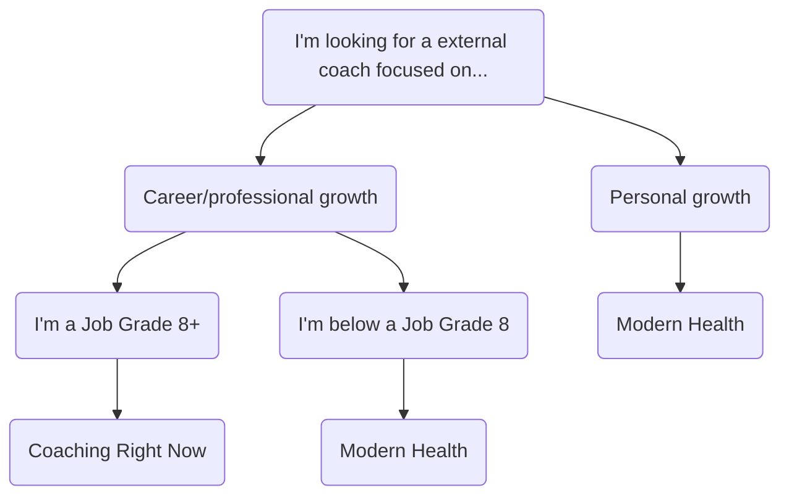

## Coaching at GitLab

Coaching conversations are fluid, dynamic acts of co-creation where the coach and the coachee are equal partners. Coaching is an important component of our [360 review process](/handbook/people-group/360-feedback/) and for [guidance on feedback](/handbook/people-group/guidance-on-feedback/). Coaching can occur during
[one-on-one meetings]() or at any time. It is an important component of [career development](/handbook/leadership/1-1/#career-development-discussion-at-the-1-1), [leading teams](), [building an inclusive culture](https://about.gitlab.com/company/culture/inclusion/building-diversity-and-inclusion/#tips-for-managers), [mentoring](/handbook/engineering/career-development/mentoring/), and much more.

## Selecting a coach

There are various ways to find a coach at GitLab:

| Coaching Type | Description |
| ----- | --------------- |
| Coaching Right Now | Professional coaching by external coaches is offered for managers and IC's Job Grade 8 and above using the [Growth and Development Benefit](/handbook/total-rewards/benefits/general-and-entity-benefits/growth-and-development/#types-of-growth-and-development-reimbursements). We work with [Coaching Right Now](/handbook/total-rewards/benefits/general-and-entity-benefits/growth-and-development/#professional-coaching) as our vendor of choice to pair team members with coaches who have been reviewed by the GitLab L&D team. More information about this program with Coaching Right Now can be found [here](https://docs.google.com/document/d/188H3iuIY9JwE4kmAeoLobNz-e6j-rKie/edit?rtpof=true&sd=true). |
| [Modern Health](/handbook/total-rewards/benefits/modern-health/) | Using our Modern Health Employee Assistance Program provides professional coaching to all team members. Coaches on Modern Health specialize in professional/career, mental health, and financial coaching. |
| Manager Coaching | Your manager can be a coach that steers you towards future goals. Ensure that your Manager can take you on in a coaching capacity. However, coaching can also be a type of interaction you have with your Manager during 1:1 discussions. |
| Internal Coach | Consider a senior to you in your larger team or someone outside of your team that has inspired you on the specific areas you are working and developing on. Consider searching on [this list of available mentors](/handbook/people-group/learning-and-development/mentor/#find-a-mentor).
| Alternative Professional Coach | If some reason the coaches offered via Coaching Right Now or Modern Health do not fit your needs, team members with a Job Grade 8+ can seek and get approval for alternate external coaches. |

### Why you might need or want a coach

Coaching is a powerful career growth tool. Individual contributors and people leaders can both benefit from coaching. It's a common misconception that coaches are a last resort resource, or only for team members who are on a performance improvement plan. It's also a misconception that coaching is only for senior leaders.

Review examples of why you might want to, or benefit from, meeting with a professional coach. This list is not exhaustive.

1. A new people manager wants to define and develop their individual leadership style.
1. An individual contributor has a general idea of their growth goals and wants to refine their goal and stay accountable.
1. An experienced people manager is developing their communication style and skill to meet the needs of their new team.
1. A team member is thinking about moving into a new role and wants guidance on the transition.
1. A team member has a new manager or direct report and is trying to adapt their working style.

{.shadow.medium.center}

## How coaches coach

Coaches help team members focus their attention on the future while recognizing their strengths and areas for development. Coaches help the coachee tap into their potential, identify desired outcomes, and achieve goals.

Key attributes of a coach include:

1. Ask powerful questions to deepen learning or insight.
1. Help your coachee recognize their strengths and untapped potential.
1. Encourage your coachee to move to action on their choices.
1. Hold your coachee accountable for the actions they have committed to.
1. Fully focusing on the coachee.
1. Listen deeply while offering support.

### Essential coaching skills

Effective coaches use a defined set of skills to enable coaching coversations. Those skills include:

{}
Asking powerful, open-ended questions. Coaching is about coming from a place of asking, not telling, while empowering team members to create their solutions. Coaching works to "pull out" insight from an individual.

**How to structure questions**

- Ask open ended questions. Good questions start with "what" or "how." As you move to questions around action, "who" and "when" can also be helpful.
- One question at a time. Focus attention on one question that focuses on one element of the conversation.
- Keep the questions brief.
- Stay with the coachee's agenda. Pick a question that reflects where they are, not where you think they should be.
- Ask for permission. If you want to challenge the person, or give them a suggestion or insight they may not otherwise have, ask them for permission.

**Questioning - What to avoid**

- Avoid closed questions - they can close down thinking. Avoid questions that use the following: "Does that...do you...have you...is there?"
- Why questions - these can cause the person to feel defensive and may close down their learning from the coach.
- Leading questions, statements, or opinions in the form of questions. These points the coachee to a place you think they should go, when they will be more committed to action if they come to their own conclusions.
- Stale questions - avoid asking questions that you thought of at the start of the session, but which may not be relevant anymore (If you find yourself waiting for the right time to ask a question, chances are you may not be listening anymore).

{}

{}
Listening enables openness and curiosity. It also signals to the coachee that you are fully present. To ask great questions, you need to be fully listening.

**Listening like a coach**

- Be present physically, mentally, emotionally (close down screens and give your coachee your undivided attention).
- Focus on the other coachee.
- Listen with curiosity and without judgment.
- Allow time for silence when the coachee is processing your question.
- Pay attention to body language through video chat: Make eye contact in the camera, smile, make gestures such as nodding your head to show you are present and lean into the discussion.
- Provide focus and try to clarify for the coachee.
- Without judgement, offer an observation, hold up the mirror to show what you are hearing and to deepen insight for the other person.
- Without judgement, confront or challenge what might be a limiting belief to open up new opportunities for the coachee.

**What to listen for**

- The tone of voice
- The pace of speech and shifts in energy
- Virtual body language
- Choice of words
- Overarching themes or what the coachee continues to come back too
- Underlying beliefs and assumptions
- Blind spots
- Personal values and what matters most to them
- The pauses and the silence
{}

{}
Encourage and show enthusiasm by identifying strengths in the coachee to build trust. Be open and ground yourself in individual team member strengths. Reflect on what you noticed and determine the impact on the coachee to see that the [feedback](/handbook/people-group/guidance-on-feedback/) has landed.

**When to Encourage**

- At the beginning of a coaching conversation, acknowledge progress made or an accomplishment achieved.
- During a conversation, acknowledge when the coachee makes a connection or gains new insight.
- During brainstorming, acknowledge when somone has stretched beyond their comfort zone.
- During planning for action, acknowledge someone's commitment to change.

**Strategies to practice encouraging**

- Acknowledging: Focuses on the coachee - who they are as a person and what they have done in their life, their inner character. Make the coachee feel unique and that you recognize what sets them apart.
- Appreciating: Focuses on the positive impact and contribution of the deed to others.
- Praising: Focuses on the deed, what people do - [results](), [transparency](), [efficiency](), [inclusion](https://about.gitlab.com/company/culture/inclusion/), and performance.
{}

{}
Challenge your coachee to push their comfort zone, raise the bar, and play a bigger role. Your role as a coach is to hold a bigger picture of what's possible. A great challenge jolts someone into examining the limits of their comfort zone and move beyond them.

**When to challenge**

- When your coachee has been sitting in their comfort zone or they've been playing it safe for too long.
- A coachee who has been moving fast and thrives on challenges.
- To increase the coachee's self-confidence and to increase their perception of what is possible.
{}

{}
Focus on the other person without judgment. Give your coachee your undivided attention. Closeout other programs during a virtual coaching session. Be open and curious by identifying what's working and what's not. Be truly present physically, mentally, and emotionally.

**Strategies on how to be present**

- Make gestures such as nodding your head to show you are present.
- Empty your own mind of all preoccupations that are diverting your own focus, attention, and energy.
- Ground yourself in an open, curious, and appreciative mindset.
- Look for something to appreciate about your coachee, your self, and the coaching process.
- Ground yourself in your intentions for the coaching conversation.
{}

### Different hats for different conversations

Coaching is just one mode of conversation you might use as a [leader](). You may be a team lead running an engineering program. You may be managing [one of our TMRG's](https://about.gitlab.com/company/culture/inclusion/erg-guide/). You may [be a mentor](https://about.gitlab.com/handbook/engineering/career-development/mentoring/) or [an onboarding buddy](/handbook/people-group/general-onboarding/onboarding-buddies/). You are also most likely a direct report of someone else. Think of these roles as wearing `different hats.`

You may wear multiple hats in any given day:

1. **Manager Hat** - Being directive and assigning tasks to your team.
1. **Teacher Hat** - Passing on your knowledge and expertise to grow someone else's skills.
1. **Mentor Hat** - Sharing advice and giving guidance from your own experience.
1. **Coach Hat** - Asking questions and listening deeply to help team members reach solutions.

<figure class="video_container">
<iframe src="https://docs.google.com/presentation/d/e/2PACX-1vTadK6g9lEwLV8nP9GWPrgcF7sRHxycOuLwlZQm_h05D_FJpC3T9JzGUB7FmZY0UyW-ii4IfP0groBd/embed?start=true&loop=false&delayms=3000" frameborder="0" width="960" height="569" allowfullscreen="true" mozallowfullscreen="true" webkitallowfullscreen="true"></iframe>
</figure>

### Trust and Coaching

Building trust is an important ingredient in coaching and team dynamics. Trust lies at the heart of a functioning and cohesive team. There are five dysfunctions of a team [according to Patrick Lencioni](https://www.youtube.com/watch?v=GCxct4CR-To) that can break down trust throughout the team:

1. **Absence of Trust:** Team members are reluctant to be vulnerable with one another and are unwilling to admit their mistakes, weaknesses, or need for help.
1. **Fear of Conflict:** Lack of trust prevents the flow of unfiltered, passionate debate about tasks, activities, and projects. These conversations are crucial to ensure all voices are heard and all options are considered.
1. **Lack of Commitment:** Without some conflict it is difficult for team members to commit to decisions, fostering an environment where ambiguity prevails. A team with strong commitment is more likely to put in more effort.
1. **Avoidance of Accountability:** When teams do not commit to a clear plan of action, even the most focused and driven individuals are hesitant to call their peers on actions and behaviors that may seem counterproductive.
1. **Inattention to Results:** When no one is accountable, team members may naturally tend to put their own needs ahead of the collective goals; for example, career development and recognition.

<figure class="video_container">
<iframe src="https://docs.google.com/presentation/d/e/2PACX-1vQwmhv3MIUV4065TeQ4N1Lz4xhjROQRTaTW2XNa5qH4k-mq4GNLgRYhi2fr2hjZslZ7V8JBipbvuaBv/embed?start=true&loop=false&delayms=3000" frameborder="0" width="960" height="569" allowfullscreen="true" mozallowfullscreen="true" webkitallowfullscreen="true"></iframe>
</figure>

#### The Trust Equation

**[The Trust Equation&trade;](https://trustedadvisor.com/why-trust-matters/understanding-trust/understanding-the-trust-equation#:~:text=The%20Trust%20Equation%20uses%20four,%2C%20Intimacy%20and%20Self%2DOrientation.&text=The%20Trust%20Quotient%20is%20a,trustworthiness%20against%20the%20four%20variables.)** is a concept to help increase trustworthiness with your team. The more trust you have with team members, the easier it will be to have coaching conversations.

The trust equation uses four objective variables to measure trustworthiness:

| Objective Variable | Measurement |
| ----- | ---------- |
| **Credibility:** | My word is believable. Put simply, credibility rates "what you say and how believable you are to others." In other words, you must be credible if you are asking others to follow your lead. |
| **Reliability:** | I do what I say I will do. Reliability measures "actions, and how dependable you appear." Can you be counted on? People need to know that their leaders will come through for them. |
| **Intimacy:** | I empathize with others. Intimacy considers 'how safe people are sharing information with you." When you are presented with confidential information, you need to keep it so. |
| **Self-Orientation:** | My focus is on my team, not personal gain. Self-orientation is a personal focus on yourself or others. Too much self-focus will lower your degree of trustworthiness. |

The trust equation has one variable in the denominator (self-orientation) and three in the numerator (credibility, reliability, intimacy). Increasing the value of the factors in the numerator increases the value of trust. Increasing the denominator (self-orientation) decreases the value of trust.

<figure class="video_container">
<iframe src="https://docs.google.com/presentation/d/e/2PACX-1vQ7oRKaXPc3-pqXJEU5SHdlBJlHw00HO4oOcfmH5z0Iq0ojz-lQ1HoudBSeUoHlQNQfUZf_4UoCyObR/embed?start=true&loop=false&delayms=3000" frameborder="0" width="960" height="569" allowfullscreen="true" mozallowfullscreen="true" webkitallowfullscreen="true"></iframe>
</figure>

#### Neuroscience of Trust

The neuroscience studies show that recognition has the largest effect on trust when it occurs after a [goal has been met](https://hbr.org/2017/01/the-neuroscience-of-trust). The neuroscience of trust can help team members increase empathy, plan efficiently, and decrease thread and fear responses.

<figure class="video_container">
<iframe src="https://docs.google.com/presentation/d/e/2PACX-1vSxZWO97gkIShmnZ-Ue7C9tbHVMT9BcuUx643pcGKrV29EQiXnpZ6yzTIZIuCUscwhTsT5ZoR6Gn-ZL/embed?start=true&loop=false&delayms=3000" frameborder="0" width="960" height="569" allowfullscreen="true" mozallowfullscreen="true" webkitallowfullscreen="true"></iframe>
</figure>

#### The Return on Trust

Compared with people at low-trust companies, people at high trust companies report the following according to a [study from Accenture](https://bankingblog.accenture.com/the-importance-of-building-trust-in-the-financial-services-workplace-explained-in-6-eye-opening-statistics):

1. 106% more energy at work
1. 76% more engagement
1. 50% higher productivity
1. 60% more satisfaction with their job and 29% more satisfaction with their lives
1. 70% more aligned with their companies purpose
1. 74% less stress
1. 40% less burnout

## GROW Model

The GROW Model is a four-step method for holding coaching conversations with a coachee. You can apply it during coaching sessions to guide the coachee through future-focused discussions.

**G - Goals:** Identify the inspirational goal to drive success and keep energy and motivation high.

**R - Reality:** Discuss the current situation and what barriers currently exist to achieve future goals

**O - Options:** Explore the options for moving forward

**W - Way Forward:** Agree on specific actions and timeframe to set accountability for the coachee

<figure class="video_container">
<iframe src="https://docs.google.com/presentation/d/e/2PACX-1vRyDezAdhbc9k5YOQmkUxCxkroz-yR6dpX1CoevIULZM10DcYLy_hBo3yQGlHPUgzPrAxZmNzR7Qjwj/embed?start=true&loop=false&delayms=3000" frameborder="0" width="960" height="569" allowfullscreen="true" mozallowfullscreen="true" webkitallowfullscreen="true"></iframe>
</figure>

## Attributes of a coachee

As a coach uses their core coaching skills, a coachee can access their own set of skills and activities to get the most out of the coaching conversation through the following:

1. **Be Present**: Just as the coach is being present, a coachee needs to be present in the conversation, attentive, open to possibilities and fully engaged.
1. **Reflect**: A coachee is invited to reflect, wonder, ponder, and contemplate through a coaching conversation through powerful questions.
1. **Visualize**: The coachee can harness the power of their imagination and paint a picture in their mind of the desired future outcomes to enhance their chances of success.
1. **Learn**: Coaching conversations revolve around learning by discovering new perspectives by coming to a new understanding or realization.
1. **Transform**: Change is a core attribute of coaching. Sometimes the transformation may be small when a coachee has increased clarity on appropriate action to move forward. At times the transformation may be more profound, as a coachee can shift their mindset in a way that there's no going back.

## Coaching Conversations

### Planning for action

The planning for the action phase is about enabling the coachee to make a plan with action steps that support their goals.

**How to plan for action:**

- The coachee commits to and is accountable for actions that they design for themselves.
- The coach may brainstorm, probe, request, challenge, or raise the bar but the coachee is ultimately responsible for designing the action steps.
- The coach's actions for the coachee are in service of the coachee's agenda.
- Coaches may not necessarily be attached to the results a coachee achieves.
- Actions are anchored in what is important to the coachee, what changes they want to achieve. Coaches should hold their coachee accountable for performance on action steps and their overall change agenda.

When you are planning for action while wearing your coaching hat, you are not evaluating or judging or driving your agenda. The coachee should ultimately decide the action steps, committing to their path forward. As a coach, you are curious and non-judgemental while living up to [GitLab values]().

#### Sample planning for action questions:

- What might be three next steps that you can take in order to....?
- What are you going to do? When are going to do it? How will you know?
- What do you need/want to find more about...?
- What kind of support do you need? From whom?
- My request is that this week you... Will that work for you?
- I challenge you to...What do you think?
- In what way do you want me to follow up with you?

### Ending the coaching conversation

When a coaching session is completed, it is essential to review the goal of the conversation with the outcome by asking:

- So you wanted to talk about _____, in what way has this conversation been useful for you?
- What do you want to take away from this conversation?

The coach might also want to end the conversation with a few statements about what this session has reminded them of and what they truly appreciate in the coachee. Coaching is about empowering. They are helping team members to increase and balance their self-confidence and self-worth:

- What I truly appreciate from our conversation was...
- What I admire you for is...
- What you have helped me realize, learn, or reminded me about is...

### Additional coaching skills

- Offering a big picture perspective
- Use of metaphors
- Brainstorming
- Creating a compelling picture of what could be
- Championing
- Challenging
- Identifying underlying limiting beliefs, assumptions, and mindset
- [Tips for managing conflict]()

## Live Learning Session

During Week 2 of our Manager Challenge Pilot, we had a course covering [Building Trust]() and [Coaching](). The [slide deck](https://docs.google.com/presentation/d/1PT8x7lUR0-X-M_H7n_tvYKsC1HRtKTiMy0BtmtPcO4Q/edit?usp=sharing) and [meeting agenda](https://docs.google.com/document/d/1eHhOfgqllzAiGOf6gI98wegaxm5-8eLnZ8Qpq7KOLaY/edit?usp=sharing) follow along with the session.

A recording of the first of two sessions can be found here:



### Introduction to Coaching



We held 50 minute Introduction to Coaching [Live Learning](/handbook/people-group/learning-and-development/#live-learning) sessions on 2020-12-03. The recording follows along with the [slide deck](https://docs.google.com/presentation/d/1jOAZQkIJq9iU7ho6a09AOANKJs7W7IwnbVYBIlX9kmk/edit?usp=sharing) and [agenda](https://docs.google.com/document/d/1UIyIeyCcWCtNcOR2Wz5jvbSdKHI2OanLoM-WR7Gtknw/edit?usp=sharing).

## Coaching Manager Competency

In an all-remote organization, coaching is a critical skill for managers to develop and improve upon as they progress in their careers. Coaching helps to facilitate the career development of team members through regular coaching conversations. Coaching helps team members change behavior, improve performance, and sustain commitment through encouragement, support, collaborative problem-solving, goal setting, and [feedback](/handbook/people-group/guidance-on-feedback/).

**Skills and behavior of the [coaching competency](/handbook/competencies/) for managers:**

- Facilitates job performance growth of team members by providing regular coaching sessions
- Understands team members long-term career goals and acts as a mentor and guide to achieving them
- Conducts development and career planning dialogues with team members continuously
- Reflects on their leadership style and impact on the team and team situation
- Seeks new coaching approaches and techniques and exemplifies what it means to continuously develop their skills
- Delivers effective strategies for dealing with cases of [underperformance]() and instills that in other leaders across the organization

### Resources for coaching and providing feedback

There is a [handbook page](/people-group/learning-and-development/manager-coaching-and-leadership-resources/) which collects resources for different approaches, techniques, and styles of coaching and providing feedback.

### Additional coaching resources

- [The Leader as Coach - Harvard Business Review Article](https://hbr.org/2019/11/the-leader-as-coach)
- [What Can Coaches Do for You? - Harvard Business Review Article](https://hbr.org/2009/01/what-can-coaches-do-for-you)
- [Four Tips for Coaching Remote Employees](https://insideoutdev.com/blog/4-Tips-for-Coaching-Remote-Employees)
