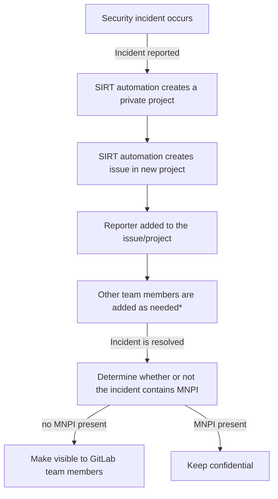

The Security Incident Response Team - SIRT is on the forefront of security events that impact both GitLab.com and GitLab the company.

## <i class="fas fa-rocket" id="biz-tech-icons"></i> Our Vision

To detect security incidents before they happen and to respond promptly when they do happen.

### Our Mission Statement

Ensure maximum operational uptime of mission critical infrastructure and informational assets in its daily operations. This mission is achieved by providing effective crisis response, timely distribution of security notifications, continuous monitoring of potential issues, postmortem of major incidents for training and environmental awareness.

## <i class="fas fa-users" id="biz-tech-icons"></i> The Team

### Team Members

The following people are permanent members of the SIRT

|Person|Role|
|---|---|
|Joaquin Fuentes|[Director, Security Operations](/job-families/security/security-incident-response-team/#manager-security-incident-response-team)|
|Valentine Mairet|[Security Manager, SIRT](/job-families/security/security-incident-response-team/#manager-security-incident-response-team)|
|Matt Coons|[Security Manager, SIRT]()|
|Shrishti Choudhary|[Security Manager, SIRT]()|
|Mitra Jozenazemian|[Staff Security Engineer, SIRT]()|
|Harjeet Sharma|[Staff Security Engineer, SIRT]()|
|Janina Roppelt|[Senior Security Engineer, SIRT]()|
|Laurens Van Dijk|[Senior Security Engineer, SIRT]()|
|Chathura Kuruwita|[Senior Security Engineer, SIRT]()|
|Sean Gillespie|[Senior Security Engineer, SIRT]()|
|Bala Allam|[Security Engineer, SIRT]()|
|Leslie Anzures|[Security Engineer, SIRT]()|
|Ellis Coulson|[Security Engineer, SIRT]()|

## <i class="fas fa-stream" id="biz-tech-icons"></i> Services We Provide:

1. Reactive - Services design to respond to active incident handling, including but not limited to
    - Incident analysis
    - Incident response support and coordination
    - Incident response resolution
    - Detection and response engineering
1. Proactive - Services designed to improve the infrastructure  and security  processes of Gitlab before any incident occurs or is detected. The main goals are to avoid incidents and to reduce the impact and scope when they do occur.
    - Cyber Threat Analysis of vulnerability warnings and security advisories
    - Monitor Adversaries' activities and related trends to help identify future threats
    - Configuration and maintenance of security tools, applications, and infrastructure
    - Detection and response engineering
1. Administrative - Services design to assist with requests from Gitlab's Legal and HR Departments.

## <i class="fas fa-bullseye" id="biz-tech-icons"></i> Engaging SIRT

The [SIRT]() is on-call [24/7/365](https://about.gitlab.com/handbook/on-call/#security-team-on-call-rotation) to assist with any security incidents. If an urgent security incident has been identified or you suspect an incident may have occurred, please refer to [Engaging the Security Engineer On-Call]().

Information about SIRT responsibilities and incident ownership is available in the [SIRT On-Call Guide]().

## <i class="fas fa-receipt" id="biz-tech-icons"></i> Incident Management and Review

As part of the incident management and review process the SIRT maintains a recurring meeting that takes place on Monday of each week. During this meeting all of the previous weeks incidents, and any incidents that are currently open are reviewed. The review process covers the incident's scope, impact, the work performed to mitigate and remediate the incident, next steps, blockers, and current status. These meetings are also an opportunity to discuss mishandled incidents and process improvements.

## Limited Access

Information about security incidents or investigations is considered [limited access]() and is not shared with all team members. After being resolved, a determination will be made as to whether or not the incident or investigation issue contains [Materially Non-Public Information (MNPI)](https://about.gitlab.com/handbook/product/product-safe-guidance/#materially-non-public-information). Only incidents or investigation issues that do not contain MNPI will be made visible to GitLab team members. More information about how this aligns with [GitLab's value of Transparency]() can be found on the [Transparency by Default page](). The workflow for this is:

\*A pre-defined list of team members are automatically added when the incident is `~severity::1`.
