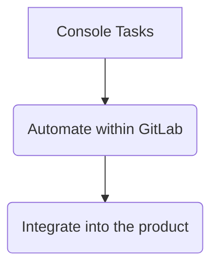
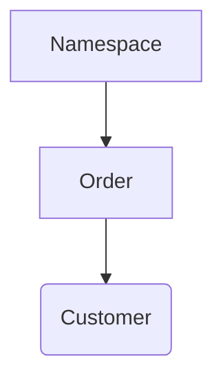

---

title: Customer Console
category: CustomersDot
description: Using the customer console for internal requests is only for special cases where the existing tools won't allow us to complete the task at hand.
---

## Overview

Using the customer console for internal requests is only for specials cases where the existing tools won't allow us to complete the task at hand.

Console access requires a completed [Access Request](https://gitlab.com/gitlab-com/access-requests/issues/new?issuable_template=Single%20Person%20Access%20Request) as outlined in the [Customers Console training](https://gitlab.com/gitlab-com/support/support-training/-/blob/master/.gitlab/issue_templates/Customers%20Console.md) and its completion.

The scope of what's outlined in this workflow is for frequently used functions which are pre-loaded via [Customers Console and Functions project](https://gitlab.com/gitlab-com/support/toolbox/console-training-wheels).

## Using the support console

After logging into the CustomersDot server, enter the command:

```sh
support_console
```

This will open the rails console and automatically load the functions available to use.

Most functions rely on the namespace (i.e. GitLab.com Group name or username), always make sure to have it handy before starting any work from the console.

Consider creating a [Shell alias](/handbook/tools-and-tips/#shell-aliases) such as the below:

```sh
alias cdot-console="ssh -t <YOUR_USERNAME>@customersdot-prod 'support_console'"
```

- If needed, review the [Production SSH Config settings here](https://gitlab.com/gitlab-org/customers-gitlab-com/-/blob/main/doc/setup/production.md) for more information on configuring your local SSH settings to access the console.

## Scope

The console will be for tasks which cannot be completed from the tools we have available.

We need to see the console as a `transition` stage:



The more we use a function the more we should ask ourselves why we haven't automated that process or integrated that missing function into our product.

## Search methods

### view_namespace

> **Note**: This functionality is mostly covered by namespace search in UI.

Provides a unified view for the namespace including orders and customer account linked to the orders.

Function to see namespace information and linked orders/customer profile.
The function will find orders linked to the provided namespace and then customer profile linked to the orders:



#### Parameters

| Name | Required | Details |
| ------ | ------ | ------ |
| `:namespace` | *Yes* | The namespace to find information about |

#### Sample

```ruby
irb(main):002:0> view_namespace('example')

[+]Namespace information
id                                7744884
name                              example
path                              example
members_count_with_descendants    15
shared_runners_minutes_limit      50000
billable_members_count            14
plan                              gold
trial_ends_on                     2020-06-22
trial                             true

[+] There are 1 orders for this namespace
 id                                00000
 customer_id                       111111
 subscription_id
 subscription_name
 start_date                        2020-04-22
 end_date                          2020-06-22
 gl_namespace_id                   2222222
 gl_namespace_name                 example

[+] Customer linked to orders
 https://customers.gitlab.com/admin/customer/111111
 id                                111111
 company                           example Ltd
 first_name                        Jane
 last_name                         Doe
 email                             jdoe@examplecorp.net
 uid                               666666
 zuora_account_id
```

### Manual Lookup

> *Note*: Customer name, email, company, group name, subscription name searching is available in UI.

If required, you can search for an order based on any existing order attribute. Use `find_by` if you believe there is only one, or `where` if you believe there may be multiple matching orders.

#### Example find_by

```ruby
irb(main):003:0> Order.find_by_gl_namespace_name "example"
#<Order:0x0000000000000
 id: 0000,
 customer_id: 00000,
 product_rate_plan_id: "2c92a00d76f0d5060176f2fb0a5029ff",
 subscription_id: nil,
 subscription_name: nil,
 start_date: Fri, 31 Aug 2019,
 end_date: Mon, 31 Aug 2020,
 quantity: 1,
 created_at: Mon, 20 May 2019 08:59:04 UTC +00:00,
 updated_at: Mon, 27 Jul 2020 14:16:12 UTC +00:00,
 gl_namespace_id: "0000000",
 gl_namespace_name: "example",
 amendment_type: nil,
 trial: true,
 last_extra_ci_minutes_sync_at: nil,
 zuora_account_id: nil,
 increased_billing_rate_notified_at: nil,
 reconciliation_accepted: false,
 billing_rate_adjusted_at: nil,
 billing_rate_last_action: nil>
```

#### Example where

```ruby
irb(main):005:0> pp Order.where(customer_id: 000000)
[#<Order:0x000000000bfd8990
  id: 00000,
  customer_id: 000000,
  product_rate_plan_id: "2c92a0ff76f0d5250176f2f8c86f305a",
  subscription_id: nil,
  subscription_name: nil,
  start_date: Tue, 12 Jun 2020,
  end_date: Mon, 12 Jun 2021,
  quantity: 1,
  created_at: Tue, 16 Jun 2020 14:37:24 UTC +00:00,
  updated_at: Wed, 19 Aug 2020 23:56:49 UTC +00:00,
  gl_namespace_id: "000000",
  gl_namespace_name: "example",
  amendment_type: nil,
  trial: true,
  last_extra_ci_minutes_sync_at: nil,
  zuora_account_id: nil,
  increased_billing_rate_notified_at: nil,
  reconciliation_accepted: false,
  billing_rate_adjusted_at: nil,
  billing_rate_last_action: nil>]
```

### Order history

> **Note**: Having a way to view this in the UI has been requested in [customer #3081](https://gitlab.com/gitlab-org/customers-gitlab-com/-/issues/3081).

You can view the change history of an order using `versions`.

#### Example

```ruby
irb(main):005:0> pp Order.find(943369).versions
[#<PaperTrail::Version:0x00000000023248d8
  id: 943369,
  item_type: "Order",
  item_id: 159764,
  event: "create",
  whodunnit: nil,
  object: nil,
  created_at: Wed, 07 Apr 2021 00:19:21.297520000 UTC +00:00,
  transaction_id: 943369,
  object_changes:
   "---\n" +
   "id:\n" +
   "- \n" +
   "- 159764\n" +
   "customer_id:\n" +
   "- \n" +
   "- 34580\n" +
   "product_rate_plan_id:\n" +
   "- \n" +
   "- 2c92a0ff76f0d5250176f2f8c86f305a\n" +
   "start_date:\n" +
   "- \n" +
   "- 2021-04-07\n" +
   "end_date:\n" +
   "- \n" +
   "- 2021-05-07\n" +
   "quantity:\n" +
   "- \n" +
   "- 1\n" +
   "created_at:\n" +
   "- \n" +
   "- !ruby/object:ActiveSupport::TimeWithZone\n" +
   "  utc: &1 2021-04-07 00:19:21.297520292 Z\n" +
   "  zone: &2 !ruby/object:ActiveSupport::TimeZone\n" +
   "    name: Etc/UTC\n" +
   "  time: 2021-04-07 00:19:21.297520292 Z\n" +
   "updated_at:\n" +
   "- \n" +
   "- !ruby/object:ActiveSupport::TimeWithZone\n" +
   "  utc: *1\n" +
   "  zone: *2\n" +
   "  time: 2021-04-07 00:19:21.297520292 Z\n" +
   "gl_namespace_id:\n" +
   "- \n" +
   "- '8981798'\n" +
   "gl_namespace_name:\n" +
   "- \n" +
   "- to keep\n" +
   "trial:\n" +
   "- false\n" +
   "- true\n">]
```

### find_namespace

> **Note**: Finding an account based on group name is available in the UI. However, accounts with trials typically do not show up due to [customers #978](https://gitlab.com/gitlab-org/customers-gitlab-com/-/issues/973).

Find a given GitLab.com namespace.

#### Parameters

| Name | Required | Details |
| ------ | ------ | ------ |
| `:namespace` | *Yes* | The namespace to search for, it can be complete or partial|

#### Sample

```ruby
irb(main):421:0> find_namespace('test')
[!] Possible matches:
 [+] Name Test Example         | Full Path test
 [+] Name Other Example        | Full Path test1
 [+] Name My Test              | Full Path test2
=> " "
```

## Plan Methods

### update_gitlab_plan

> *Note*: This can be deprecated when this is available in the UI which will require [showing expired trials (customers #1173)](https://gitlab.com/gitlab-org/customers-gitlab-com/-/issues/1173), [ability to extend (customers #1643)](https://gitlab.com/gitlab-org/customers-gitlab-com/-/issues/1643), and for [the Gitlab account to be tied to customers portal to show GitLab Groups after a trial is initiated (customers #973)](https://gitlab.com/gitlab-org/customers-gitlab-com/-/issues/973).

Use cases for this function:

1. Extend an active or reactivate an expired trial.
1. Downgrade to free.
1. "Extend" a subscription by creating a trial if one does not exist. If an old trial exists, it will reuse it.

The function will change the minutes quota to the paid plan equivalent, and add additional minutes to get around shared runner cc requirement.

| Name | Required | Details |
| ------ | ------ | ------ |
| `:namespace` | *Yes* | The namespace to update using the path |
| `:plan` | *Yes* | The plan to assign to the namespace (free, bronze, silver, gold) |
| `:expire` | *No* | Optional parameter, if entered the existing subscription will be extended up to this date |
| `:subscription` | *No* | Required to extend a subscription, but not for trials. |

#### Sample

```ruby
irb(main):001:0> update_gitlab_plan('example','bronze','2020-10-22','A-S00000000')
{"plan"=>
  {"code"=>"bronze",
   "name"=>"Bronze",
   "trial"=>false,
   "auto_renew"=>nil,
   "upgradable"=>false},
 "usage"=>
  {"seats_in_subscription"=>0,
   "seats_in_use"=>1,
   "max_seats_used"=>1,
   "seats_owed"=>0},
 "billing"=>
  {"subscription_start_date"=>"2020-08-21",
   "subscription_end_date"=>"2020-10-22",
   "trial_ends_on"=>nil}}
{"id"=>0000000,
 "name"=>"Example",
 "path"=>"example",
 "kind"=>"group",
 "full_path"=>"example",
 "parent_id"=>nil,
 "avatar_url"=>nil,
 "web_url"=>"https://gitlab.com/groups/example",
 "members_count_with_descendants"=>1,
 "shared_runners_minutes_limit"=>2000,
 "extra_shared_runners_minutes_limit"=>nil,
 "additional_purchased_storage_size"=>0,
 "additional_purchased_storage_ends_on"=>nil,
 "billable_members_count"=>1,
 "plan"=>"bronze",
 "trial_ends_on"=>nil,
 "trial"=>false}
```

### force_attr

If the order has the subscription number, but a number of nil values (especially product plan), then use this function to have the system look up the values in Zuora and copy them over.

#### Parameters

| Name | Required | Details |
| ------ | ------ | ------ |
| `:subscription_name` | *Yes* | Subscription name in the order to update |

#### Sample

```ruby
irb(main):021:0> force_attr("A-S00000000")
=> {:success=>true}
```

### force_reassociation

> *Note*: The ability to do this in the UI is [customers #2165](https://gitlab.com/gitlab-org/customers-gitlab-com/-/issues/2165).

Force a .com group to be associated with a given subscription. This is typically done to associate a group without charging additional seats.

#### Parameters

| Name | Required | Details |
| ------ | ------ | ------ |
| `:subscription_name` | *Yes* | The subscription name to be re-associated|
| `:namespace_path` | *Yes* | The [unique Gitlab namespace](https://docs.gitlab.com/ee/user/group/#namespaces) *`path`*|

#### Sample

```ruby
irb(main):021:0> force_reassociation("A-S00000000", "example")
=> {:success=>true}
```

### unlink_sub

This function sets the group ID and name to `nil` to the order and downgrades the group to Free.
This is typically done if there are issues associating a different subscription but the existing subscription should show for user.

#### Parameters

| Name | Required | Details |
| ------ | ------ | ------ |
| `:subscription_name` | *Yes* | Subscription name in the order to update |

#### Sample

```ruby
irb(main):021:0> unlink_sub("A-S00000000")
=> {:success=>true}
```

### unlink_customer

> *Note*: Ability to do this in UI is [customers #2166](https://gitlab.com/gitlab-org/customers-gitlab-com/-/issues/2166).

Completely unlink a GitLab.com account from a CustomersDot account. **Note:** Use the customer ID (from customers portal, not GitLab.com).

**Warning**: Unlinking means the .com groups will no longer show. This is typically only used when an admin accidentally links their account to a customers.

#### Parameters

| Name | Required | Details |
| ------ | ------ | ------ |
| `:customer_id` | *Yes* |Customer ID to be unlinked from it's GitLab account.|

#### Sample

```ruby
irb(main):021:0> unlink_customer(0000000)
=> {:success=>true}
```

### associate_full_user_count_with_group

> *Note*: Feature request is [customers #2167](https://gitlab.com/gitlab-org/customers-gitlab-com/-/issues/2167).

When the subscription has multiple products listed, then the quantity (seats) is only pulled from the product plan line. Add-on seats are not automatically added. The function adds the seat count for all products listed for the subscription and copies it over to .com.

#### Parameters

This function requires a subscription name.

| Name | Required | Details |
| ------ | ------ | ------ |
| `:subscription_name` | *Yes* | Subscription name as it appears in Zuora, e.g., `A-S12345678` |

#### Sample

```ruby
irb(main):021:0> associate_full_user_count_with_group("A-S12345678")
=> {:success=>true}
```

### enable_ci_minutes

This function allows removal of the CC validation **only for sale supported trials** to prevent having to enroll these users credit cards to use CI/CD by adding additional minutes.

#### Parameters

This function requires a namespace object

| Name | Required | Details |
| ------ | ------ | ------ |
| `:namespace` | *Yes* | Namespace to update |

#### Sample

```ruby
irb(main):003:0> enable_ci_minutes("mmoraphotocr")


=> "{\"status\":\"success\",\"message\":\"namespace members are now enabled to run CI minutes\"}"
irb(main):004:0>
```

### create_order_from_zuora

On rare occasions, an Order object may not exist in customersDot for a subscription in Zuora. This function creates a valid Order from the subscription data found in Zuora which can then be linked to a namespace.

Use cases for this function:

1. [Entity changes](https://gitlab.com/gitlab-com/Finance-Division/finance/-/wikis/Process-for-change-of-entity)
1. System bugs

#### Parameters

| Name | Required | Details |
| ------ | ------ | ------ |
| `:customer_id` | *Yes* | The ID number of a customersDot account linked to the billing account, e.g., the subscription must appear in their cDot account |
| `:subscription_name` | *Yes* | Subscription name as it appears in Zuora, e.g., `A-S12345678` |

#### Sample

```ruby
irb(main):003:0> create_order_from_zuora(123456,'A-S12345678')

=> "{\"status\":\"success\",\"message\":{\"success\":true,\"order\" ....."
```

## GitLab.com Group methods

These functions help fix various bug issues that have surfaced on GitLab.com. These functions do *not* change anything in the CustomersDot.

### Reset max seats

Occasionally, to ensure the correct number at renewal, the number of max seats need to be changed for a group.

#### Parameters

With only the namespace, it will display the seats information. Entering the max seats will change the value.

| Name | Required | Details |
|------|----------|---------|
| :namespace      | *Yes* | The namespace to update |
| :max_seats_used | No  | Max number of seats to use |

#### Sample

```ruby
irb(main):035:0> account_seats("gitlab-silver")
{"plan"=>
  {"code"=>"silver",
   "name"=>"Silver",
   "trial"=>false,
   "auto_renew"=>nil,
   "upgradable"=>false},
 "usage"=>
  {"seats_in_subscription"=>8,
   "seats_in_use"=>10,
   "max_seats_used"=>10,
   "seats_owed"=>2},
 "billing"=>
  {"subscription_start_date"=>"2020-01-01",
   "subscription_end_date"=>"2021-01-01",
   "trial_ends_on"=>nil}}
irb(main):089:0> account_seats("gitlab-silver",0)
{"plan"=>
  {"code"=>"silver",
   "name"=>"Silver",
   "trial"=>false,
   "auto_renew"=>nil,
   "upgradable"=>false},
 "usage"=>
  {"seats_in_subscription"=>8,
   "seats_in_use"=>10,
   "max_seats_used"=>10,
   "seats_owed"=>2},
 "billing"=>
  {"subscription_start_date"=>"2020-01-01",
   "subscription_end_date"=>"2021-01-01",
   "trial_ends_on"=>nil}}

[+] Resetting max_seats_used ...
{"plan"=>
  {"code"=>"silver",
   "name"=>"Silver",
   "trial"=>false,
   "auto_renew"=>nil,
   "upgradable"=>false},
 "usage"=>
  {"seats_in_subscription"=>8,
   "seats_in_use"=>10,
   "max_seats_used"=>0,
   "seats_owed"=>2},
 "billing"=>
  {"subscription_start_date"=>"2020-01-01",
   "subscription_end_date"=>"2021-01-01",
   "trial_ends_on"=>nil}}
***** seats_owed will be automatically recalculated at 12:00 UTC *****
```

### update_group_mins

> *Note*: Possible through GitLab.com admin.

Update a group's shared runner minutes monthly quota.

#### Parameters

| Name | Required | Details |
| ------ | ------ | ------ |
| `:id` | *Yes* | The namespace ID to update |
| `:mins` | *Yes* | Compute minutes to update |

#### Sample

```ruby
irb(main):180:0>  update_group_mins(1234,50000)
=> {:success=>true}
```

### update_extra_minutes

> *Note*: Additional minutes can also be changed via chatops. Feature request for editing via UI in [gitlab#325917](https://gitlab.com/gitlab-org/gitlab/-/issues/325917).

Update a group's additional runner minutes.

> **WARNING:** Additional minutes added using this function will last **indefinitely** until used. If the request is to provide "extra minutes" during a trial period only, use the [update_group_mins function](#update_group_mins) to change the monthly usage quota, or the [update_gitlab_plan function](#update_gitlab_plan) which will set the usage quota to match a paid plan.

#### Parameters

| Name | Required | Details |
| ------ | ------ | ------ |
| `:namespace` | *Yes* | The namespace to update |
| `:mins` | *Yes* | Compute minutes to update |

#### Sample

```ruby
irb(main):180:0>  update_group_mins("gitlab-gold",50000)
=> {:success=>true}
```

### update_extra_storage

> *Note*: Additional storage can also be changed via API. Feature request for editing via UI in [gitlab#325918](https://gitlab.com/gitlab-org/gitlab/-/issues/325918).

Update a group's additional storage.

#### Parameters

| Name | Required | Details |
| ------ | ------ | ------ |
| `:namespace` | *Yes* | The namespace to update |
| `:extra_storage` | *Yes* | Amount of additional storage in MiB |

#### Sample

```ruby
irb(main):180:0>  update_extra_storage("gitlab-gold",5000)
{"id"=>12345678,
 "name"=>"GitLab.com - Gold",
 "path"=>"gitlab-gold",
 "kind"=>"group",
 "full_path"=>"gitlab-gold",
 "parent_id"=>nil,
 "avatar_url"=>"/uploads/-/system/group/avatar/123456/gitlab-icon-rgb.png",
 "web_url"=>"https://gitlab.com/groups/gitlab-gold",
 "members_count_with_descendants"=>105,
 "shared_runners_minutes_limit"=>50000,
 "extra_shared_runners_minutes_limit"=>nil,
 "additional_purchased_storage_size"=>5000,
 "additional_purchased_storage_ends_on"=>"2022-03-02",
 "billable_members_count"=>105,
 "seats_in_use"=>105,
 "max_seats_used"=>103,
 "plan"=>"gold",
 "trial_ends_on"=>nil,
 "trial"=>false}
=> nil
```

### container_registry_storage_usage

> Note: For a large group, this may take several hours. If unsure, ask for help before running it.

Calculates the storage usage of the container registry for each project in a given group, the output is the total result in GB and detailed per project.

#### Parameters

| Name | Required | Details |
| ------ | ------ | ------ |
| `:group` | *Yes* | The group to query |

#### Sample

```ruby
irb(main):749:0>  container_registry_storage_usage('some-group') ; nil
[*] Total Storage Used [ 0.799 GB ]

{"my-project-bash"=>
  {"project_id"=>00000000,
   "project_path"=>"example/for-output/my-project-bash",
   "container_registry_storage_used"=>"0.764 GB"},
 "my-other-project"=>
  {"project_id"=>00010000,
   "project_path"=>"example/for-output/my-other-project",
   "container_registry_storage_used"=>"0.025 GB"}}
=>

```

## FAQ

1. How can I add a function?

- With the decision made on [Mechanizer and Hacks Maintenance mode](https://gitlab.com/gitlab-com/support/support-team-meta/-/issues/4299) we won't be adding more functions into the mechanizer

1. Can I use other code not available in `support_team.rb`?

- Functions and parts of functions from `support_team.rb` can be executed within console as needed. Otherwise, the only time other code should be run is under direction from the Fulfillment development team to help debug or workaround an issue.

### Manually changing attributes

We should avoid the editing of live data as much as possible, even a small change could cause a problem later and affect the customer in a bigger way than the original reason for us to do the change.
The guidance is to only use the functions in `support_team.rb`. If we don't have anything that helps, then a feature request should be opened and prioritized.
Within the feature request, we can ask for a temporary workaround to the dev team in order for us to be able to act on those requests while the official product enhancement is completed.
