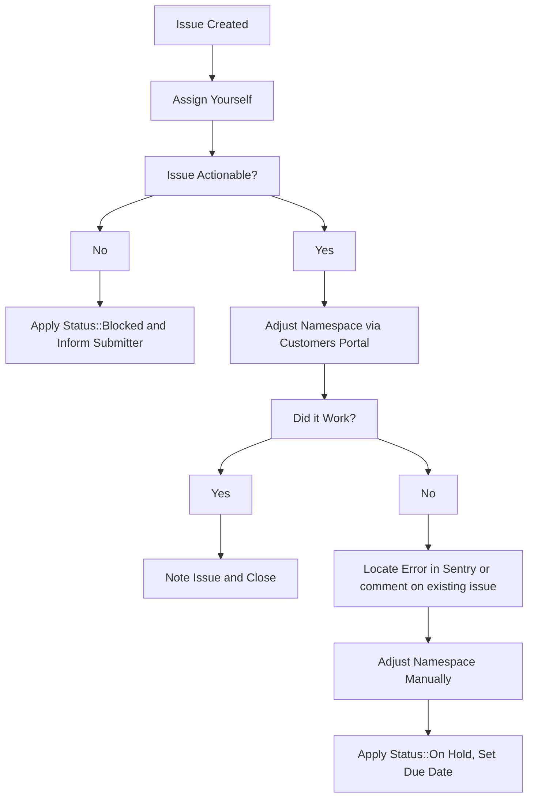

---

title: Handling trials, extensions and plan changes on GitLab.com
description: "How to handle GitLab.com subscription trials and plan changes"
category: GitLab.com subscriptions & purchases
---

## Request for Premium trial

GitLab.com [only offers the self-service ability to trial the Ultimate subscription](https://gitlab.com/gitlab-org/customers-gitlab-com/issues/409).
GitLab.com support can assist with trials of other plans. Ask the user to create the GitLab.com Ultimate trial, then change the plan via the CustomersDot admin `GitLab Groups` page.

## Extending trials

Sales will often request through a Zendesk Ticket that we extend the duration of GitLab.com trials on behalf of their prospects. These tickets will always be raised from the GitLab Support End User <gitlab_support@example.com>, with the submitter cc'd on the ticket. If a customer or sales representative raise an extend trial request on a *customer ticket*, we should respond that an internal request **must** be created by the sales representative to request the trial extension.

If any fields when opening the ticket were filled out incorrectly,  send a public reply in the ticket asking the submitter to supply the missing information.

> **NOTE**: Due to [customers #973](https://gitlab.com/gitlab-org/customers-gitlab-com/-/issues/973) and [customers #1643](https://gitlab.com/gitlab-org/customers-gitlab-com/-/issues/1643), these must be done via [mechanizer]() or [CustomersDot console](). Once those issues are resolved, these requests should be done via CustomersDot admin.

1. Take ownership of the ZD ticket.
1. Check over the request and ensure that we've been provided enough information to action the request. To do this check that:
   1. The `Namespace:` field contains a valid GitLab namespace and it that holds the active trial. This should not be a Salesforce link or email address.
   1. The `Extend the date to:` field contains a future date. (Trial expires around 23:59 UTC on this date)
   1. The `Trial license plan:` field is filled out
1. Use the [Update GitLab Subscription form]({{ ref "mechanizer#update-gitlab-subscription" >}}) to process the request.
   1. This should create a new internal request issue documenting the change action. Reference this new issue to the ZD Ticket where the extension was requested.
   1. If there is an error while taking action, check the internal issue to see what went wrong. Please also locate the [error in sentry](https://sentry.gitlab.net/gitlab/customersgitlabcom/) (see [Searching Sentry](/handbook/support/workflows/500_errors.html#searching-sentry) if needed) and file an issue, or comment on an existing one.
1. If namespace needs to be adjusted manually, then raise a new internal issue with details and  `~Console Escalation::Customers` label.

If a customer is requesting a trial extension, please follow [Working with Sales workflow]() to let Sales team know in case they would like to have a discussion with the customer.

## Extend an existing active or expired subscription

1. Before taking any action to create the trial license, get confirmation from
   the customer that they understand and accept the
   [constraints](https://about.gitlab.com/free-trial/#what-is-included-in-my-free-trial-what-is-excluded)
   that accompany a trial. Use the `Support::L&R::Trial Subscription - Exclusions Sign Off`
   macro in Zendesk for this purpose. Be sure to assign the ticket to
   yourself so that you will receive the customer's response and be
   able to take action quickly.
1. This is done via the Mechanizer tool through
   [Manage GitLab Plan and Trials]().

**Note**: We cannot extend the trial if the customer hasn't started one on the namespace. The Subscription name field in the ZenDesk Mechanizer app is there for that reason. When there's a Subscription name, the mechanizer will create a new trial for the namespace.

## Applying a trial to a namespace with an active subscription

> [As of 2022-07-01](https://gitlab.com/gitlab-com/support/managers/change-management/-/issues/10), Support won't act on any request for trials on top of plans.

A namespace cannot have a trial and an active subscription run
concurrently.

A workaround is to advise the customer to create a new group and request a trial
for it in order to test the  higher plan features. See more in the [Sales FAQ for Trials over Paid Plans on GitLab SaaS](https://docs.google.com/document/d/14oypfuslV75Uqw_JWvJmoxCEtrOQ_At_DIm4sk8KzvM/edit?usp=sharing).

There is an [open feature request #12186](https://gitlab.com/gitlab-org/gitlab/-/issues/12186)
requesting to implement this functionality in GitLab.

## Workflow diagram



## Plan change requests

Plan changes should **never** be done manually except in the following cases:

1. Downgrading to Free.
1. Emergency: a next business day follow up is required for the customer to no longer be on a manual plan. The ticket should be passed to L&R or an internal ticket created.

Plan changes on a paid non-trial namespace should be done through a subscription purchase.

If a manual plan change is required for non-emergencies, a [legal issue](https://about.gitlab.com/handbook/legal/#3-other-legal-requests) must be created and approved by legal as manually changing a plan causes data discrepancies, can cause legal issues, and can cause bug issues.

### Downgrading to a free plan

Before actioning a downgrade request:

1. Ensure that the requester provides authorization per the [Ownership verification workflow](https://about.gitlab.com/handbook/support/license-and-renewals/workflows/customersdot/associating_purchases.html#ownership-verification).
1. Determine whether they want to pursue a refund. If they do, then follow the [refunds workflow](https://about.gitlab.com/handbook/support/license-and-renewals/workflows/billing_contact_change_payments.html#refunds).

| Example Ticket | Date |
| --- | --- |
| [ZD Link](https://gitlab.zendesk.com/agent/tickets/322319) | 2022-09-02 |

### Using customerDot

**Important**

From CustomerDot you can only change the plan type not the subscription end date.

1. From the left side menu click on `customers` and search for the customer.
1. In the search results click on the GitLab groups icon for the customer you want to update.
1. You'll see a list of groups owned by the customer and you can perform your change here.

> If you receive an error, follow the usual troubleshooting procedures in
> looking up the error in sentry and/or for an existing CustomersDot issue,
> adding to an existing issue or creating a new one as required.

If you get an error, use admin following the instructions in the next section.

### Using GitLab.com Admin

1. Go to the namespace admin page (`/admin/users/username` or `/admin/groups/group_path`).
1. Click `Edit`.
1. Change the `Plan` to the appropriate plan (`Ultimate` or `Premium`).
   - Don't use `Ultimate Trial` or `Premium Trial` in these cases -- these plans are intended for use by automated systems only, and may [cause an error](https://gitlab.com/gitlab-org/customers-gitlab-com/-/issues/3698) on the namespace when set incorrectly.
1. Add [an admin note]({{ ref "admin_note" >}}).
1. Click `Save`.

### How to create an NFR (Not for resale) SaaS License

A NFR SaaS 'license' must begin with either an existing trial or a new trial on a GitLab namespace.
Console acccess is then required to convert from trial to an NFR subscription.

## How to extend an NFR (Not for resale) SaaS trial using the rails console

To extend a trial SaaS extension.

1. The NFR partner needs to either signup for a trial at: <https://about.gitlab.com/free-trial/> or start a trial from within their current GitLab namespace.
1. Once they have a valid namespace for their trial they need to provide this to support.
1. The support engineer requires [console access to CustomersDot](/handbook/support/license-and-renewals/workflows/customersdot/customer_console.html) to GitLab Rails to update the namespace.
1. Within the CustomersDot rails console you should execute the command: ``` view_namespace '<group name space>' ```
1. This will return the partners namespace information and order information. Get the order 'id' (i.e. 123456), you will need it for the next command.


1. Execute the command to interact with the order id: ```o = Order.find 123456```
1. Review, modify, and execute the following command to update the order:

```o.update!(product_rate_plan_id: Plan::ULTIMATE_SAAS_1_YEAR_PLAN, quantity: 25, end_date: Date.parse('2022-11-09'), trial: false)```

- View the important info below for what values to substitute as needed

1. Execute the command to synchronise the update: ```Gitlab::Namespaces::UpdatePlanInfoService.new(o, force_sync: true).execute```
1. In GitLab.com admin, edit the group and update the **Quota of compute minutes** to 400. See next step on how to find the admin screen.
1. [Add an admin note]() for the group to document the partner has an NFR subscription and link the issue.

Some important information to consider:

- Product_rate_plan_id == the requested NFR plan, it should be `Plan::ULTIMATE_SAAS_1_YEAR_PLAN` or `Plan::PREMIUM_SAAS_1_YEAR_PLAN` (no quotes)
- Quantity ==  the ticket submitter will specify this in the issue, it is typically 10 or 25 users
- Trial == must be false otherwise they will be unable to use GitLab shared runners.
- Start date == is the specified in the issue or the date today.
- End date == is one year from specified date or from today's date.
