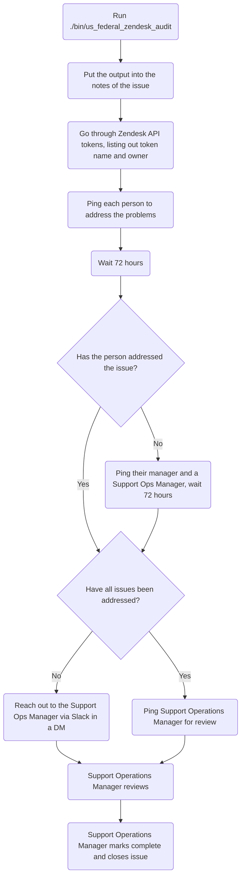

## When do we perform these?

Zendesk US Federal audits are to be completed every 6 months:

- Once in the first quarter of the fiscal year
- Once in the third quarter of the fiscal year

## Process

To get started, you will first want to make an issue using the
[US Federal Zendesk issue template](<https://gitlab.com/gitlab-com/support/support-ops/support-ops-tools/audits/-/issues/new?issuable_template=Zendesk> US Federal)
in the
[audits project](https://gitlab.com/gitlab-com/support/support-ops/support-ops-tools/audits).

This is a more complex audit, requiring a lot of checking and following up. To
start, you will want to run the
[us federal zendesk audit script](https://gitlab.com/gitlab-com/support/support-ops/support-ops-tools/audits/-/blob/master/bin/us_federal_zendesk_audit)
(see [below](#running-the-script) for help with running the script). It will
take a considerable amount of time, but the script reduces a large portion of
the manual work required for the process. Once the script completes, it will
output a large amount of information. This should be copied and pasted into the
`## Notes` section of the issue you created via the
[US Federal Zendesk issue template](<https://gitlab.com/gitlab-com/support/support-ops/support-ops-tools/audits/-/issues/new?issuable_template=Zendesk> US Federal).

From there, you need to go through the items reported and ping the person in
the issue to ask for the item to be fixed (or clarify if this is intentional).
This can take time, so wait about 72 hours after pinging someone before
following back up. If the person has not replied concerning the topic by that
time, ping that person's manager (as well as the Support Operations Manager).

After that, you need to review the API tokens currently in use. The
[us federal zendesk audit script](https://gitlab.com/gitlab-com/support/support-ops/support-ops-tools/audits/-/blob/master/bin/us_federal_zendesk_audit)
will output the basic details of what to put into the issue, but you will need
to fill it out and seek out the maintainer/requester of the API token to enter
the justification/use case. This can take time, so wait about 72 hours after
pinging someone before following back up. If the person has not replied
concerning the topic by that time, ping that person's manager (as well as the
Support Operations Manager).

Once all the items have been addressed, you will then ping a Support Operations
Manager to review the audit. They will then close out the issue.

#### Flowchart



#### Running the script

The requirements to run the script are:

- Ruby (version 3.0.1)
- A Zendesk US Federal API token
- A GitLab.com personal access token

To run the script, you will want to do the following commands:

```bash
git clone git@gitlab.com:gitlab-com/support/support-ops/audits.git
cd audits
gem install bundler
bundle install
./bin/us_federal_zendesk_audit
```

**NOTE**: This uses environment variables to run. As such, you'd want to set
the following environment variables:

- `US_ZD_USERNAME` - The Zendesk Username (ex: `jcolyer@gitlab.com`)
- `US_ZD_TOKEN` - The Zendesk API token to use
- `GL_TOKEN` - The GitLab.com access token to use

As the script output is quite large, you might want to have it output to a file
so you don't lose the data due to scrollback. This can be done by doing the
following:

```bash
./bin/us_federal_zendesk_audit > audit_output.txt
```

#### How the script works

1. Zendesk API requests are made to gather all agent and admin users in Zendesk
US Federal
1. The script then loops on the users gathered to get more information on them:
   - The groups they are in
   - The role they currently have
1. The script then outputs the information about the Light Agents
1. The script then outputs the information about the Admins
   - If the person doesn't have an entry in the
     [support-team.yaml](https://gitlab.com/gitlab-com/support/team/-/blob/master/data/support-team.yaml)
     file, the script will make note of these as a point to investigate.
1. The script then outputs the information about the remaining agents:
   - If the person doesn't have an entry in the
     [support-team.yaml](https://gitlab.com/gitlab-com/support/team/-/blob/master/data/support-team.yaml)
     file, the script will make note of these as a point to investigate.
1. The script will then output the table output needed for the API token review

#### What issues does the script check for?

As it goes through the full agents (ie those who are more than Light Agents),
it checks the following:

- Do they have an entry in the
  [support-team.yaml](https://gitlab.com/gitlab-com/support/team/-/blob/master/data/support-team.yaml)
  file?
- Does their name in Zendesk match their name in the
  [support-team.yaml](https://gitlab.com/gitlab-com/support/team/-/blob/master/data/support-team.yaml)
  file?
- Does their ID in Zendesk match their ID in the
  [support-team.yaml](https://gitlab.com/gitlab-com/support/team/-/blob/master/data/support-team.yaml)
  file?
- Does their group(s) in Zendesk match their group(s) in the
  [support-team.yaml](https://gitlab.com/gitlab-com/support/team/-/blob/master/data/support-team.yaml)
  file?
- Does their role in Zendesk match their role in the
  [support-team.yaml](https://gitlab.com/gitlab-com/support/team/-/blob/master/data/support-team.yaml)
  file?
