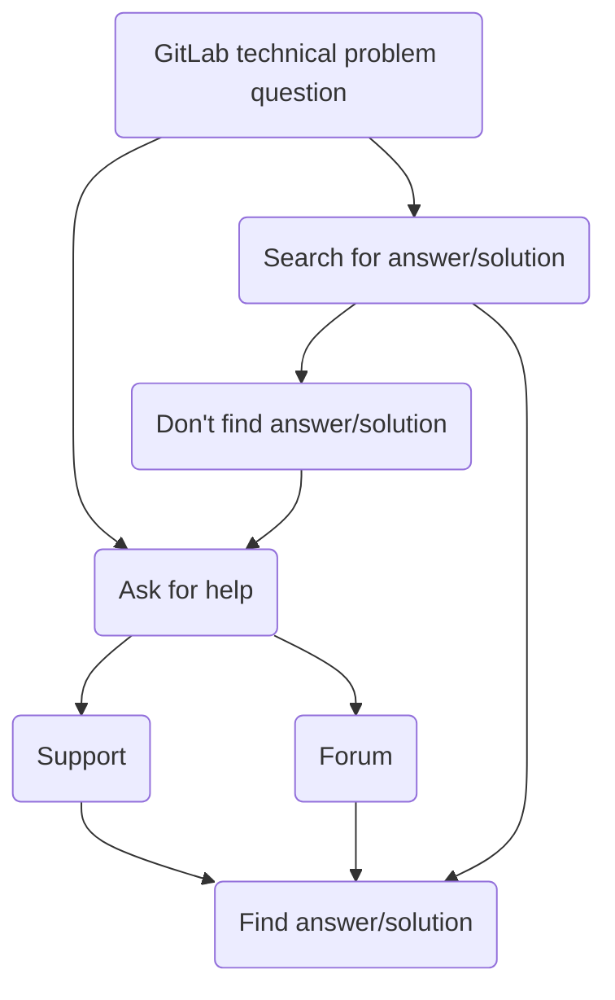
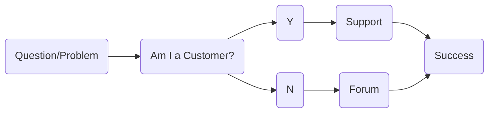
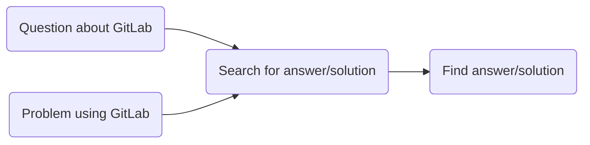

---

title: Community Forum Workflows
category: References
description: Workflows for Support ticket deflection via the GitLab Community Forum.
---

## Technical Support in the Community Forum

The Community Forum is the official place for our wider community to seek technical support assistance with GitLab.

Technical support solutions shared in the forum reach a wide audience as they are indexed by search engines, making them easily discoverable to GitLab users looking for solutions.

Oftentimes, technical problems encountered and questions asked by our wider community have known solutions and answers that were provided to customers by GitLab Support team members in Support tickets. In this situation, having Support Engineers sharing these known tech support solutions in the community forum can be a highly effective form of ticket deflection.

### Docs-first Community Assistance

Similar to GitLab Support ZenDesk tickets, unsolved GitLab technical support threads in the forum are often an opportunity to:

- link to the relevant documentation
- improve docs based on user interaction/feedback

As such, GitLab Support Engineers should default to using a **Docs-first approach to Community Assistance**.

The critical points of the Docs-first approach for Community Assistance are:

- Always (try to) respond with a link to the docs.
- If you find helpful content missing from our documentation, create a merge request or issue to add it. Then link the MR or issue in your reply.
- If a Community member says the documentation is incorrect, confusing, or deficient - encourage them to create an issue explaining the problem or contribute an MR to fix it.

#### Special types

There are several "special types" of content that are not well-suited for our documentation, such as Tutorials, "How-to" guides, and context-specific explanations.

A docs-first approach to Community Assistance in the Forum can help fill these "special type" gaps by making relevant answers/solutions easily discoverable and readily available.

For example, these Community forum threads where answers and solutions are "special types" that don't "fit" into the docs:

- Situation-specific Tutorials/How-tos - (eg. "I'm running GitLab CE 11.0 as a Docker container, and I want to upgrade to GitLab 13.2 EE Omnibus with minimal downtime, how can I do this safely?")
- Context-based Explanation - (eg. "I read the docs, but I don't understand how to do X.")
- Problem-specific Troubleshooting steps (eg. "I upgraded GitLab from 12.9 to 13.1 and now it's not working, I get 404 error on every page - please help!")

### Community Assistance Workflows

- **[First Responder](#first-responder)** - early detection of customer-facing problems, bugs, and regressions
- **[Silo-breaker](#silo-breaker)** - publicly share solutions/answers relevant to free users
- **[Fruit picker](#fruit-picker)** - pick low-hanging fruit for quick, easy wins
- **[Fishing Instructor](#fishing-instructor)** - teaching Self-service and Community-first GitLab Support

#### First Responder

For detecting bugs, improving documentation, and identifying problems in our product that will affect paying customers, the GitLab community is an excellent resource.

The Community Forum is an early detection and early alert system for customer-facing problems.

GitLab FOSS makes up over 80% of the GitLab codebase. Any technical problems with this 80% of the codebase impact *all* GitLab users, including customers.

Free users often surface up bugs, regressions, and problems with our product or docs in the Community forum before we start getting support tickets from customers about them.

#### Silo breaker

Silo-breakers take common answers/solutions in Support ZenDesk and ensure they're available and discoverable to all GitLab users.

Support team members may notice patterns or trends in incoming Support tickets - new FAQs, increasingly common problems, confusion regarding a new feature, unclear documentation, or bugs affecting customers.

We communicate internally, usually via Slack and Support Week in Review, to raise awareness in Support and help anyone who encounters tickets on the subject.

If these same patterns or trends are present in the Community forum, providing answers and solutions in forum threads helps ensure answers/solutions are discoverable via a search engine.

#### Fruit-picker

Specializes in picking "low-hanging fruit" by publicly sharing known answers and solutions.

- Quick, easy wins. ("*I know the problem/question and can easily explain the solution/answer*")
- The answer is in our documentation. (polite link to docs is sufficient)
- Single-touch Solutions. (no follow-up required)

#### Fishing Instructor

It is more worthwhile to teach someone to do something (for themselves) than to do it for them (on an ongoing basis).

The forum is like fishing, "Toss in a question or problem, get an answer or solution".

"Fishing instruction" in this context is an opportunity to showcase the resources available and how to find them. (docs, issues, MRs, codebase, forum threads).

Currently, we have a lot of folks reach out to Support without first looking for easy answers/solutions.

The most efficient and effective way to connect users with appropriate support option is to act in a way that encourages and increases the following support-seeking user flow.

"Fishing instructors" enable and empower GitLab users and customers to catch their own fish - find solutions and answer questions without Support intervention.

By directing incoming Free user tickets to the Community forum, free users get in the habit of finding answers/solutions without relying on GitLab Support.

### Optimal Free User Support Experience

Win-win-win - benefits GitLab community, customers, and team members.

- [x] self-serve support
- [x] docs-first
- [x] ticket deflection

### Additional Resources

For additional tips and best practices when working in the Community forum, refer to the [Developer Relations Handbook entry for the Community forum](https://about.gitlab.com/handbook/marketing/developer-relations/workflows-tools/forum/).
