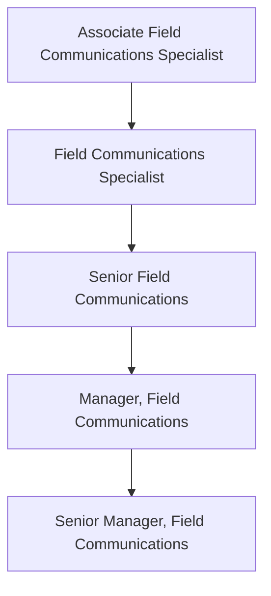

The Field Communications function is part of the Revenue Operations team and is responsible for creating effective, timely, and easily consumable communications for the GitLab Field Team. The team's charter is to help GitLab's Field organization sell better, faster and smarter with communication programs that keep them better informed of organizational/business updates that impact their roles, as well as useful resources that will enable day-to-day work.

## Levels

### Associate Field Communications Specialist

The Field Communications Specialist reports to the Manager/Sr. Manager, Field Communications.

#### Associate Field Communications Specialist Job Grade

The Field Communications Specialist (Intermediate) is a grade [5](https://about.gitlab.com/handbook/total-rewards/compensation/compensation-calculator/#gitlab-job-grades).

#### Associate Field Communications Specialist Responsibilities

- Copywriting and editing support for major Field Communications programs including the monthly newsletter and GitLab monthly release
- Assist with the development of copy for Field announcements as a part of the Field Communications calendar
- Maintain Field Update Tickers with messaging gathered through the Field announcement process
- Provide insights and recommendations for process improvement to intermediate and senior Field Communications specialists
- Monitor key communication channels for two-way feedback (i.e. Slack) and escalate high-priority items to senior team members as needed
- Assist with the development of copy as well as provide logistical support for key in-person & virtual Field events such as Sales Kickoff and Quarterly Business Reviews.

#### Associate Field Communications Specialist Requirements

- Experience in copywriting and editing
- Excellent communication (oral and written) and presentation skills
- Strong organizational abilities
- Ability to continuously meet deadlines and execute on multiple projects at once  
- Excellent team player and ability to effectively collaborate with others and action on guidance from senior team members
- Self-starter with strong problem solving abilities
- Working knowledge of Google docs; photo and video-editing software is an asset
- Willingness to learn new tools such as Staffbase (or a similar marketing/communications platform)
- You share our [values](/handbook/values/), and work in accordance with those values
- Ability to use GitLab in day to day responsibilities

### Field Communications Specialist (Intermediate)

The Field Communications Specialist reports to the Manager/Sr. Manager, Field Communications.

#### Field Communications Specialist (Intermediate) Job Grade

The Field Communications Specialist (Intermediate) is a grade [6](https://about.gitlab.com/handbook/total-rewards/compensation/compensation-calculator/#gitlab-job-grades).

#### Field Communications Specialist (Intermediate) Responsibilities

- Manage effective field communication strategies and tactics including but not limited to newsletters, videos, memos, presentations, and more
- Maintain regular communications programs including the monthly newsletter and support for the GitLab monthly release
- Support the Field Communications announcement calendar, working with DRIs across the business to triage and plan for updates
- Foster strong partnerships with cross functional teams such as Field Enablement, Product Marketing, and others for aligned content and communication delivery
- Support senior team members where needed on company initiatives that impact the Field teams
- Champion efforts to improve Field Communications via GitLab’s [handbook-first approach to learning and development](https://about.gitlab.com/handbook/sales/field-operations/field-enablement/#handbook-first-approach-to-gitlab-learning-and-development-materials)
- Develop and implement a strategy for soliciting feedback from GitLab Field team members to inform communication priorities and requirements
- Assist in communication of strategies or messages from senior leadership as needed
- Take on additional projects and responsibilities as needed
- Knowledge of the software development life cycle, DevOps, and/or open source software is preferred

#### Field Communications Specialist (Intermediate) Requirements

- BS/BA in communications or relevant field
- Experience in copywriting and editing
- Excellent communication (oral and written) and presentation skills
- Outstanding organizational and planning abilities
- Excellent team player and ability to effectively collaborate with others
- Strong project management skills and attention to detail needing minimal supervision
- Working knowledge of Google docs; photo and video-editing software is an asset
- Proven experience as a communications specialist, preferably with high-tech B2B sales audiences
- Proven experience developing and executing effective sales newsletters is a huge plus
- Experience with a marketing/communications platform (examples: Staffbase, Mailchimp) is preferred
- Experience in web design and content creation is a plus
- You share our [values](/handbook/values/), and work in accordance with those values
- Ability to use GitLab in day to day responsibilities

### Senior Field Communications Specialist

The Senior Field Communications Specialist reports to the Manager/Sr. Manager, Field Communications.

#### Senior Field Communications Specialist Job Grade

The Senior Field Communications Specialist is a grade [7](https://about.gitlab.com/handbook/total-rewards/compensation/compensation-calculator/#gitlab-job-grades).

#### Senior Field COmmunications Specialist Responsibilities

- Provide strategic communications advice to field leadership with change management, project management, and internal communications support for key revenue-impacting field initiatives
- Own the Field Communications announcement calendar, working with DRIs across the business to triage and plan for updates
- Foster strong partnerships with cross functional teams such as Field Enablement, Product Marketing, and others for aligned content and communication delivery
- Support the communication deliverables for key field events including Sales Kick Off and Quarterly Business Reviews
- Develop and manage effective communication strategies that improve transparency and efficiency across the entire field team
- Lead a Sales Advocacy program and standardize feedback collection and response to more efficiently bring visibility to team member questions and blockers
- Spearhead efforts to ensure field communications are aligned with expectations, rules, and industry/market regulations
- Iterate on current field communication channels to improve accessibility and adoption across the field organization

#### Senior Requirements

- BS/BA in communications or relevant field
- Experience in copywriting and editing
- Proven experience developing and executing effective communication strategies within a high-tech B2B sales environment
- Change management experience (certification preferred)
- Ability to work with senior sales leadership on communication needs
- Impeccable communication (oral and written) and presentation skills
- Outstanding organizational and planning abilities
- Ability to maintain attention to detail, be an effective team player, meet project deadlines, and lead efforts across disciplines
- Ability to plan, maintain good judgment and execute on multiple projects simultaneously in an organized manner
- Strong project management skills and attention to detail needing minimal supervision
- Working knowledge of Google docs; photo and video-editing software is an asset
- Knowledge of the software development life cycle, DevOps, and/or open source software is preferred
- You share our [values](/handbook/values/), and work in accordance with those values
- Ability to use GitLab in day to day responsibilities

### Manager, Field Communications

The Manager, Field Communications reports to the Sr. Manager, Field Communications (if applicable) or the [Vice President, Revenue Operations](https://about.gitlab.com/job-families/sales/vp-revenue-operations/).

#### Manager, Field Communications Job Grade

The Manager, Field Communications is a grade [8](https://about.gitlab.com/handbook/total-rewards/compensation/compensation-calculator/#gitlab-job-grades).

#### Manager, Field Communications Responsibilities

- Manage, coach, and develop Field Communications Specialist(s) responsible for managing and executing field communication tactics including QBRs, newsletters, videos, memos, presentations, and more
- Serve as change management and communication expert for large, cross-functional company projects and initiatives, developing communication plans and enablement materials
- Develop and manage effective communication strategies that improve transparency and efficiency across the entire Field team and with supporting functions
- Build relationships with key internal business stakeholders and executives to keep Field Comms processes top-of-mind
- Lead the planning and execution of multi-channel communications plans supporting key field events including Sales Kick Off, President’s Club and Quarterly Business Reviews
- Run Field Recognition programs, including the Quarterly Achiever’s Chat, collaborating with the CEO, CRO and FOPS team members to support
- Own the Field All Hands meeting landscape, including planning & organizing as well as iterating the cadence where necessary. Landscape includes WW Field Sales calls, Sales/Marketing/Product QBR & Recognition, All Field Manager calls and CRO Segment Manager Roundtables
- Run the Field Operations Release process, working with stakeholders from across FOPS to coordinate timing for system/process changes and efficiently raise awareness of those changes with the Field team
- Spearhead efforts to ensure field communications are aligned with expectations as well as industry-standard rules and regulations

#### Manager, Field Communications Requirements

- Senior Specialist requirements, plus:
- BS/BA in communications or relevant field
- Experience in internal and/or executive communications
- People management experience required
- Sales or Field/Sales Operations experience is a plus
- Expert in copywriting and editing
- Proven experience developing and implementing effective communication strategies within a high-tech B2B sales environment
- Strong executive presence and experience working with executive teams on communication initiatives and proposals
- Experience with change management communication plans and content (change management certification preferred)
- Experience with implementing and/or managing long term communications and enablement content platforms
- Impeccable communication (oral and written) and presentation skills
- Experience writing, proofing and editing leadership emails, slide decks, video scripts, articles, talking points and change communication updates
- Excellent team player and ability to effectively collaborate with others
- Strong project management skills and attention to detail needing minimal supervision
- Working knowledge of Google docs; photo and video-editing software is an asset
- Knowledge of the software development life cycle, DevOps, and/or open source software is preferred
- You share our [values](/handbook/values/), and work in accordance with those values
- Ability to use GitLab in day to day responsibilities

### Senior Manager, Field Communications

The Senior Manager, Field Communications reports to the [Vice President, Revenue Operations](https://about.gitlab.com/job-families/sales/vp-revenue-operations/).

#### Senior Manager, Field Communications Job Grade

The Senior Manager, Field Communications is a grade [9](https://about.gitlab.com/handbook/total-rewards/compensation/compensation-calculator/#gitlab-job-grades).

#### Senior Manager, Field Communications Responsibilities

- Manage, coach, and develop Field Communications Manager, Field Content [Program Managers](https://about.gitlab.com/job-families/sales/program-manager-field-enablement/), and Field Communications Specialists responsible for managing and executing robust Field Comms and Content programs.
- Collaborate and iterate directly with CRO and the CRO leadership team to provide strategic communications guidance for key revenue-impacting field initiatives
- Oversee the management and iteration of GitLab’s Sales content management system, ensuring CRO LT, field leaders, and field sellers plus key stakeholders are engaged and informed on the platform’s performance/ROI  
- Lead sales content and messaging initiatives that support proactive go-to-market activities as well as document internal sales processes for various customer segments and all routes to market
- Champion efforts to define, maintain, and improve communication and alignment between Go-To-Market functions including Field, Marketing and Product teams
- Actively support the planning and execution of key field events including but not limited to Sales Kick Off, President’s Club and Quarterly Business Reviews
- Promote and oversee development and management of a cascading Field Comms strategy that begins with CRO LT and Field leaders.
- Liaise with the Field Enablement Leadership Team to maintain an overarching view of asks for the Field team to monitor and mitigate team overload
- Provide visibility to CRO Leadership, Field Operations, and other supporting functions across large GitLab initiatives that have large scale communications or content requirements

#### Senior Manager, Field Communications Requirements

- BS/BA in communications or relevant field
- Experience in internal and/or executive communications
- People management experience required
- Sales or Field/Sales Operations experience is a plus
- Impeccable communication (oral and written) and presentation skills
- Well-organized, hands-on, skilled at planning and time management
- Ability to drive consensus across a diverse set of stakeholders, including executive leadership in Field Organization, Marketing, Product, and other functions.
- Strong executive presence and experience working with executive teams on initiatives and proposals
- Experience with designing a strategy plus implementing and/or managing long term communications and enablement content platforms
- Proven experience developing and executing effective communication strategies within a high-tech B2B sales environment
- Proactively proposes effective iterations to programs where efficiency gains are available and establishes solutions through creative methods
- Exceptional interpersonal and communication skills with ability to build strong trusted relationships
- Demonstrated ability to collaborate in a virtual and matrixed team environment across business areas to achieve common goals
- Adapts in a fast-paced, rapidly changing environment while accurately judging priorities and tracking all initiatives, projects, and details
- Experience with change management communication plans and content (change management certification preferred)
- Strong project management skills and attention to detail with the ability to execute on multiple projects simultaneously in an organized manner with minimal supervision
- Knowledge of the software development life cycle, DevOps, and/or open source software is preferred
- You share our [values](/handbook/values/), and work in accordance with those values
- Ability to use GitLab

## Performance Indicators

- [Field communication/newsletter open and click-through rates](https://about.gitlab.com/handbook/sales/field-communications/field-flash-newsletter/#measurement)
- Field Comms & Content Pulse Survey response rates
  - Results from benchmark questions related to the Field’s sentiment around feeling informed and enabled in their roles
- Feedback from key stakeholders, including CRO LT and Field Leaders/Managers
- Adoption metrics from sales asset management system, including recurring usage, average sessions and average time-in-platform
- ROI metrics from sales asset management system and successfully tying ROI insights to sales content
- Future performance indicators will include (but not be limited to) additional usage metrics, sales pitch tracking, pipeline generation, sales efficiency (time spent on comms) tracker and new hire productivity

## Career Ladder

### Hiring Process

Candidates for this position can expect the hiring process to follow the order below. Please keep in mind that candidates can be declined from the position at any stage of the process. To learn more about someone who may be conducting the interview, find their job title on our [team page](https://about.gitlab.com/company/team/).

- Qualified candidates will be invited to schedule a 30 minute [screening call](https://about.gitlab.com/handbook/hiring/interviewing/#screening-call) with one of our Global Recruiters.
- Next, candidates will meet with members of the [GitLab Field Operations team](https://about.gitlab.com/company/team/?department=field-operations),
- Then, candidates will meet with the Manager and/or Senior Manager of Field Communications,
- Finally, candidates will meet with the VP of Field Operations.

Additional details about our process can be found on our [hiring page](https://about.gitlab.com/handbook/hiring/).
