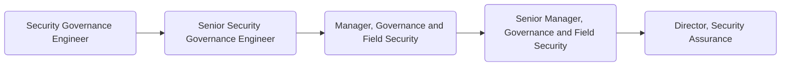

As members of GitLab's [Security Assurance sub department](https://about.gitlab.com/handbook/security/security-assurance/), it is the goal of the [Security Governance](https://about.gitlab.com/handbook/security/security-assurance/governance/) function to:

- Provide oversight and coordination of security policies, procedures, metrics and internally facing training
- Ensure security documentation upholds Gitlab's security governance framework through monitoring of the regulatory and compliance landscapes applicable to GitLab and our stakeholders.
- Administer and monitor Security Assurance technologies

Security Governance professionals at GitLab focus on oversight of our security assurance programs and are proficient in all things regulatory. They have a tight partnership with the externally facing Field Security team, are comfortable operating within our transparent assurance programs and understand how security works with cloud-native technology stacks.

## Responsibilities

- Professionally handle communications with internal and external stakeholders
- Maintain up-to-date knowledge of GitLab's product, environment, systems and architecture
- Educate internal stakeholders on GitLab's Security practices through formal and informational trainings, handbook improvements and security awareness campaigns
- Gather and report on established metrics within the Security Assurance programs

## Requirements

- Ability to use GitLab
- Prior experience working with a SaaS company preferred
- Experience with at least two security control frameworks (e.g. SOC 2, ISO, NIST, COSO, COBIT, etc.)
- Passion for transparent firald security, governance, risk and compliance programs

## Levels

### Security Governance Engineer (Intermediate)

This position reports to the Manager, Governance and Field Security

#### Security Governance Engineer (Intermediate) Job Grade

The {Security Governance Engineer} is a [6](https://about.gitlab.com/handbook/total-rewards/compensation/compensation-calculator/#gitlab-job-grades).

#### Security Governance Engineer (Intermediate) Responsibilities

- Support the maintenance of the GitLab Control Framework (GCF) to ensure controls align with security strategy, support business objectives, and are consistent with applicable laws and regulations
- Support the oversight of handbook pages, policies, standards, procedures and runbooks related to Security Governance
- Participate in Security Assurance technology administration activities
- Participate in security training and awareness programs
- Promote and evangelize security best practices
- Monitor external regulatory, security and compliance landscapes and proactively inform management of significant changes
- Identify opportunities for security and governance process automation
- Maintain governance automation tasks

#### Security Governance Engineer (Intermediate) Requirements

- A minimum of 2 years' experience working with Security Governance and technical writing programs
- Demonstrated experience with at least two security control frameworks (e.g. SOC 2, ISO, NIST, COSO, COBIT, etc.)
- Working understanding of security and governance with cloud-native technology stacks

### Senior Security Governance Engineer

This position reports to the Manager, Governance and Field Security

#### Senior Security Governance Engineer Job Grade

The {Senior Security Governance Engineer} is a [7](https://about.gitlab.com/handbook/total-rewards/compensation/compensation-calculator/#gitlab-job-grades).

#### Senior Security Governance Engineer Responsibilities

- The responsibilities of a Security Governance Engineer, plus;
- Maintain the GitLab Control Framework (GCF) to ensure controls align with security strategy, support business objectives, and are consistent with applicable laws and regulations
- Publish and maintain handbook pages, policies, standards, procedures and runbooks related to Security Governance
- Provide Security Assurance technology administration oversight to include continuous quality reviews and training
- Maintain security program controlled documents
- Peer review security collateral and provide feedback and guidance to Governance and Field Security Engineers
- Recommend new Security Governance metrics and automate reporting of existing metrics
- Mature security training and awareness programs

#### Senior Security Governance Engineer Requirements

- A minimum of 5 years' experience defining and shaping Security Governance and technical writing programs
- Demonstrated experience with at least four security control frameworks (e.g. SOC 2, ISO, NIST, COSO, COBIT, etc.)
- Detailed understanding of security and governance with cloud-native technology stacks

### Manager, Governance and Field Security

This position reports to the Director, Security Assurance.

#### Manager, Governance and Field Security Job Grade

The {Manager, Governance and Field Security} is a [grade 8](https://about.gitlab.com/handbook/total-rewards/compensation/compensation-calculator/#gitlab-job-grades).

#### Manager, Governance and Field Security Responsibilities

- Hire and oversee a world class team of Security Governance and Field Security Engineers
- Hold regular 1:1s with team members
- Build a strong, collaborative partnership with Security, Training, Legal, Infrastructure, Sales and Product teams
- Manage a robust governance program, to include oversight of security policies, security training and awareness programs
- Manage a robust field security program, to include oversight of security RFP databases, customer assurance and security evangelization activities
- Assess and promote customer concerns, industry trends and changing regulatory requirements and appropriately adjust the scope to accommodate these changes
- Oversee deployment and promote continuous improvement of Security Assurance technologies, automations and integrations
- Present a minimum of 3 external facing engagements per annum, ex: Commit, SKO, conferences, guest speaking engagements, blog posts, whitepapers
- Prepare and deliver meaningful metrics to Security Assurance leadership
- Successfully execute on quarterly OKR(s)

#### Manager, Governance and Field Security Requirements

- At least 3 years prior experience managing information security and customer facing teams
- Exceptional communication skills, including verbal, written, and presentation skills to a variety of stakeholders
- Detailed knowledge of common information security management frameworks, regulatory requirements and applicable standards such as: ISO 27001, SOC 2, HIPAA, GDPR, PCI, SOX, etc.

### Senior Manager, Governance and Field Security

This position reports to the Director, Security Assurance.

#### Senior Manager, Governance and Field Security

The {Senior Manager, Governance and Field Security} is a [grade 9](https://about.gitlab.com/handbook/total-rewards/compensation/compensation-calculator/#gitlab-job-grades).

#### Senior Manager, Governance and Field Security Responsibilities

- The same responsibilities of a Security Governance Manager, plus the below:
- Hold regular 1:1s with team managers and skip-level 1:1s with all members of their team
- Plan and execute long term strategies that benefit your team and align with strategic objectives
- Partner with the product organization to dogfood and drive GitLab security and compliance features
- Expose technology and organizational needs throughout security assurance and oversee successful deployments
- Create and deploy innovative and effective strategies for proactively addressing regulatory and customer security requests
- Maintain reliable, up-to-date, information across the industry regarding new security trends, threats and vulnerabilities
- Present a minimum of 6 external facing engagements per annum, ex: Commit, SKO, conferences, guest speaking engagements, blog posts, whitepapers
- Proactively identify new metrics along with strategic recommendations to Security Assurance leadership
- Draft and successfully execute on multiple quarterly OKRs

#### Senior Manager, Governance and Field Security Requirements

- At least 6 years prior experience managing information security and customer facing teams
- Outstanding communication skills, including verbal, written, and presentation skills to a variety of stakeholders
- Expert knowledge of common information security management frameworks, regulatory requirements and applicable standards such as: ISO 27001, SOC 2, HIPAA, GDPR, PCI, SOX, etc.

## Specialties

### Security Automation - Security Assurance Operations

This role is interconnected with GitLab's [Security Automation team](https://about.gitlab.com/job-families/security/security-engineer/#security-automation), this specialty is explicitly focused on the development and automation of Security Assurance processes and controls.

#### Security Automation - Security Assurance Operations Requirements

- Previous experience on or supporting Security Governance, Risk, Compliance or Field Security teams.
- Scripting/coding experience with one or more languages - Python, Ruby, and/or Golang experience a plus
- Experience operating with GRC applications (ex: ZenGRC, ServiceNow, AuditBoard)

#### Security Automation - Security Assurance Operations Responsibilities

- Collaborate with Security Assurance stakeholders on their automation roadmap, understand their operational processes and assist with developing technical solutions to scale critical business operations
- Design, engineer, deploy, and maintain custom automation products
- Participate in end-to-end activities related to implementation planning including assessments, integrations, enhancements, and maintenance with various systems
- Onboard, configure and maintain third party applications and integrations to those applications
- Automate and monitor Key Performance Indicators and metrics for the Security Assurance sub-department
- Collaborate with Product and Engineering in influencing product roadmaps related to security and compliance
- Identify and deploy dogfooding opportunities associated with the deployment and use of the GitLab product
- Collaborate with stakeholders to develop and report upon a visible project plan
- Escalate issues and competing priorities with the potential to impact delivery
- Clearly document the result of automation activities for training and scalable use

## Segment

### Security Leadership

For details on the Security organization leadership roles, to include the Security Assurance Director and VP of Security, see the Security Leadership page.

## Performance Indicators

- [Security Control Health](https://about.gitlab.com/handbook/security/performance-indicators/#security-control-health)

## Career Ladder

## Hiring Process

Candidates for this position can expect the hiring process to follow the order below. Please keep in mind that candidates can be declined from the position at any stage of the process. To learn more about someone who may be conducting the interview, find their job title on our [team page](https://about.gitlab.com/company/team/).

- Qualified candidates will be invited to schedule a 30 minute [screening call](https://about.gitlab.com/handbook/hiring/interviewing/#screening-call) with one of our Global Recruiters.
- Next, candidates will be invited to schedule a 50-minute interview with the hiring manager,
- Then, candidates will be invited to schedule 3 separate 50-minute interviews with 3 different peers from within the Security organization,
- Finally, candidates will be invited to schedule a 25-minute interview with the Director, Security Assurance.

Additional details about our process can be found on our [hiring page](https://about.gitlab.com/handbook/hiring/).
