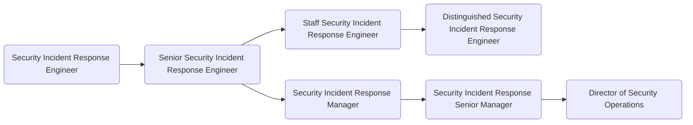

As members of GitLab's [Security Operations sub department](https://about.gitlab.com/handbook/security/security-operations/), the [Security Incident Response Team](https://about.gitlab.com/handbook/security/security-operations/sirt/sec-incident-response.html) detects, manages, and remediates security incidents across GitLab. Members of the Security Incident Response Team (SIRT) are the fire fighters of the GitLab Security department. SIRT works to create and maintain a safe and secure operating environment for the organization and its customers and responds to active security incidents. As a Security Engineer on SIRT you will build and maintain the tools we use to detect and respond to emerging threats in efficient and scalable ways, respond to security incidents and drive them to resolution, and develop and deploy preventative security measures for the GitLab organization and GitLab.com. Successful Security Engineers thrive in high-stress environments and can think like both an attacker and defender, engage with and mentor more junior Security Engineers, and can help come up with proactive and preventative security measures to keep GitLab and its user’s data safe in an ever changing threat landscape.

## Responsibilities

- Detect and respond to company-wide security incidents, coordinating cross-functional teams to mitigate and eradicate threats
- Monitor and analyze emerging threats, vulnerabilities and exploits
- Develop and implement scalable preventative security measures (detection, monitoring, exploitation)
- Incorporate current security trends, advisories, publications, and academic research
- Communicate risks and mitigations across multiple audiences

## Requirements

- Ability to use GitLab
- Experience with designing and implement processes and tools to improve incident handling and resolution
- Technical knowledge of systems in a multi-tenant, cloud environment
- Proficiency to communicate over a text-based medium (Slack, GitLab Issues, Email) and can succinctly document technical details
- Share our [values](/handbook/values/), and work in accordance with those values

## Levels

### Security Incident Response Team Engineer (Intermediate)

This position reports to the [Manager, Security Incident Response Team](#manager-security-incident-response-team).

#### Security Incident Response Team Engineer (Intermediate) Job Grade

The Security Incident Response Team Engineer is a [grade 6](https://about.gitlab.com/handbook/total-rewards/compensation/compensation-calculator/#gitlab-job-grades).

#### Security Incident Response Team Engineer (Intermediate) Responsibilities

- Detect and respond to basic security incidents across the organization or GitLab.com
- Implement and monitor security measures for the protection of corporate and production infrastructure
- Utilize log ingestion platform for security analytics and identification of tactics, techniques and patterns of attackers
- Contribute to creation of runbooks
- Contribute to the production and tuning of detection rules
- Participate in the Security Incident Response Team on-call rotation
- Digital forensics & incident response (DFIR)
- Identify and mitigate complex security vulnerabilities before an attacker exploits them

#### Security Incident Response Team Engineer (Intermediate) Requirements

- A minimum of 2 years experience working with incident response
- Good written and verbal communication skills
- Experience using log analysis platforms such as splunk, ELK, bigquery, etc
- Familiarity with Google Cloud Platform (GCP), AWS, and/or Azure
- Substantial engineering mindset

### Senior Security Incident Response Team Engineer

This position reports to the [Manager, Security Incident Response Team](#manager-security-incident-response-team).

#### Senior Security Incident Response Team Engineer Job Grade

The Senior Security Incident Response Team Engineer is a [grade 7](https://about.gitlab.com/handbook/total-rewards/compensation/compensation-calculator/#gitlab-job-grades).

#### Senior Security Incident Response Team Engineer Responsibilities

- Extends Security Incident Response Engineer responsibilities, plus;
- Detect and independently respond to security incidents across the organization or GitLab.com
- Conduct proactive threat hunting based on threat intel
- Perform forensic analysis of infected hosts independently
- Analyze network traffic and identify attacker activity
- Mentor other members of the Security Incident Response Team
- Build and maintain scalable log ingestion and analytics platforms and tooling
- Perform root cause analysis (RCA) and incident reviews

#### Senior Security Incident Response Team Engineer Requirements

- 5+ years of demonstrated experience in web or cloud security engineering, log aggregation, and/or penetration testing
- A minimum of 2 years experience working with incident response
- Excellent written and verbal communication skills
- Capability to build working relationships with key stakeholders
- Experience with operating system internals and hardening, web application and browser security, and monitoring and intrusion detection

### Hiring Process

Candidates for this position can expect the hiring process to follow the order below. Please keep in mind that candidates can be declined from the position at any stage of the process.

- Qualified candidates will be invited to schedule a 30 minute [screening call](https://about.gitlab.com/handbook/hiring/interviewing/#screening-call) with one of our Global Recruiters.
- Next, candidates will be invited to schedule an interview with Security Incident Response Team Manager
- Candidates will then be invited to schedule an interview with 2 SIRT peers, one of which will be a Senior
- Candidates will then be invited to schedule an interview with Director of Security Operations
- Successful candidates will subsequently be made an offer via email

### Staff Security Incident Response Team Engineer

This position reports to the [Manager, Security Incident Response Team](#manager-security-incident-response-team).

#### Staff Security Incident Response Team Engineer Job Grade

The Staff Security Incident Response Team Engineer is a [grade 8](https://about.gitlab.com/handbook/total-rewards/compensation/compensation-calculator/#gitlab-job-grades).

#### Staff Security Incident Response Team Engineer Responsibilities

- Extends Senior Security Incident Response Engineer responsibilities, plus;
- SME in incident response, mentoring and training other members of the Security Incident Response Team
- Participate in the Security Incident Manager on-call rotation
- Lead the design, evaluation, implementation and deployment of new security technologies
- Maintain knowledge of emerging threats, security technologies and academic research for application in the protection of the organization and GitLab.com
- Lead efforts to design and collect incident response metrics and improve efficiency and effectiveness of incident response plans

#### Staff Security Incident Response Team Engineer Requirements

- 10 years of demonstrated experience in web or cloud security engineering, log aggregation, and/or penetration testing
- Profound knowledge of attack and mitigation methods
- Experience with secure network design, firewalls, authentication and authorization systems
- Experience with threat modeling
- Experience in the development of security tools and automation

### Manager, Security Incident Response Team

This position reports to the [Senior Manager, Security Incident Response Team](#senior-manager-security-incident-response-team).

#### Manager, Security Incident Response Team Job Grade

The Security Incident Response Team Manager is a [grade 8](https://about.gitlab.com/handbook/total-rewards/compensation/compensation-calculator/#gitlab-job-grades).

#### Manager, Security Incident Response Team Responsibilities

- Hire a world class team of security engineers to work on their team
- Help their team grow their skills and experience
- Provide input on security architecture, issues, and features
- Hold regular 1:1's with all members of their team
- Create a sense of psychological safety on their team
- Be your team's role model in terms of positive thinking, de-escalating conflict, and taking time off
- Identify the need to, and drive the implementation of security-related technical and process improvements
- Author project plans for security initiatives
- Draft and successfully deliver on quarterly OKRs
- Train team members to screen candidates and conduct engineering interviews
- Build a substantial, collaborative partnership with Legal, Infrastructure, Development and Product departments
- Assume the role of an Incident Manager during larger security events

#### Manager, Security Incident Response Team Requirements

- Proven track record as an experienced member of Security Operations or Incident Response teams - either as an Individual Contributor or as a Manager
- Experience with leading Security or security-focused Site Reliability teams
- Experience with working at a SaaS, or product company
- Excellent written and verbal communication skills, especially experience with executive-level communications
- Capability to make concrete progress in the face of ambiguity and imperfect knowledge
- Being comfortable with often not being in control of their time (because security events don't care about anyone's plans)
- Being comfortable with very frequent context switching
- Willingness to be part of the Security Manager On-Call rotation
- Robust understanding of security issues, mitigations, and a solid grasp of the current global threat landscape
- Experience with the role of an incident manager during medium and large scale security events
- First hand experience with major cloud providers - GCP, AWS, Azure, Digital Ocean
- Alignment with Manager responsibilities as outlined in [Leadership at GitLab](https://about.gitlab.com/company/team/structure/#management-group)

### Senior Manager, Security Incident Response Team

This role reports to the [Director of Security Operations](/job-families/security/security-leadership/#director-security-operations).

#### Senior Manager, Security Incident Response Team Job Grade

The Security Incident Response Team Senior Manager is a [grade 9](https://about.gitlab.com/handbook/total-rewards/compensation/compensation-calculator/#gitlab-job-grades).

#### Senior Manager, Security Incident Response Team Responsibilities

- Extends Manager, Security Incident Response Team responsibilities, plus;
- Provide tactical oversight of the teams' daily efforts
- Maintain vision for the teams' immediate and near-term future
- Develop and maintain teams' KPIs
- Be your teams' role model in terms of positive thinking, de-escalating conflict, and taking time off
- Help teams prioritise efforts and ensure they align with the overall direction of the company
- Draft and successfully deliver on quarterly OKRs
- Train team members to screen candidates and conduct managerial interviews
- Build a substantial, collaborative partnership with your peers in the Legal, Infrastructure, IT, Development and Product departments
- Being part of the Security Escalation On-Call rotation

#### Senior Manager, Security Incident Response Team Requirements

- Experience with leading people managers
- Experience with leading Security or security-focused Site Reliability teams
- Experience with working at a SaaS, or product company
- Excellent written and verbal communication skills, especially experience with executive-level communications
- Capability to make concrete progress in the face of ambiguity and imperfect knowledge
- Being comfortable with rapid context switching
- Willingness to be part of the Security Escalation On-Call rotation
- Robust understanding of security issues, mitigations, and a solid grasp of the current global threat landscape
- Experience with the role of an incident manager during large scale security events
- Familiarity with major cloud providers - GCP, AWS, Azure, Digital Ocean
- Alignment with Manager responsibilities as outlined in [Leadership at GitLab](https://about.gitlab.com/company/team/structure/#management-group).

## Performance Indicators

- Support the organisation by [ensuring that the Security Engineer On-Call meets SLAs](https://about.gitlab.com/handbook/security/performance-indicators/#sirt-former-security-operations-page-volume).

### Career Ladder

For details on the Security organization leadership roles, to include the Security Operations Director and VP of Security, see the Security Leadership page.

## Hiring Process

Candidates for this position can expect the hiring process to follow the order below. Please keep in mind that candidates can be declined from the position at any stage of the process.

- Qualified candidates will be invited to schedule a 30 minute [screening call](https://about.gitlab.com/handbook/hiring/interviewing/#screening-call) with one of our Global Recruiters.
- Next, candidates will be invited to schedule an interview with Security Incident Response Team Manager
- Candidates will then be invited to schedule an interview with Senior Security Incident Response Team Engineer, Red Team Manager, Trust & Safety Manager
- Candidates will then be invited to schedule an interview with Director of Security Operations
- Successful candidates will subsequently be made an offer via email

Additional details about our process can be found on our [hiring page](https://about.gitlab.com/handbook/hiring/).
