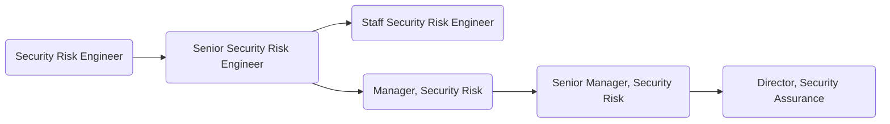

As members of GitLab's [Security Assurance sub department](https://about.gitlab.com/handbook/security/security-assurance/), the Security Risk team identifies, tracks, monitors and advises on security risks both operatioinally and for third party vendors. The team is responsible for implementaion of proactive security risk management programs.

## Responsibilities

- Professionally handle communications with internal and external stakeholders
- Maintain up-to-date knowledge of GitLab's product, environment, systems and architecture
- Identify, review, analyze and manage operational security risks accross business units
- Execute third party (vendor) risk management assessments
- Gather and report on established metrics within the operational security risk programs

## Requirements

- Capability to use GitLab
- Exemplary written and verbal communication and presentation skills
- Prior experience working with a SaaS company preferred

## Levels

### Security Risk Engineer (Intermediate)

This position reports to the Manager, Security Risk at GitLab.

#### Security Risk Engineer (Intermediate) Job Grade

The Security Risk Engineer is a [6](https://about.gitlab.com/handbook/total-rewards/compensation/compensation-calculator/#gitlab-job-grades).

#### Security Risk Engineer (Intermediate) Responsibilities

- Execute operational security risk management activities to include: annual security risk assessments, business impact assessments and ctitical systems assessments
- Execute third party security risk assessments within SLA
- Deliver security risk reports to management
- Triage new or changing security requirements, security issues, third party, customer or external potential risks
- Maintain handbook pages, policies, standards, procedures and runbooks related to Security Risk programs
- Identify opportunities for Security Risk process automation
- Maintain Security Risk automation tasks

#### Security Risk Engineer (Intermediate) Requirements

- At least 2 years of experience conducting risk management activities
- Demonstrated experience with common risk management standards and models such as: ISO 31000, NIST 800-39, FAIR, ISACA Risk IT, OCTAVE
- Demonstrated experience with at least two security control frameworks such as: SOC 2, ISO, NIST, COSO, COBIT
- Working understanding of how security works with cloud-native technology stacks

### Senior Security Risk Engineer

This position reports to the Manager, Security Risk at GitLab.

#### Senior Security Risk Engineer Job Grade

The Senior Security Risk Engineer is a [7](https://about.gitlab.com/handbook/total-rewards/compensation/compensation-calculator/#gitlab-job-grades).

#### Senior Security Risk Engineer Responsibilities

- Extends the Security Risk Engineer responsibilities
- Execute end to end Security Risk initiatives in accordance with the compliance roadmap
- Develop indicators to identify and control potential security operational risks
- Develop risk treatment plans with risk owners to mitigate operational risks and test treatment plans for closure
- Document detailed observations and meaningful remediation recommendations to mitigate third party risk
- Map operational risks to common controls and advise on new common controls needed to cover emerging risks
- Execute peer reviews and provide meaningful feedback
- Design requirements for Security Risk automation tasks
- Recommend new Security Risk metrics and automate reporting of existing metrics

#### Senior Security Risk Engineer Requirements

- Ability to use GitLab
- At least 5 years of experience conducting customer support, security and risk management activities
- Detailed experience with common risk management standards and models such as: ISO 31000, NIST 800-39, FAIR, ISACA Risk IT, OCTAVE
- Demonstrated experience with at least four security control frameworks such as: SOC 2, ISO, NIST, COSO, COBIT
- Demonstrated industry security experience, particularly in DevSecOps, Application Security and/or Cloud-Native Security

### Staff Security Risk Engineer (Risk Manager)

This position reports to the Manager, Security Risk at GitLab.

#### Staff Security Risk Engineer Job Grade

The Staff Security Risk Engineer is a [8](https://about.gitlab.com/handbook/total-rewards/compensation/compensation-calculator/#gitlab-job-grades).

#### Staff Security Risk Engineer Responsibilities

- Extends the Senior Security Risk Engineer responsibilities
- Monitor emerging industry threats
- Maintain expert knowledge of GitLab's product, environment, systems and architecture while mentoring others on this knowledge
- Mentor other Security Risk Engineers and improve quality and quantity of the team's output
- Design and implement major iterations of Security Risk programs in alignment with industry trends, predictions and regulatory demands
- Participate in Security Assurance roadmap development based on business needs and regulatory drivers
- Work with business units to understand drivers, concerns and future plans and offer support to proactively mitigate security risk
- Create dynamic open-source Security Risk programs that deliver value to the GitLab community
- Design, develop, and deploy scripts to automate administrative and process tasks related to Security Risk
- Design, develop, and deploy an automated metric reporting for all Security Risk programs

#### Staff Security Risk Engineer Requirements

- At least 10 years of experience conducting security risk management activities
- Expert experience with common risk management standards and models such as: ISO 31000, NIST 800-39, FAIR, ISACA Risk IT, OCTAVE
- Expert experience with at least six security control frameworks such as: SOC 2, ISO, NIST, COSO, COBIT
- Demonstrated industry security experience, particularly in DevSecOps, Application Security and/or Cloud-Native Security

### Manager, Security Risk

The Manager, Security Risk reports directly to the Security Assurance Director.

#### Manager, Security Risk Job Grade

The Manager, Security Risk is a [8](https://about.gitlab.com/handbook/total-rewards/compensation/compensation-calculator/#gitlab-job-grades).

#### Manager, Security Risk Responsibilities

- Hire and oversee a world class team of Security Risk Engineers
- Evangelize operational security risk programs across GitLab
- Continuously improve handbook pages, policies, standards, procedures and runbooks related to Security Risk
- Build a strong, collaborative partnership with Security, Infrastructure, Legal, Internal Audit and IT teams
- Maintain a dynamic operational risk management program
- Maintain a comprehensive risk-based third party risk management program, to include proactive backlog and scheduling management
- Participate in enterprise risk management activities and ensure cohesion between programs
- Prepare and deliver meaningful operational security risk metrics to Security Assurance leadership
- Identify and implement automation of manual processes to streamline operational risk identification and management
- Draft and successfully execute on quarterly OKRs

#### Manager, Security Risk Requirements

- Exceptional communication skills, including verbal, written, and presentation skills to a variety of stakeholders
- At least 3 years prior experience managing information security risk teams
- Detailed knowledge of common risk management standards and models such as: ISO 31000, NIST 800-39, FAIR, ISACA Risk IT, OCTAVE
- Working knowledge of common information security management frameworks, regulatory requirements and applicable standards such as: ISO 27001, SOC 2, HIPAA, GDPR, PCI, SOX, etc.

### Senior Manager, Security Risk

The Senior Manager, Security Risk reports directly to the Security Assurance Director.

#### Senior Manager, Security Risk Job Grade

The Senior Manager, Security Risk is a [9](https://about.gitlab.com/handbook/total-rewards/compensation/compensation-calculator/#gitlab-job-grades).

#### Senior Manager, Security Risk Responsibilities

- Extends the Manager, Security Risk responsibilities
- Maintain a 3 year strategic roadmap that ties to business objectives
- Develop strong relationships with key stakeholders by addressing issues/concerns in timely manner
- Create and deploy innovative and effective strategies for preventing or eliminating security operational and third party risk
- Conduct presentations and workshop sessions on operational security and third party risk identification and mitigation strategies
- Proactively identify and deploy dogfooding opportunities to leverage the GitLab product in security risk programs
- Continually monitor the business to find potential new threats and redesign security risk processes accordingly
- Provide meaningful data to influence strategic decision based on current and potential security risks

#### Senior Manager, Security Risk Requirements

- At least 6 years prior experience managing information security risk teams
- Proficient knowledge of common risk management standards and models such as: ISO 31000, NIST 800-39, FAIR, ISACA Risk IT, OCTAVE
- Detailed knowledge of common information security management frameworks, regulatory requirements and applicable standards such as: ISO 27001, SOC 2, HIPAA, GDPR, PCI, SOX, etc.

## Segment

### Security Leadership

For details on the Security organization leadership roles, to include the Security Assurance Director and VP of Security, see the Security Leadership page.

## Performance Indicators

- [Operational Security Risk Management (Tier 2 Risks)](https://about.gitlab.com/handbook/security/performance-indicators/#operational-security-risk-management-tier-2-risks)
- [Third Party Risk Management](https://about.gitlab.com/handbook/security/performance-indicators/#third-party-risk-management)

## Career Ladder

## Hiring Process

Candidates for this position can expect the hiring process to follow the order below. Please keep in mind that candidates can be declined from the position at any stage of the process. To learn more about someone who may be conducting the interview, find their job title on our [team page](https://about.gitlab.com/company/team/).

- Qualified candidates will be invited to schedule a 30 minute [screening call](https://about.gitlab.com/handbook/hiring/interviewing/#screening-call) with one of our Global Recruiters.
- Next, candidates will be invited to schedule a 50-minute interviews with the hiring manager,
- Then, candidates will be invited to schedule 3 separate 50-minute interviews with 3 different peers from within the Security orgnaization,
- Finally, candidates will be invited to schedule a 25-minute interview with the Director, Security Risk and Compliance (Security Assurance).

Additional details about our process can be found on our [hiring page](https://about.gitlab.com/handbook/hiring/).
